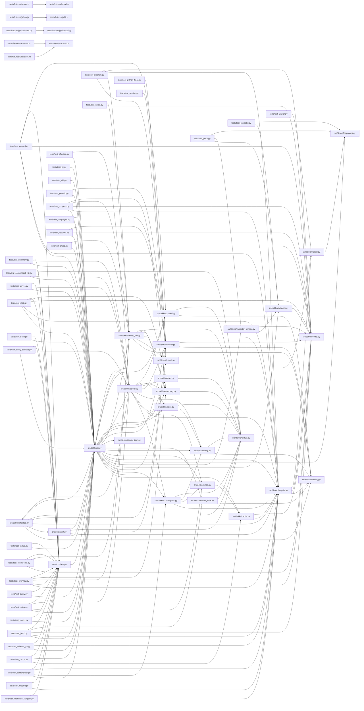

# Code Map — code-map

Generated by dekko on 2026-06-14 23:44 UTC. Do not edit by hand.

> **Agents:** prefer `dekko summary` for an overview and `dekko query | context | affected` (or the dekko MCP tools) for specifics — this file is the human-readable index and can be large.

**75** files (python 63, c 2, javascript 2, rust 2, bash 1, cpp 1, go 1, java 1, ruby 1, typescript 1) · **664** functions/methods · **33** classes · **1242** call edges (98 ambiguous, 1320 external — see map.json)

*Mapped 75 files in 225 ms (cache: 0 reused / 75 parsed).*

## Overview

| Directory | Files | Symbols | Internal | Cross-dir | Purpose |
|---|--:|--:|--:|--:|---|
| `src/dekko/` | 26 | 361 | 615 | 287 | dekko: static code map generator (MAP.md + map.json). |
| `tests/` | 35 | 294 | 310 | 287 | Shared pytest configuration. |
| `tests/fixtures/go/` | 1 | 5 | 3 | 0 |  |
| `tests/fixtures/java/` | 1 | 5 | 4 | 0 |  |
| `tests/fixtures/js/` | 2 | 5 | 5 | 0 |  |
| `tests/fixtures/python/` | 2 | 5 | 5 | 0 |  |
| `tests/fixtures/ruby/` | 1 | 5 | 3 | 1 |  |
| `tests/fixtures/rust/` | 2 | 5 | 4 | 1 |  |
| `tests/fixtures/ts/` | 1 | 5 | 2 | 0 |  |
| `tests/fixtures/cpp/` | 1 | 4 | 1 | 0 |  |
| `tests/fixtures/c/` | 2 | 3 | 2 | 0 |  |
| `./` | 1 | 0 | 0 | 0 |  |

**Load-bearing** (most called):

- [`make_mapped_repo(tmp_path: Path) -> RepoFactory`](#tests-conftest-py-make-mapped-repo) — 109
- [`main(argv: list[str] | None) -> int`](#src-dekko-cli-py-main) — 81
- [`class FileMap`](#src-dekko-model-py-filemap) — 24
- [`load_map(root: Path) -> MapIndex | None`](#src-dekko-mapfile-py-load-map) — 22
- [`class CallGraph`](#src-dekko-model-py-callgraph) — 22

**Orchestrators** (most calls out):

- [`_sharded(files: list[FileMap], graph: CallGraph, root_label: str, run_stats: RunStats | None, root: Path | None, order: str) -> list[tuple[str, str]]`](#src-dekko-render-md-py-sharded) — 16
- [`run_map(args: argparse.Namespace) -> int`](#src-dekko-cli-py-run-map) — 15
- [`render_markdown(files: list[FileMap], graph: CallGraph, root_label: str, run_stats: RunStats | None, root: Path | None, order: str) -> str`](#src-dekko-render-md-py-render-markdown) — 13
- [`run(index: MapIndex, target: str, hops: int, budget: int | None, as_json: bool, root: Path | None, with_source: bool, notes: bool) -> int`](#src-dekko-contextpack-py-run) — 10
- [`resolve(files: list[FileMap]) -> CallGraph`](#src-dekko-resolver-py-resolve) — 8

**Largest files** (symbols):

- [`src/dekko/extractor.py`](#src-dekko-extractor-py) — 53
- [`src/dekko/cli.py`](#src-dekko-cli-py) — 42
- [`src/dekko/server.py`](#src-dekko-server-py) — 33
- [`src/dekko/render_md.py`](#src-dekko-render-md-py) — 31
- [`src/dekko/summary.py`](#src-dekko-summary-py) — 21

**Hotspots** (recent churn x fan-in — change carefully):

| File | Commits | Fan-in | Risk |
|---|--:|--:|--:|
| [`tests/conftest.py`](#tests-conftest-py) | 4 | 109 | 3.0 |
| [`src/dekko/cli.py`](#src-dekko-cli-py) | 1 | 144 | 1.0 |
| [`src/dekko/extractor.py`](#src-dekko-extractor-py) | 1 | 95 | 0.7 |
| [`src/dekko/model.py`](#src-dekko-model-py) | 1 | 91 | 0.6 |
| [`src/dekko/server.py`](#src-dekko-server-py) | 1 | 89 | 0.6 |
| [`tests/test_server.py`](#tests-test-server-py) | 3 | 28 | 0.6 |
| [`src/dekko/mapfile.py`](#src-dekko-mapfile-py) | 1 | 66 | 0.5 |
| [`src/dekko/render_md.py`](#src-dekko-render-md-py) | 1 | 77 | 0.5 |
| [`src/dekko/cache.py`](#src-dekko-cache-py) | 2 | 20 | 0.3 |
| [`src/dekko/contextpack.py`](#src-dekko-contextpack-py) | 1 | 24 | 0.2 |

**Entry points:**

- [`main(argv: list[str] | None) -> int`](#src-dekko-cli-py-main)
- [`main(argc: int, argv: char **) -> int`](#tests-fixtures-c-main-c-main)
- [`main()`](#tests-fixtures-go-srv-go-main)
- [`App.main(args: String[]) -> void`](#tests-fixtures-java-app-java-app-main)
- [`main()`](#tests-fixtures-js-app-js-main)
- [`Greeter.constructor(prefix)`](#tests-fixtures-js-lib-js-greeter-constructor)
- [`class Point`](#tests-fixtures-rust-lib-rs-point)
- [`main()`](#tests-fixtures-rust-main-rs-main)

## Contents

- **./**
  - *also present:* `install.sh`
- **src/dekko/**
  - [`__init__.py`](#src-dekko-init-py) — dekko: static code map generator (MAP.md + map.json).
  - [`affected.py`](#src-dekko-affected-py) (12 symbols) — Select the tests impacted by a change.
  - [`cache.py`](#src-dekko-cache-py) (13 symbols) — Per-file extraction cache stored under ``.dekko/``.
  - [`classify.py`](#src-dekko-classify-py) (1 symbols) — Shared path classification: test code vs production code.
  - [`cli.py`](#src-dekko-cli-py) (42 symbols) — dekko: programmatically map a repository into MAP.md/map.json.
  - [`contextpack.py`](#src-dekko-contextpack-py) (17 symbols) — Context packs: the minimal neighborhood needed to work on a target.
  - [`diff.py`](#src-dekko-diff-py) (14 symbols) — Compare the working tree's symbols against an earlier git rev.
  - [`export.py`](#src-dekko-export-py) (11 symbols) — Render the call graph as Mermaid or Graphviz DOT.
  - [`extractor.py`](#src-dekko-extractor-py) (53 symbols) — Tree-sitter extraction: source file → symbols, raw calls, imports.
  - [`extractor_generic.py`](#src-dekko-extractor-generic-py) (8 symbols) — Tier-2 extraction: best-effort symbols for any grammar.
  - [`languages.py`](#src-dekko-languages-py) (4 symbols) — Language registry: extensions, grammars, and tree-sitter queries.
  - [`mapfile.py`](#src-dekko-mapfile-py) (17 symbols) — Read map.json back into a queryable index; provenance + freshness.
  - [`model.py`](#src-dekko-model-py) (8 symbols) — Shared data model for the code map: symbols, calls, edges.
  - [`notes.py`](#src-dekko-notes-py) (7 symbols) — Symbol-anchored notes: durable, committable annotations on code.
  - [`query.py`](#src-dekko-query-py) (16 symbols) — Query the loaded map index: callers, callees, symbols, files.
  - [`render_html.py`](#src-dekko-render-html-py) (8 symbols) — Render the map as one self-contained interactive HTML file.
  - [`render_json.py`](#src-dekko-render-json-py) (1 symbols) — Render the extracted symbol/call graph as map.json.
  - [`render_md.py`](#src-dekko-render-md-py) (31 symbols) — Render the extracted symbol/call graph as MAP.md.
  - [`resolver.py`](#src-dekko-resolver-py) (10 symbols) — Best-effort static call resolution: raw calls → graph edges.
  - [`server.py`](#src-dekko-server-py) (33 symbols) — A hand-rolled MCP server exposing the map over stdio.
  - [`stats.py`](#src-dekko-stats-py) (7 symbols) — Aggregate metrics over the map: hotspots, sizes, language mix.
  - [`summary.py`](#src-dekko-summary-py) (21 symbols) — A compact repo digest: the middle ground between MAP.md and a query.
  - [`textutil.py`](#src-dekko-textutil-py) (4 symbols) — Small shared text helpers for the read-command renderers.
  - [`trace.py`](#src-dekko-trace-py) (8 symbols) — Trace shortest call path(s) between two symbols.
  - [`unused.py`](#src-dekko-unused-py) (8 symbols) — Find symbols with no inbound calls that look like dead code.
  - [`walker.py`](#src-dekko-walker-py) (7 symbols) — File discovery: enumerate mappable source files in a repository.

tests (48 files)

- **tests/**
  - [`conftest.py`](#tests-conftest-py) (2 symbols) — Shared pytest configuration.
  - [`test_affected.py`](#tests-test-affected-py) (12 symbols) — The affected subcommand: impacted test selection and exit codes.
  - [`test_cache.py`](#tests-test-cache-py) (17 symbols) — The .dekko incremental cache: creation, reuse, and --full.
  - [`test_cli.py`](#tests-test-cli-py) (19 symbols) — CLI surface tests: flags, output resolution, plugin install.
  - [`test_contextpack.py`](#tests-test-contextpack-py) (6 symbols) — Context packs: neighborhood building, hops, budget trimming.
  - [`test_contextpack_v2.py`](#tests-test-contextpack-v2-py) (8 symbols) — Context pack v2: doc lines, --with-source, call-site excerpts.
  - [`test_diagram.py`](#tests-test-diagram-py) (8 symbols) — MAP.md embedded mermaid diagram: scale-guard tiers and block syntax.
  - [`test_diff.py`](#tests-test-diff-py) (9 symbols) — The diff subcommand: added/removed/changed symbols and exit codes.
  - [`test_docs.py`](#tests-test-docs-py) (12 symbols) — Doc-line extraction: ``Symbol.doc`` and ``FileMap.doc``.
  - [`test_export.py`](#tests-test-export-py) (4 symbols) — The export command: mermaid/dot rendering, scope, size guard.
  - [`test_extractor.py`](#tests-test-extractor-py) (8 symbols) — Extraction tests for the Tier-1 Python and Rust queries.
  - [`test_freshness_fastpath.py`](#tests-test-freshness-fastpath-py) (6 symbols) — The mtime/size fast path in check_freshness skips redundant hashing.
  - [`test_generic.py`](#tests-test-generic-py) (1 symbols) — Tier-2 generic fallback tests (Ruby fixture).
  - [`test_hotspots.py`](#tests-test-hotspots-py) (10 symbols) — B5: trust line, largest-files overview, and churn x fan-in hotspots.
  - [`test_html.py`](#tests-test-html-py) (10 symbols) — B7: interactive HTML export — document, escaping, size guard, CLI.
  - [`test_languages.py`](#tests-test-languages-py) (8 symbols) — Per-language extraction and resolution tests for Tier-1 specs.
  - [`test_mapfile.py`](#tests-test-mapfile-py) (6 symbols) — map.json round-trip, provenance, and freshness checks.
  - [`test_noise.py`](#tests-test-noise-py) (7 symbols) — B6: minor-file collapse, test grouping, and ``--order``.
  - [`test_notes.py`](#tests-test-notes-py) (10 symbols) — Symbol-anchored notes: CRUD, rendering, orphans, MCP, committability.
  - [`test_overview.py`](#tests-test-overview-py) (5 symbols) — MAP.md Overview section: rollup table, hotspots, anchor links.
  - [`test_python_floor.py`](#tests-test-python-floor-py) (2 symbols) — Guard the package's declared requires-python floor.
  - [`test_query.py`](#tests-test-query-py) (7 symbols) — Query subcommand: actions, target syntax, exit codes.
  - [`test_query_surface.py`](#tests-test-query-surface-py) (13 symbols) — A2 query surface: --sites, uses, --no-tests, ranking, footers.
  - [`test_render_md.py`](#tests-test-render-md-py) (7 symbols) — MAP.md rendering: the agent-steering header and purpose lines.
  - [`test_resolver.py`](#tests-test-resolver-py) (7 symbols) — End-to-end resolution tests over the language fixtures.
  - [`test_schema_v3.py`](#tests-test-schema-v3-py) (8 symbols) — map.json doc version 3: edge lines, externals, test flags, compat.
  - [`test_server.py`](#tests-test-server-py) (21 symbols) — The hand-rolled MCP server: protocol handling and tool dispatch.
  - [`test_shard.py`](#tests-test-shard-py) (13 symbols) — Sharded MAP.md: mode matrix, auto threshold, orphans, link resolution.
  - [`test_stats.py`](#tests-test-stats-py) (3 symbols) — The stats command: counts, hotspots, language mix.
  - [`test_status.py`](#tests-test-status-py) (6 symbols) — Status subcommand exit codes and the auto-regen/no-regen paths.
  - [`test_summary.py`](#tests-test-summary-py) (12 symbols) — The summary digest and the MCP resource that serves it.
  - [`test_trace.py`](#tests-test-trace-py) (8 symbols) — Trace subcommand: shortest call paths, exit codes, JSON shape.
  - [`test_unused.py`](#tests-test-unused-py) (12 symbols) — The unused command: root rules, used-via-container, exit codes.
  - [`test_version.py`](#tests-test-version-py) (4 symbols) — Guard: the version is declared in four places and must agree.
  - [`test_walker.py`](#tests-test-walker-py) (3 symbols) — File discovery tests.
- **tests/fixtures/c/**
  - [`main.c`](#tests-fixtures-c-main-c) (1 symbols)
  - [`math.c`](#tests-fixtures-c-math-c) (2 symbols)
- **tests/fixtures/cpp/**
  - [`shapes.cpp`](#tests-fixtures-cpp-shapes-cpp) (4 symbols)
- **tests/fixtures/go/**
  - [`srv.go`](#tests-fixtures-go-srv-go) (5 symbols)
- **tests/fixtures/java/**
  - [`App.java`](#tests-fixtures-java-app-java) (5 symbols)
- **tests/fixtures/js/**
  - [`app.js`](#tests-fixtures-js-app-js) (1 symbols)
  - [`lib.js`](#tests-fixtures-js-lib-js) (4 symbols)
- **tests/fixtures/python/**
  - [`main.py`](#tests-fixtures-python-main-py) (1 symbols)
  - [`util.py`](#tests-fixtures-python-util-py) (4 symbols)
- **tests/fixtures/ruby/**
  - [`store.rb`](#tests-fixtures-ruby-store-rb) (5 symbols)
- **tests/fixtures/rust/**
  - [`lib.rs`](#tests-fixtures-rust-lib-rs) (4 symbols)
  - [`main.rs`](#tests-fixtures-rust-main-rs) (1 symbols)
- **tests/fixtures/ts/**
  - [`svc.ts`](#tests-fixtures-ts-svc-ts) (5 symbols)

---

##  `src/dekko/__init__.py`

*python · 0 symbols — dekko: static code map generator (MAP.md + map.json).*

---

##  `src/dekko/affected.py`

*python · 12 symbols — Select the tests impacted by a change.*

###  `class TestImpact`

*class · lines 43-56*

One impacted test file and why it is impacted.

- **called by:** [`_call_impacts`](#src-dekko-affected-py-call-impacts), [`analyze`](#src-dekko-affected-py-analyze)

###  `_changed_for_calls(result: diff.DiffResult) -> set[str]`

*function · lines 59-61*

Symbol ids present in the new tree (added + changed).

- **called by:** [`_call_impacts`](#src-dekko-affected-py-call-impacts)

###  `_changed_files(result: diff.DiffResult) -> set[str]`

*function · lines 64-67*

Every file touched by the diff (added, changed, or removed).

- **called by:** [`analyze`](#src-dekko-affected-py-analyze)

###  `_reverse_hops(seed_ids: set[str], callers: dict[str, list[str]]) -> dict[str, int]`

*function · lines 70-92*

Minimum reverse-call distance from any seed to each reachable id.

- **calls:** `get` *(ambiguous: 2 candidates)*
- **called by:** [`_call_impacts`](#src-dekko-affected-py-call-impacts)

###  `_id_path(sym_id: str) -> str`

*function · lines 95-97*

Repo-relative file path embedded in a symbol or module id.

- **called by:** [`_call_impacts`](#src-dekko-affected-py-call-impacts)

###  `_call_impacts(result: diff.DiffResult, new: diff.Snapshot) -> dict[str, TestImpact]`

*function · lines 100-120*

Test files reached from changed symbols through call edges.

- **calls:** [`TestImpact`](#src-dekko-affected-py-testimpact), [`_changed_for_calls`](#src-dekko-affected-py-changed-for-calls), [`_id_path`](#src-dekko-affected-py-id-path), [`_reverse_hops`](#src-dekko-affected-py-reverse-hops), [`is_test_path`](#src-dekko-classify-py-is-test-path), `get` *(ambiguous: 2 candidates)*
- **called by:** [`analyze`](#src-dekko-affected-py-analyze)

###  `_import_hits(new: diff.Snapshot, changed_files: set[str]) -> set[str]`

*function · lines 123-133*

Test files whose imports resolve to any changed file.

- **calls:** [`is_test_path`](#src-dekko-classify-py-is-test-path), [`_module_matches`](#src-dekko-resolver-py-module-matches), `add` *(ambiguous: 2 candidates)*
- **called by:** [`analyze`](#src-dekko-affected-py-analyze)

###  `analyze(result: diff.DiffResult, new: diff.Snapshot) -> list[TestImpact]`

*function · lines 136-154*

Combine call-edge and import evidence into impacted test files.

- **calls:** [`TestImpact`](#src-dekko-affected-py-testimpact), [`_call_impacts`](#src-dekko-affected-py-call-impacts), [`_changed_files`](#src-dekko-affected-py-changed-files), [`_import_hits`](#src-dekko-affected-py-import-hits)
- **called by:** [`run`](#src-dekko-affected-py-run)

###  `_impact_json(impact: TestImpact) -> dict`

*function · lines 157-166*

Structured rendering of one impacted test file.

- **calls:** [`signature`](#src-dekko-textutil-py-signature)
- **called by:** [`render`](#src-dekko-affected-py-render)

###  `render(impacts: list[TestImpact], rev: str, as_json: bool, limit: int) -> None`

*function · lines 169-194*

Emit the impacted-test report as text or JSON.

- **calls:** [`_impact_json`](#src-dekko-affected-py-impact-json), [`_pytest_hint`](#src-dekko-affected-py-pytest-hint), [`signature`](#src-dekko-textutil-py-signature)
- **called by:** [`run`](#src-dekko-affected-py-run)

###  `_pytest_hint(impacts: list[TestImpact]) -> str`

*function · lines 197-201*

A ready-to-paste pytest invocation, or empty when none apply.

- **called by:** [`render`](#src-dekko-affected-py-render)

###  `run(root: Path, rev: str | None, as_json: bool, limit: int) -> int`

*function · lines 204-238*

Execute ``dekko affected`` against a repository.

- **calls:** [`analyze`](#src-dekko-affected-py-analyze), [`render`](#src-dekko-affected-py-render), [`compare`](#src-dekko-diff-py-compare), [`export_rev`](#src-dekko-diff-py-export-rev), [`snapshot`](#src-dekko-diff-py-snapshot), [`load_map`](#src-dekko-mapfile-py-load-map), `get` *(ambiguous: 2 candidates)*
- **called by:** [`run_affected`](#src-dekko-cli-py-run-affected), [`tool_impacted_tests`](#src-dekko-server-py-tool-impacted-tests)

---

##  `src/dekko/cache.py`

*python · 13 symbols — Per-file extraction cache stored under ``.dekko/``.*

###  `_tool_version() -> str`

*function · lines 36-38*

Current dekko version, used to invalidate stale extractions.

- **called by:** [`load`](#src-dekko-cache-py-load), [`save`](#src-dekko-cache-py-save)

###  `_filemap_to_dict(fm: FileMap) -> dict`

*function · lines 41-43*

Serialize a ``FileMap`` for the cache.

- **called by:** [`IncrementalCache.store`](#src-dekko-cache-py-incrementalcache-store)

###  `_filemap_from_dict(d: dict) -> FileMap`

*function · lines 46-56*

Rebuild a ``FileMap`` from its cached dict.

- **calls:** [`_symbol_from_dict`](#src-dekko-mapfile-py-symbol-from-dict), [`FileMap`](#src-dekko-model-py-filemap), [`Import`](#src-dekko-model-py-import), [`RawCall`](#src-dekko-model-py-rawcall), `get` *(ambiguous: 2 candidates)*
- **called by:** [`IncrementalCache.reuse`](#src-dekko-cache-py-incrementalcache-reuse)

###  `class IncrementalCache`

*class · lines 59-105*

A read-old / write-new view over the per-file extraction cache.

- **called by:** [`run_map`](#src-dekko-cli-py-run-map)

###  `IncrementalCache.__init__(self, old: dict[str, dict]) -> None`

*method · lines 69-79*

Initialize with the entries loaded from a prior run.

###  `IncrementalCache.reuse(self, root: Path, rel: str) -> FileMap | None`

*method · lines 81-97*

Return the cached ``FileMap`` for an unchanged file.

- **calls:** [`_filemap_from_dict`](#src-dekko-cache-py-filemap-from-dict), [`_file_hash`](#src-dekko-mapfile-py-file-hash), `get` *(ambiguous: 2 candidates)*
- **called by:** [`map_repository`](#src-dekko-cli-py-map-repository)

###  `IncrementalCache.store(self, root: Path, rel: str, fm: FileMap) -> None`

*method · lines 99-105*

Record a freshly extracted ``FileMap`` for persistence.

- **calls:** [`_filemap_to_dict`](#src-dekko-cache-py-filemap-to-dict), [`_file_hash`](#src-dekko-mapfile-py-file-hash)
- **called by:** [`map_repository`](#src-dekko-cli-py-map-repository)

###  `load(root: Path) -> dict[str, dict]`

*function · lines 108-132*

Load the prior cache entries for a repository.

- **calls:** [`_tool_version`](#src-dekko-cache-py-tool-version), `get` *(ambiguous: 2 candidates)*
- **called by:** [`run_map`](#src-dekko-cli-py-run-map), [`test_cache_created_and_ignored`](#tests-test-cache-py-test-cache-created-and-ignored), [`test_version_change_invalidates_cache`](#tests-test-cache-py-test-version-change-invalidates-cache)

###  `save(root: Path, cache: IncrementalCache) -> None`

*function · lines 135-148*

Persist a cache, wiring gitignore only if ``.dekko/`` is new.

- **calls:** [`_make_cache_dir`](#src-dekko-cache-py-make-cache-dir), [`_tool_version`](#src-dekko-cache-py-tool-version)
- **called by:** [`run_map`](#src-dekko-cli-py-run-map)

###  `ensure_dir(root: Path) -> Path`

*function · lines 151-164*

Create ``.dekko/``, wiring gitignore only when it is new.

- **calls:** [`_make_cache_dir`](#src-dekko-cache-py-make-cache-dir)
- **called by:** [`run_map`](#src-dekko-cli-py-run-map)

###  `ensure_notes_tracked(root: Path) -> Path`

*function · lines 167-182*

Ensure ``.dekko/`` exists and its inner gitignore tracks notes.

- **calls:** [`_make_cache_dir`](#src-dekko-cache-py-make-cache-dir), [`_write_inner_gitignore`](#src-dekko-cache-py-write-inner-gitignore)
- **called by:** [`save`](#src-dekko-notes-py-save), [`test_ensure_notes_tracked_keeps_custom_ignore`](#tests-test-cache-py-test-ensure-notes-tracked-keeps-custom-ignore), [`test_ensure_notes_tracked_migrates_legacy_ignore`](#tests-test-cache-py-test-ensure-notes-tracked-migrates-legacy-ignore)

###  `_make_cache_dir(root: Path) -> Path`

*function · lines 185-203*

Return ``.dekko/``, creating it and wiring gitignore if absent.

- **calls:** [`_write_inner_gitignore`](#src-dekko-cache-py-write-inner-gitignore)
- **called by:** [`ensure_dir`](#src-dekko-cache-py-ensure-dir), [`ensure_notes_tracked`](#src-dekko-cache-py-ensure-notes-tracked), [`save`](#src-dekko-cache-py-save)

###  `_write_inner_gitignore(cache_dir: Path) -> None`

*function · lines 206-214*

Write the notes-aware inner ``.gitignore`` if safe to do so.

- **called by:** [`_make_cache_dir`](#src-dekko-cache-py-make-cache-dir), [`ensure_notes_tracked`](#src-dekko-cache-py-ensure-notes-tracked)

---

##  `src/dekko/classify.py`

*python · 1 symbols — Shared path classification: test code vs production code.*

###  `is_test_path(path: str) -> bool`

*function · lines 24-38*

Whether a repo-relative POSIX path looks like test code.

- **called by:** [`_call_impacts`](#src-dekko-affected-py-call-impacts), [`_import_hits`](#src-dekko-affected-py-import-hits), [`map_repository`](#src-dekko-cli-py-map-repository), [`_filter_paths`](#src-dekko-mapfile-py-filter-paths), [`_prod_id`](#src-dekko-mapfile-py-prod-id), [`report_unresolved`](#src-dekko-query-py-report-unresolved), [`_files`](#src-dekko-render-html-py-files), [`_toc`](#src-dekko-render-md-py-toc), [`_resolve_call`](#src-dekko-resolver-py-resolve-call), [`_is_root`](#src-dekko-unused-py-is-root)

---

##  `src/dekko/cli.py`

*python · 42 symbols — dekko: programmatically map a repository into MAP.md/map.json.*

###  `build_legacy_parser() -> argparse.ArgumentParser`

*function · lines 67-114*

Construct the legacy flag-based parser (v0.2 aliases).

- **calls:** [`_add_map_options`](#src-dekko-cli-py-add-map-options)
- **called by:** [`_legacy_main`](#src-dekko-cli-py-legacy-main)

###  `_add_map_options(parser: argparse.ArgumentParser) -> None`

*function · lines 117-169*

Attach the mapping output/filter options shared by both parsers.

- **called by:** [`build_legacy_parser`](#src-dekko-cli-py-build-legacy-parser), [`build_subcommand_parser`](#src-dekko-cli-py-build-subcommand-parser)

###  `_add_read_options(parser: argparse.ArgumentParser) -> None`

*function · lines 172-195*

Attach the options shared by map-reading subcommands.

- **called by:** [`build_subcommand_parser`](#src-dekko-cli-py-build-subcommand-parser)

###  `build_subcommand_parser() -> argparse.ArgumentParser`

*function · lines 198-561*

Construct the subcommand parser (map/query/context/status).

- **calls:** [`_add_map_options`](#src-dekko-cli-py-add-map-options), [`_add_read_options`](#src-dekko-cli-py-add-read-options)
- **called by:** [`_legacy_main`](#src-dekko-cli-py-legacy-main), [`main`](#src-dekko-cli-py-main)

###  `extract_one(root: Path, rel: str) -> FileMap | None`

*function · lines 564-581*

Extract a single file, or ``None`` when it is unsupported.

- **calls:** [`extract_file`](#src-dekko-extractor-py-extract-file), [`extract_file_generic`](#src-dekko-extractor-generic-py-extract-file-generic), [`spec_for_path`](#src-dekko-languages-py-spec-for-path), [`tier2_grammar_for_path`](#src-dekko-languages-py-tier2-grammar-for-path)
- **called by:** [`_extract_misses`](#src-dekko-cli-py-extract-misses)

###  `_resolve_workers(jobs: int) -> int`

*function · lines 584-588*

Map a ``--jobs`` value to a concrete worker count (0 → all cores).

- **called by:** [`map_repository`](#src-dekko-cli-py-map-repository)

###  `_extract_misses(root: Path, misses: list[str], workers: int) -> dict[str, FileMap | None]`

*function · lines 591-608*

Extract the cache-miss files, in parallel when it pays off.

- **calls:** [`extract_one`](#src-dekko-cli-py-extract-one)
- **called by:** [`map_repository`](#src-dekko-cli-py-map-repository)

###  `map_repository(root: Path, subpath: str | None, excludes: tuple[str, ...], max_file_size: int, cache: cache_mod.IncrementalCache | None, jobs: int) -> tuple[list[FileMap], list[tuple[str, str]]]`

*function · lines 611-667*

Discover and extract every mappable file under a root.

- **calls:** [`IncrementalCache.reuse`](#src-dekko-cache-py-incrementalcache-reuse), [`IncrementalCache.store`](#src-dekko-cache-py-incrementalcache-store), [`is_test_path`](#src-dekko-classify-py-is-test-path), [`_extract_misses`](#src-dekko-cli-py-extract-misses), [`_resolve_workers`](#src-dekko-cli-py-resolve-workers), [`discover`](#src-dekko-walker-py-discover)
- **called by:** [`run_map`](#src-dekko-cli-py-run-map), [`snapshot`](#src-dekko-diff-py-snapshot), [`test_ruby_generic_extraction`](#tests-test-generic-py-test-ruby-generic-extraction), [`_map`](#tests-test-languages-py-map), [`_edges`](#tests-test-resolver-py-edges), [`test_external_calls_recorded`](#tests-test-resolver-py-test-external-calls-recorded)

###  `resolve_outputs(root: Path, output: str | None, json_output: str | None) -> tuple[Path, Path]`

*function · lines 670-700*

Resolve the markdown and JSON output paths.

- **called by:** [`run_map`](#src-dekko-cli-py-run-map), [`test_resolve_outputs_defaults`](#tests-test-cli-py-test-resolve-outputs-defaults), [`test_resolve_outputs_explicit_json`](#tests-test-cli-py-test-resolve-outputs-explicit-json)

###  `_resolve_shard(shard: str, output: str | None, md_path: Path) -> str`

*function · lines 703-721*

Apply the ``--output`` precedence rule to the shard mode.

- **called by:** [`run_map`](#src-dekko-cli-py-run-map)

###  `_write_pages(md_path: Path, pages: list[tuple[str, str]]) -> list[Path]`

*function · lines 724-751*

Write the index and any directory pages; wipe stale pages first.

- **called by:** [`run_map`](#src-dekko-cli-py-run-map)

###  `_summary(files: list[FileMap], edges: int, ambiguous: int, external: int, skipped: list[tuple[str, str]], outputs: list[Path]) -> str`

*function · lines 754-803*

Build the human-readable run summary.

- **called by:** [`run_map`](#src-dekko-cli-py-run-map)

###  `_run_subprocess(cmd: list[str]) -> subprocess.CompletedProcess`

*function · lines 806-808*

Run a CLI command, capturing its output as text.

- **calls:** `run` *(ambiguous: 12 candidates)*
- **called by:** [`claude_install`](#src-dekko-cli-py-claude-install), [`claude_uninstall`](#src-dekko-cli-py-claude-uninstall), [`mcp_install`](#src-dekko-cli-py-mcp-install), [`mcp_uninstall`](#src-dekko-cli-py-mcp-uninstall)

###  `_claude_cli_present() -> bool`

*function · lines 811-820*

Return True if the ``claude`` CLI is on PATH, else warn and False.

- **called by:** [`claude_install`](#src-dekko-cli-py-claude-install), [`claude_uninstall`](#src-dekko-cli-py-claude-uninstall), [`mcp_install`](#src-dekko-cli-py-mcp-install), [`mcp_uninstall`](#src-dekko-cli-py-mcp-uninstall)

###  `claude_install() -> int`

*function · lines 823-860*

Register the bundled plugin with the Claude Code CLI.

- **calls:** [`_claude_cli_present`](#src-dekko-cli-py-claude-cli-present), [`_run_subprocess`](#src-dekko-cli-py-run-subprocess)
- **called by:** [`_legacy_main`](#src-dekko-cli-py-legacy-main), [`test_claude_install_requires_claude_cli`](#tests-test-cli-py-test-claude-install-requires-claude-cli)

###  `claude_uninstall() -> int`

*function · lines 863-890*

Remove the bundled plugin from the Claude Code CLI.

- **calls:** [`_claude_cli_present`](#src-dekko-cli-py-claude-cli-present), [`_run_subprocess`](#src-dekko-cli-py-run-subprocess)
- **called by:** [`_legacy_main`](#src-dekko-cli-py-legacy-main), [`test_claude_uninstall_removes_plugin_and_marketplace`](#tests-test-cli-py-test-claude-uninstall-removes-plugin-and-marketplace), [`test_claude_uninstall_requires_claude_cli`](#tests-test-cli-py-test-claude-uninstall-requires-claude-cli), [`test_claude_uninstall_tolerates_missing_plugin`](#tests-test-cli-py-test-claude-uninstall-tolerates-missing-plugin)

###  `mcp_install() -> int`

*function · lines 893-910*

Register the MCP server with Claude Code via ``claude mcp add``.

- **calls:** [`_claude_cli_present`](#src-dekko-cli-py-claude-cli-present), [`_run_subprocess`](#src-dekko-cli-py-run-subprocess)
- **called by:** [`_legacy_main`](#src-dekko-cli-py-legacy-main)

###  `mcp_uninstall() -> int`

*function · lines 913-936*

Remove the standalone MCP server via ``claude mcp remove``.

- **calls:** [`_claude_cli_present`](#src-dekko-cli-py-claude-cli-present), [`_run_subprocess`](#src-dekko-cli-py-run-subprocess)
- **called by:** [`_legacy_main`](#src-dekko-cli-py-legacy-main), [`test_mcp_uninstall_removes_server`](#tests-test-cli-py-test-mcp-uninstall-removes-server), [`test_mcp_uninstall_requires_claude_cli`](#tests-test-cli-py-test-mcp-uninstall-requires-claude-cli), [`test_mcp_uninstall_tolerates_missing_server`](#tests-test-cli-py-test-mcp-uninstall-tolerates-missing-server)

###  `run_map(args: argparse.Namespace) -> int`

*function · lines 939-1032*

Execute the mapping action for parsed CLI arguments.

- **calls:** [`IncrementalCache`](#src-dekko-cache-py-incrementalcache), [`ensure_dir`](#src-dekko-cache-py-ensure-dir), [`load`](#src-dekko-cache-py-load), [`save`](#src-dekko-cache-py-save), [`_map_is_fresh`](#src-dekko-cli-py-map-is-fresh), [`_resolve_shard`](#src-dekko-cli-py-resolve-shard), [`_summary`](#src-dekko-cli-py-summary), [`_write_pages`](#src-dekko-cli-py-write-pages), [`map_repository`](#src-dekko-cli-py-map-repository), [`resolve_outputs`](#src-dekko-cli-py-resolve-outputs), [`compute_provenance`](#src-dekko-mapfile-py-compute-provenance), [`render_json`](#src-dekko-render-json-py-render-json), [`RunStats`](#src-dekko-render-md-py-runstats), [`render_map`](#src-dekko-render-md-py-render-map), [`resolve`](#src-dekko-resolver-py-resolve)
- **called by:** [`_cmd_map`](#src-dekko-cli-py-cmd-map), [`_legacy_main`](#src-dekko-cli-py-legacy-main), [`regen_map`](#src-dekko-cli-py-regen-map)

###  `_map_is_fresh(root: Path, args: argparse.Namespace) -> bool`

*function · lines 1035-1058*

True when the existing map matches the request and is fresh.

- **calls:** [`check_freshness`](#src-dekko-mapfile-py-check-freshness), [`load_map`](#src-dekko-mapfile-py-load-map), `get` *(ambiguous: 2 candidates)*
- **called by:** [`run_map`](#src-dekko-cli-py-run-map)

###  `_load_or_regen(root: Path, no_regen: bool) -> tuple[mapfile.MapIndex | None, int]`

*function · lines 1061-1087*

Load the map at root, regenerating when missing or stale.

- **calls:** [`regen_map`](#src-dekko-cli-py-regen-map), [`check_freshness`](#src-dekko-mapfile-py-check-freshness), [`load_map`](#src-dekko-mapfile-py-load-map)
- **called by:** [`_note_list`](#src-dekko-cli-py-note-list), [`_read_index`](#src-dekko-cli-py-read-index), [`run_export`](#src-dekko-cli-py-run-export), [`_index_for`](#src-dekko-server-py-index-for)

###  `regen_map(root: Path, full: bool, quiet: bool) -> int`

*function · lines 1090-1120*

Re-generate the map at ``root`` with its recorded options.

- **calls:** [`run_map`](#src-dekko-cli-py-run-map), [`load_map`](#src-dekko-mapfile-py-load-map), `get` *(ambiguous: 2 candidates)*
- **called by:** [`_load_or_regen`](#src-dekko-cli-py-load-or-regen), [`tool_refresh_map`](#src-dekko-server-py-tool-refresh-map)

###  `_cmd_map(args: argparse.Namespace) -> int`

*function · lines 1123-1126*

Adapter: ``dekko map DIR`` → ``run_map`` namespace.

- **calls:** [`run_map`](#src-dekko-cli-py-run-map)

###  `_read_index(args: argparse.Namespace) -> tuple[mapfile.MapIndex | None, int]`

*function · lines 1129-1147*

Load (auto-regen) the index for a read command, applying filters.

- **calls:** [`_load_or_regen`](#src-dekko-cli-py-load-or-regen), [`MapIndex.without_tests`](#src-dekko-mapfile-py-mapindex-without-tests), [`resolve`](#src-dekko-resolver-py-resolve)
- **called by:** [`run_context`](#src-dekko-cli-py-run-context), [`run_query`](#src-dekko-cli-py-run-query), [`run_stats`](#src-dekko-cli-py-run-stats), [`run_summary`](#src-dekko-cli-py-run-summary), [`run_trace`](#src-dekko-cli-py-run-trace), [`run_unused`](#src-dekko-cli-py-run-unused)

###  `run_query(args: argparse.Namespace) -> int`

*function · lines 1150-1163*

Handle ``dekko query``.

- **calls:** [`_read_index`](#src-dekko-cli-py-read-index), [`run`](#src-dekko-query-py-run)

###  `run_context(args: argparse.Namespace) -> int`

*function · lines 1166-1180*

Handle ``dekko context``.

- **calls:** [`_read_index`](#src-dekko-cli-py-read-index), [`run`](#src-dekko-contextpack-py-run), [`resolve`](#src-dekko-resolver-py-resolve)

###  `run_trace(args: argparse.Namespace) -> int`

*function · lines 1183-1194*

Handle ``dekko trace <from> <to>``.

- **calls:** [`_read_index`](#src-dekko-cli-py-read-index), [`run`](#src-dekko-trace-py-run)

###  `run_diff(args: argparse.Namespace) -> int`

*function · lines 1197-1205*

Handle ``dekko diff [REV]``.

- **calls:** [`run`](#src-dekko-diff-py-run), [`resolve`](#src-dekko-resolver-py-resolve)

###  `run_affected(args: argparse.Namespace) -> int`

*function · lines 1208-1216*

Handle ``dekko affected [REV]``.

- **calls:** [`run`](#src-dekko-affected-py-run), [`resolve`](#src-dekko-resolver-py-resolve)

###  `run_unused(args: argparse.Namespace) -> int`

*function · lines 1219-1229*

Handle ``dekko unused``.

- **calls:** [`_read_index`](#src-dekko-cli-py-read-index), [`run`](#src-dekko-unused-py-run)

###  `run_stats(args: argparse.Namespace) -> int`

*function · lines 1232-1237*

Handle ``dekko stats``.

- **calls:** [`_read_index`](#src-dekko-cli-py-read-index), [`run`](#src-dekko-stats-py-run)

###  `run_summary(args: argparse.Namespace) -> int`

*function · lines 1240-1245*

Handle ``dekko summary``.

- **calls:** [`_read_index`](#src-dekko-cli-py-read-index), [`run`](#src-dekko-summary-py-run)

###  `run_note(args: argparse.Namespace) -> int`

*function · lines 1248-1254*

Handle ``dekko note add|list|rm``.

- **calls:** [`_note_add`](#src-dekko-cli-py-note-add), [`_note_list`](#src-dekko-cli-py-note-list), [`_note_rm`](#src-dekko-cli-py-note-rm)

###  `_resolve_for_note(root: Path, target: str) -> tuple[str | None, int]`

*function · lines 1257-1266*

Resolve a note target to a symbol id (no map regeneration).

- **calls:** [`load_map`](#src-dekko-mapfile-py-load-map), [`report_unresolved`](#src-dekko-query-py-report-unresolved), [`resolve_target`](#src-dekko-query-py-resolve-target)
- **called by:** [`_note_add`](#src-dekko-cli-py-note-add), [`_note_list`](#src-dekko-cli-py-note-list), [`_note_rm`](#src-dekko-cli-py-note-rm)

###  `_note_add(args: argparse.Namespace) -> int`

*function · lines 1269-1280*

Anchor a note to a resolved symbol.

- **calls:** [`_resolve_for_note`](#src-dekko-cli-py-resolve-for-note), [`add`](#src-dekko-notes-py-add), [`resolve`](#src-dekko-resolver-py-resolve)
- **called by:** [`run_note`](#src-dekko-cli-py-run-note)

###  `_note_rm(args: argparse.Namespace) -> int`

*function · lines 1283-1294*

Remove one note (or all) from a resolved symbol.

- **calls:** [`_resolve_for_note`](#src-dekko-cli-py-resolve-for-note), [`remove`](#src-dekko-notes-py-remove), [`resolve`](#src-dekko-resolver-py-resolve)
- **called by:** [`run_note`](#src-dekko-cli-py-run-note)

###  `_note_list(args: argparse.Namespace) -> int`

*function · lines 1297-1322*

List notes: all, orphaned, or for a single symbol.

- **calls:** [`_load_or_regen`](#src-dekko-cli-py-load-or-regen), [`_resolve_for_note`](#src-dekko-cli-py-resolve-for-note), [`load`](#src-dekko-notes-py-load), [`orphaned`](#src-dekko-notes-py-orphaned), [`resolve`](#src-dekko-resolver-py-resolve), `get` *(ambiguous: 2 candidates)*
- **called by:** [`run_note`](#src-dekko-cli-py-run-note)

###  `run_export(args: argparse.Namespace) -> int`

*function · lines 1325-1339*

Handle ``dekko export``.

- **calls:** [`_load_or_regen`](#src-dekko-cli-py-load-or-regen), [`run`](#src-dekko-export-py-run), [`run`](#src-dekko-render-html-py-run), [`resolve`](#src-dekko-resolver-py-resolve)

###  `run_serve(args: argparse.Namespace) -> int`

*function · lines 1342-1350*

Handle ``dekko serve --mcp``.

- **calls:** [`serve`](#src-dekko-server-py-serve)

###  `run_status(args: argparse.Namespace) -> int`

*function · lines 1353-1395*

Handle ``dekko status`` (never regenerates).

- **calls:** [`check_freshness`](#src-dekko-mapfile-py-check-freshness), [`load_map`](#src-dekko-mapfile-py-load-map), [`resolve`](#src-dekko-resolver-py-resolve), `get` *(ambiguous: 2 candidates)*

###  `_legacy_main(args_list: list[str]) -> int`

*function · lines 1398-1420*

Parse and dispatch the legacy flag-based invocation.

- **calls:** [`build_legacy_parser`](#src-dekko-cli-py-build-legacy-parser), [`build_subcommand_parser`](#src-dekko-cli-py-build-subcommand-parser), [`claude_install`](#src-dekko-cli-py-claude-install), [`claude_uninstall`](#src-dekko-cli-py-claude-uninstall), [`mcp_install`](#src-dekko-cli-py-mcp-install), [`mcp_uninstall`](#src-dekko-cli-py-mcp-uninstall), [`run_map`](#src-dekko-cli-py-run-map)
- **called by:** [`main`](#src-dekko-cli-py-main)

###  `main(argv: list[str] | None) -> int`

*function · lines 1423-1442*

CLI entry point.

- **calls:** [`_legacy_main`](#src-dekko-cli-py-legacy-main), [`build_subcommand_parser`](#src-dekko-cli-py-build-subcommand-parser)
- **called by:** top level of [`src/dekko/cli.py`](#src-dekko-cli-py), [`_make`](#tests-conftest-py-make), [`_repo`](#tests-test-affected-py-repo), [`test_bad_rev`](#tests-test-affected-py-test-bad-rev), [`test_clean_tree_has_no_impact`](#tests-test-affected-py-test-clean-tree-has-no-impact), [`test_editing_a_test_marks_it_direct`](#tests-test-affected-py-test-editing-a-test-marks-it-direct), [`test_json_shape`](#tests-test-affected-py-test-json-shape), [`test_pytest_hint_lists_impacted_files`](#tests-test-affected-py-test-pytest-hint-lists-impacted-files), [`test_tiers_direct_transitive_import`](#tests-test-affected-py-test-tiers-direct-transitive-import), [`test_existing_dekko_dir_leaves_inner_gitignore_untouched`](#tests-test-cache-py-test-existing-dekko-dir-leaves-inner-gitignore-untouched), [`test_full_forces_cold_rebuild`](#tests-test-cache-py-test-full-forces-cold-rebuild), [`test_map_run_leaves_repo_gitignore_untouched`](#tests-test-cache-py-test-map-run-leaves-repo-gitignore-untouched), [`test_no_json_skips_cache`](#tests-test-cache-py-test-no-json-skips-cache), [`test_only_changed_files_reparse`](#tests-test-cache-py-test-only-changed-files-reparse), [`test_parallel_extraction_matches_sequential`](#tests-test-cache-py-test-parallel-extraction-matches-sequential), [`test_reused_map_matches_cold_map`](#tests-test-cache-py-test-reused-map-matches-cold-map), [`test_unchanged_files_are_reused`](#tests-test-cache-py-test-unchanged-files-are-reused), [`test_version_change_invalidates_cache`](#tests-test-cache-py-test-version-change-invalidates-cache), [`test_bare_invocation_prints_help`](#tests-test-cli-py-test-bare-invocation-prints-help), [`test_map_rejects_missing_dir`](#tests-test-cli-py-test-map-rejects-missing-dir), [`test_map_writes_outputs_to_target_dir`](#tests-test-cli-py-test-map-writes-outputs-to-target-dir), [`test_output_as_directory`](#tests-test-cli-py-test-output-as-directory), [`test_output_as_file_renames_json_sibling`](#tests-test-cli-py-test-output-as-file-renames-json-sibling), [`test_version_flag`](#tests-test-cli-py-test-version-flag), [`test_budget_trims_but_keeps_target`](#tests-test-contextpack-py-test-budget-trims-but-keeps-target), [`test_context_not_found`](#tests-test-contextpack-py-test-context-not-found), [`test_file_mode_pack`](#tests-test-contextpack-py-test-file-mode-pack), [`_context`](#tests-test-contextpack-v2-py-context), [`test_file_mode_never_inlines_source`](#tests-test-contextpack-v2-py-test-file-mode-never-inlines-source), [`_repo`](#tests-test-diff-py-repo), [`test_diff_bad_rev`](#tests-test-diff-py-test-diff-bad-rev), [`test_diff_clean_tree_is_empty`](#tests-test-diff-py-test-diff-clean-tree-is-empty), [`test_diff_detects_added_removed_changed`](#tests-test-diff-py-test-diff-detects-added-removed-changed), [`test_diff_explicit_rev`](#tests-test-diff-py-test-diff-explicit-rev), [`test_diff_json`](#tests-test-diff-py-test-diff-json), [`test_diff_reports_impacted_callers`](#tests-test-diff-py-test-diff-reports-impacted-callers), [`test_export_dot_file_scope`](#tests-test-export-py-test-export-dot-file-scope), [`test_export_max_nodes_guard`](#tests-test-export-py-test-export-max-nodes-guard), [`test_export_mermaid_symbol_scope`](#tests-test-export-py-test-export-mermaid-symbol-scope), [`test_export_requires_format`](#tests-test-export-py-test-export-requires-format), [`test_trust_line_cold_then_warm`](#tests-test-hotspots-py-test-trust-line-cold-then-warm), [`test_cli_export_html_default_path`](#tests-test-html-py-test-cli-export-html-default-path), [`test_cli_export_mermaid_output_file`](#tests-test-html-py-test-cli-export-mermaid-output-file), [`_cli`](#tests-test-notes-py-cli), [`test_ambiguous_bare_name`](#tests-test-query-py-test-ambiguous-bare-name), [`test_callees`](#tests-test-query-py-test-callees), [`test_callers`](#tests-test-query-py-test-callers), [`test_file_action_and_limit`](#tests-test-query-py-test-file-action-and-limit), [`test_file_not_found`](#tests-test-query-py-test-file-not-found), [`test_not_found`](#tests-test-query-py-test-not-found), [`test_symbol_card_json`](#tests-test-query-py-test-symbol-card-json), [`_query`](#tests-test-query-surface-py-query), [`test_token_footer_in_text_not_json`](#tests-test-query-surface-py-test-token-footer-in-text-not-json), [`test_warm_run_output_matches_cold`](#tests-test-schema-v3-py-test-warm-run-output-matches-cold), [`test_serve_loop_frames_messages`](#tests-test-server-py-test-serve-loop-frames-messages), [`test_serve_requires_mcp`](#tests-test-server-py-test-serve-requires-mcp), [`test_orphan_pages_cleaned_on_rename`](#tests-test-shard-py-test-orphan-pages-cleaned-on-rename), [`test_output_file_forces_single`](#tests-test-shard-py-test-output-file-forces-single), [`test_shard_always_writes_pages`](#tests-test-shard-py-test-shard-always-writes-pages), [`test_shard_never_leaves_no_map_dir`](#tests-test-shard-py-test-shard-never-leaves-no-map-dir), [`test_stats_json_shape_and_hotspot`](#tests-test-stats-py-test-stats-json-shape-and-hotspot), [`test_stats_text`](#tests-test-stats-py-test-stats-text), [`test_map_if_stale_short_circuits`](#tests-test-status-py-test-map-if-stale-short-circuits), [`test_no_regen_fails_on_stale`](#tests-test-status-py-test-no-regen-fails-on-stale), [`test_read_command_auto_regenerates`](#tests-test-status-py-test-read-command-auto-regenerates), [`test_status_fresh_and_stale`](#tests-test-status-py-test-status-fresh-and-stale), [`test_status_json`](#tests-test-status-py-test-status-json), [`test_status_missing`](#tests-test-status-py-test-status-missing), [`_summary`](#tests-test-summary-py-summary), [`test_endpoint_ambiguous`](#tests-test-trace-py-test-endpoint-ambiguous), [`test_endpoint_not_found`](#tests-test-trace-py-test-endpoint-not-found), [`test_json_shape`](#tests-test-trace-py-test-json-shape), [`test_linear_path`](#tests-test-trace-py-test-linear-path), [`test_max_paths_caps_results`](#tests-test-trace-py-test-max-paths-caps-results), [`test_multiple_shortest_paths`](#tests-test-trace-py-test-multiple-shortest-paths), [`test_no_path_is_clean`](#tests-test-trace-py-test-no-path-is-clean), [`test_no_path_json_exit_code`](#tests-test-trace-py-test-no-path-json-exit-code), [`test_unused_clean_exit_zero`](#tests-test-unused-py-test-unused-clean-exit-zero), [`test_unused_decorated_is_root`](#tests-test-unused-py-test-unused-decorated-is-root), [`test_unused_integration_and_exit_codes`](#tests-test-unused-py-test-unused-integration-and-exit-codes), [`test_unused_json`](#tests-test-unused-py-test-unused-json)

---

##  `src/dekko/contextpack.py`

*python · 17 symbols — Context packs: the minimal neighborhood needed to work on a target.*

###  `class PackEntry`

*class · lines 34-45*

One neighbor in a context pack.

- **called by:** [`build_file_pack`](#src-dekko-contextpack-py-build-file-pack), [`build_pack`](#src-dekko-contextpack-py-build-pack)

###  `class Pack`

*class · lines 49-77*

A built context pack, ready to render.

- **called by:** [`build_file_pack`](#src-dekko-contextpack-py-build-file-pack), [`build_pack`](#src-dekko-contextpack-py-build-pack)

###  `_neighbors(index: MapIndex, sym_id: str) -> list[tuple[str, str]]`

*function · lines 80-84*

Adjacent symbol ids of one node, tagged with direction.

- **calls:** `get` *(ambiguous: 2 candidates)*
- **called by:** [`build_pack`](#src-dekko-contextpack-py-build-pack)

###  `build_pack(index: MapIndex, target: Symbol, hops: int) -> Pack`

*function · lines 87-126*

BFS the call graph around a symbol up to ``hops``.

- **calls:** [`Pack`](#src-dekko-contextpack-py-pack), [`PackEntry`](#src-dekko-contextpack-py-packentry), [`_neighbors`](#src-dekko-contextpack-py-neighbors), `add` *(ambiguous: 2 candidates)*, `get` *(ambiguous: 2 candidates)*
- **called by:** [`run`](#src-dekko-contextpack-py-run), [`test_hop1_pack`](#tests-test-contextpack-py-test-hop1-pack), [`test_hops2_grows_pack`](#tests-test-contextpack-py-test-hops2-grows-pack)

###  `build_file_pack(index: MapIndex, path: str) -> Pack`

*function · lines 129-161*

Assemble a file-mode pack: own symbols + outside callers.

- **calls:** [`Pack`](#src-dekko-contextpack-py-pack), [`PackEntry`](#src-dekko-contextpack-py-packentry), `add` *(ambiguous: 2 candidates)*, `get` *(ambiguous: 2 candidates)*
- **called by:** [`run`](#src-dekko-contextpack-py-run)

###  `_file_lines(root: Path, rel: str) -> list[str]`

*function · lines 164-170*

Read a repo file's lines, or an empty list on failure.

- **called by:** [`attach_source`](#src-dekko-contextpack-py-attach-source)

###  `attach_source(index: MapIndex, pack: Pack, root: Path) -> None`

*function · lines 173-204*

Attach the target's body and hop-1 caller call-site excerpts.

- **calls:** [`_file_lines`](#src-dekko-contextpack-py-file-lines), `get` *(ambiguous: 2 candidates)*
- **called by:** [`run`](#src-dekko-contextpack-py-run)

###  `_entry_lines(entry: PackEntry) -> list[str]`

*function · lines 207-214*

Render one neighbor entry (with doc and call-site lines).

- **calls:** [`signature`](#src-dekko-textutil-py-signature)
- **called by:** [`render_text`](#src-dekko-contextpack-py-render-text)

###  `_target_lines(pack: Pack) -> list[str]`

*function · lines 217-229*

The target's signature/location/doc block, if any.

- **calls:** [`signature`](#src-dekko-textutil-py-signature)
- **called by:** [`render_text`](#src-dekko-contextpack-py-render-text)

###  `_source_lines(pack: Pack) -> list[str]`

*function · lines 232-240*

The inlined source section, if any.

- **called by:** [`render_text`](#src-dekko-contextpack-py-render-text)

###  `render_text(pack: Pack) -> str`

*function · lines 243-267*

Render a pack as compact text.

- **calls:** [`_entry_lines`](#src-dekko-contextpack-py-entry-lines), [`_source_lines`](#src-dekko-contextpack-py-source-lines), [`_target_lines`](#src-dekko-contextpack-py-target-lines), [`signature`](#src-dekko-textutil-py-signature)
- **called by:** [`_estimate_tokens`](#src-dekko-contextpack-py-estimate-tokens), [`run`](#src-dekko-contextpack-py-run)

###  `_estimate_tokens(pack: Pack) -> int`

*function · lines 270-272*

Crude token estimate of the rendered pack.

- **calls:** [`render_text`](#src-dekko-contextpack-py-render-text), [`estimate_tokens`](#src-dekko-textutil-py-estimate-tokens)
- **called by:** [`trim_to_budget`](#src-dekko-contextpack-py-trim-to-budget)

###  `trim_to_budget(index: MapIndex, pack: Pack, budget: int | None) -> Pack`

*function · lines 275-304*

Drop pack content until it fits the token budget.

- **calls:** [`_estimate_tokens`](#src-dekko-contextpack-py-estimate-tokens), [`MapIndex.degree`](#src-dekko-mapfile-py-mapindex-degree), [`remove`](#src-dekko-notes-py-remove)
- **called by:** [`run`](#src-dekko-contextpack-py-run)

###  `_render_json(pack: Pack) -> str`

*function · lines 307-345*

Render a pack as structured JSON.

- **calls:** [`neighbor_doc`](#src-dekko-contextpack-py-neighbor-doc), [`sym_doc`](#src-dekko-contextpack-py-sym-doc)
- **called by:** [`run`](#src-dekko-contextpack-py-run)

###  `sym_doc(sym: Symbol) -> dict`

*function · lines 310-318*

- **calls:** [`signature`](#src-dekko-textutil-py-signature)
- **called by:** [`_render_json`](#src-dekko-contextpack-py-render-json), [`neighbor_doc`](#src-dekko-contextpack-py-neighbor-doc)

###  `neighbor_doc(e: PackEntry) -> dict`

*function · lines 320-326*

- **calls:** [`sym_doc`](#src-dekko-contextpack-py-sym-doc)
- **called by:** [`_render_json`](#src-dekko-contextpack-py-render-json)

###  `run(index: MapIndex, target: str, hops: int, budget: int | None, as_json: bool, root: Path | None, with_source: bool, notes: bool) -> int`

*function · lines 348-404*

Build, trim, and print a context pack for a target.

- **calls:** [`_render_json`](#src-dekko-contextpack-py-render-json), [`attach_source`](#src-dekko-contextpack-py-attach-source), [`build_file_pack`](#src-dekko-contextpack-py-build-file-pack), [`build_pack`](#src-dekko-contextpack-py-build-pack), [`render_text`](#src-dekko-contextpack-py-render-text), [`trim_to_budget`](#src-dekko-contextpack-py-trim-to-budget), [`paths_matching`](#src-dekko-query-py-paths-matching), [`report_unresolved`](#src-dekko-query-py-report-unresolved), [`resolve_target`](#src-dekko-query-py-resolve-target), [`token_footer`](#src-dekko-textutil-py-token-footer)
- **called by:** [`run_context`](#src-dekko-cli-py-run-context), [`tool_get_context_pack`](#src-dekko-server-py-tool-get-context-pack)

---

##  `src/dekko/diff.py`

*python · 14 symbols — Compare the working tree's symbols against an earlier git rev.*

###  `class Snapshot`

*class · lines 30-44*

Symbols and inbound adjacency for one mapped tree.

- **called by:** [`snapshot`](#src-dekko-diff-py-snapshot)

###  `class SymbolDelta`

*class · lines 48-52*

One changed symbol and the symbols that call it.

- **called by:** [`compare`](#src-dekko-diff-py-compare)

###  `class DiffResult`

*class · lines 56-66*

Added/removed/changed symbols between two snapshots.

- **called by:** [`compare`](#src-dekko-diff-py-compare)

###  `DiffResult.empty(self) -> bool`

*method · lines 64-66*

True when nothing was added, removed, or changed.

- **called by:** [`render`](#src-dekko-diff-py-render), [`run`](#src-dekko-diff-py-run)

###  `_body_hash(root: Path, sym: Symbol) -> str`

*function · lines 69-76*

Short hash of a symbol's defining source lines.

- **called by:** [`snapshot`](#src-dekko-diff-py-snapshot)

###  `snapshot(root: Path, subpath: str | None, excludes: tuple[str, ...], max_file_size: int) -> Snapshot`

*function · lines 79-98*

Map a tree and capture its symbols, callers, and body hashes.

- **calls:** [`map_repository`](#src-dekko-cli-py-map-repository), [`Snapshot`](#src-dekko-diff-py-snapshot-2), [`_body_hash`](#src-dekko-diff-py-body-hash), [`resolve`](#src-dekko-resolver-py-resolve)
- **called by:** [`run`](#src-dekko-affected-py-run), [`run`](#src-dekko-diff-py-run)

###  `export_rev(root: Path, rev: str, dest: Path) -> bool`

*function · lines 101-131*

Extract the tracked sources at ``rev`` into ``dest``.

- **calls:** [`run`](#src-dekko-diff-py-run)
- **called by:** [`run`](#src-dekko-affected-py-run), [`run`](#src-dekko-diff-py-run)

###  `_render_caller(caller_id: str, syms: dict[str, Symbol]) -> str`

*function · lines 134-141*

One-line label for a caller id (resolved or module-level).

- **calls:** `get` *(ambiguous: 2 candidates)*
- **called by:** [`_callers_of`](#src-dekko-diff-py-callers-of)

###  `_callers_of(snap: Snapshot, sym_id: str) -> list[str]`

*function · lines 144-149*

Caller labels for a symbol id within a snapshot.

- **calls:** [`_render_caller`](#src-dekko-diff-py-render-caller), `get` *(ambiguous: 2 candidates)*
- **called by:** [`compare`](#src-dekko-diff-py-compare)

###  `compare(rev: str, old: Snapshot, new: Snapshot) -> DiffResult`

*function · lines 152-169*

Diff two snapshots into added/removed/changed deltas.

- **calls:** [`DiffResult`](#src-dekko-diff-py-diffresult), [`SymbolDelta`](#src-dekko-diff-py-symboldelta), [`_callers_of`](#src-dekko-diff-py-callers-of), `get` *(ambiguous: 2 candidates)*
- **called by:** [`run`](#src-dekko-affected-py-run), [`run`](#src-dekko-diff-py-run)

###  `_delta_json(delta: SymbolDelta) -> dict`

*function · lines 172-182*

Structured rendering of one symbol delta.

- **calls:** [`signature`](#src-dekko-textutil-py-signature)
- **called by:** [`render`](#src-dekko-diff-py-render)

###  `_print_delta(marker: str, delta: SymbolDelta, limit: int) -> None`

*function · lines 185-193*

Print one symbol delta and a capped list of its callers.

- **calls:** [`signature`](#src-dekko-textutil-py-signature)
- **called by:** [`render`](#src-dekko-diff-py-render)

###  `render(result: DiffResult, as_json: bool, limit: int) -> None`

*function · lines 196-222*

Emit a diff result as text or JSON.

- **calls:** [`DiffResult.empty`](#src-dekko-diff-py-diffresult-empty), [`_delta_json`](#src-dekko-diff-py-delta-json), [`_print_delta`](#src-dekko-diff-py-print-delta)
- **called by:** [`run`](#src-dekko-diff-py-run)

###  `run(root: Path, rev: str | None, as_json: bool, limit: int) -> int`

*function · lines 225-258*

Execute ``dekko diff`` against a repository.

- **calls:** [`DiffResult.empty`](#src-dekko-diff-py-diffresult-empty), [`compare`](#src-dekko-diff-py-compare), [`export_rev`](#src-dekko-diff-py-export-rev), [`render`](#src-dekko-diff-py-render), [`snapshot`](#src-dekko-diff-py-snapshot), [`load_map`](#src-dekko-mapfile-py-load-map), `get` *(ambiguous: 2 candidates)*
- **called by:** [`run_diff`](#src-dekko-cli-py-run-diff), [`export_rev`](#src-dekko-diff-py-export-rev)

---

##  `src/dekko/export.py`

*python · 11 symbols — Render the call graph as Mermaid or Graphviz DOT.*

###  `_dir_of(path: str) -> str`

*function · lines 22-25*

Directory portion of a repo-relative path (``.`` for the root).

- **called by:** [`_dir_graph`](#src-dekko-export-py-dir-graph)

###  `_path_of(index: MapIndex, node_id: str) -> str | None`

*function · lines 28-35*

File path backing a graph node id (symbol or module origin).

- **calls:** `get` *(ambiguous: 2 candidates)*
- **called by:** [`_dir_graph`](#src-dekko-export-py-dir-graph), [`_file_graph`](#src-dekko-export-py-file-graph)

###  `_symbol_graph(index: MapIndex) -> tuple[dict[str, str], list[tuple[str, str]]]`

*function · lines 38-58*

Build ``(labels, edges)`` at symbol scope.

- **calls:** `add` *(ambiguous: 2 candidates)*
- **called by:** [`build_graph`](#src-dekko-export-py-build-graph)

###  `_file_graph(index: MapIndex) -> tuple[dict[str, str], list[tuple[str, str]]]`

*function · lines 61-75*

Build ``(labels, edges)`` at file scope (no self-loops).

- **calls:** [`_path_of`](#src-dekko-export-py-path-of), `add` *(ambiguous: 2 candidates)*
- **called by:** [`build_graph`](#src-dekko-export-py-build-graph), [`overview_graph`](#src-dekko-export-py-overview-graph)

###  `_dir_graph(index: MapIndex) -> tuple[dict[str, str], list[tuple[str, str]]]`

*function · lines 78-96*

Build ``(labels, edges)`` at directory scope (no self-loops).

- **calls:** [`_dir_of`](#src-dekko-export-py-dir-of), [`_path_of`](#src-dekko-export-py-path-of), `add` *(ambiguous: 2 candidates)*
- **called by:** [`overview_graph`](#src-dekko-export-py-overview-graph)

###  `build_graph(index: MapIndex, scope: str) -> tuple[dict[str, str], list[tuple[str, str]]]`

*function · lines 99-105*

Dispatch graph construction by scope.

- **calls:** [`_file_graph`](#src-dekko-export-py-file-graph), [`_symbol_graph`](#src-dekko-export-py-symbol-graph)
- **called by:** [`run`](#src-dekko-export-py-run)

###  `overview_graph(index: MapIndex, max_nodes: int) -> tuple[dict[str, str], list[tuple[str, str]], str]`

*function · lines 108-135*

Pick the graph to embed in MAP.md's overview, with a scale guard.

- **calls:** [`_dir_graph`](#src-dekko-export-py-dir-graph), [`_file_graph`](#src-dekko-export-py-file-graph)
- **called by:** [`_overview_diagram`](#src-dekko-render-md-py-overview-diagram), [`test_dir_tier_when_files_exceed_cap`](#tests-test-diagram-py-test-dir-tier-when-files-exceed-cap), [`test_empty_graph_has_no_diagram`](#tests-test-diagram-py-test-empty-graph-has-no-diagram), [`test_file_tier_when_under_cap`](#tests-test-diagram-py-test-file-tier-when-under-cap), [`test_omitted_when_dirs_exceed_cap`](#tests-test-diagram-py-test-omitted-when-dirs-exceed-cap)

###  `_ids(labels: dict[str, str]) -> dict[str, str]`

*function · lines 138-140*

Assign stable ``n0``/``n1`` ids to graph nodes.

- **called by:** [`render_dot`](#src-dekko-export-py-render-dot), [`render_mermaid`](#src-dekko-export-py-render-mermaid)

###  `render_mermaid(labels: dict[str, str], edges: list[tuple[str, str]]) -> str`

*function · lines 143-154*

Render a flowchart in Mermaid syntax.

- **calls:** [`_ids`](#src-dekko-export-py-ids)
- **called by:** [`_overview_diagram`](#src-dekko-render-md-py-overview-diagram)

###  `render_dot(labels: dict[str, str], edges: list[tuple[str, str]]) -> str`

*function · lines 157-167*

Render a digraph in Graphviz DOT syntax.

- **calls:** [`_ids`](#src-dekko-export-py-ids)

###  `run(index: MapIndex, fmt: str, scope: str, max_nodes: int, out_path: Path | None) -> int`

*function · lines 170-206*

Emit the call graph in the requested format.

- **calls:** [`build_graph`](#src-dekko-export-py-build-graph)
- **called by:** [`run_export`](#src-dekko-cli-py-run-export)

---

##  `src/dekko/extractor.py`

*python · 53 symbols — Tree-sitter extraction: source file → symbols, raw calls, imports.*

###  `_text(node: Node) -> str`

*function · lines 16-19*

Decode a node's source text, collapsing internal whitespace.

- **called by:** [`_callee_java`](#src-dekko-extractor-py-callee-java), [`_callee_parts`](#src-dekko-extractor-py-callee-parts), [`_collect_definitions`](#src-dekko-extractor-py-collect-definitions), [`_imports_generic`](#src-dekko-extractor-py-imports-generic), [`_imports_js`](#src-dekko-extractor-py-imports-js), [`_imports_python`](#src-dekko-extractor-py-imports-python), [`_imports_rust`](#src-dekko-extractor-py-imports-rust), [`_innermost_identifier`](#src-dekko-extractor-py-innermost-identifier), [`_params_c`](#src-dekko-extractor-py-params-c), [`_params_generic`](#src-dekko-extractor-py-params-generic), [`_params_go`](#src-dekko-extractor-py-params-go), [`_params_js`](#src-dekko-extractor-py-params-js), [`_params_python`](#src-dekko-extractor-py-params-python), [`_params_rust`](#src-dekko-extractor-py-params-rust), [`_params_ts`](#src-dekko-extractor-py-params-ts), [`_qualify`](#src-dekko-extractor-py-qualify), [`_receiver_container`](#src-dekko-extractor-py-receiver-container), [`_call_parts`](#src-dekko-extractor-generic-py-call-parts), [`_containers`](#src-dekko-extractor-generic-py-containers), [`_make_symbol`](#src-dekko-extractor-generic-py-make-symbol)

###  `_compiled_query(grammar: str, query_str: str) -> Query`

*function · lines 23-25*

Compile a query once per (grammar, query) pair.

- **called by:** [`_run_query`](#src-dekko-extractor-py-run-query)

###  `_run_query(grammar: str, query_str: str, root: Node) -> list[tuple[int, dict[str, list[Node]]]]`

*function · lines 28-32*

Run a cached compiled query, returning its matches.

- **calls:** [`_compiled_query`](#src-dekko-extractor-py-compiled-query)
- **called by:** [`_collect_calls`](#src-dekko-extractor-py-collect-calls), [`_collect_definitions`](#src-dekko-extractor-py-collect-definitions), [`_collect_imports`](#src-dekko-extractor-py-collect-imports)

###  `_one(caps: dict[str, list[Node]], name: str) -> Node | None`

*function · lines 35-38*

Return the first capture for a name, or ``None``.

- **calls:** `get` *(ambiguous: 2 candidates)*
- **called by:** [`_collect_calls`](#src-dekko-extractor-py-collect-calls), [`_collect_definitions`](#src-dekko-extractor-py-collect-definitions), [`_imports_generic`](#src-dekko-extractor-py-imports-generic), [`_imports_js`](#src-dekko-extractor-py-imports-js), [`_imports_python`](#src-dekko-extractor-py-imports-python), [`_imports_rust`](#src-dekko-extractor-py-imports-rust)

###  `extract_file(root: Path, rel: str, spec: LanguageSpec) -> FileMap`

*function · lines 41-70*

Extract all symbols, calls, and imports from one source file.

- **calls:** [`_collect_calls`](#src-dekko-extractor-py-collect-calls), [`_collect_definitions`](#src-dekko-extractor-py-collect-definitions), [`_collect_imports`](#src-dekko-extractor-py-collect-imports), [`_module_doc`](#src-dekko-extractor-py-module-doc), [`FileMap`](#src-dekko-model-py-filemap)
- **called by:** [`extract_one`](#src-dekko-cli-py-extract-one), [`_extract`](#tests-test-docs-py-extract), [`test_python_calls_attributed_to_enclosing_function`](#tests-test-extractor-py-test-python-calls-attributed-to-enclosing-function), [`test_python_relative_import_sources`](#tests-test-extractor-py-test-python-relative-import-sources), [`test_python_splat_params_and_imports`](#tests-test-extractor-py-test-python-splat-params-and-imports), [`test_python_symbols`](#tests-test-extractor-py-test-python-symbols), [`test_rust_calls_and_receivers`](#tests-test-extractor-py-test-rust-calls-and-receivers), [`test_rust_symbols`](#tests-test-extractor-py-test-rust-symbols)

###  `_collect_definitions(spec: LanguageSpec, root: Node, rel: str) -> list[tuple[Node, Symbol]]`

*function · lines 77-138*

Find every function/method/class definition in the tree.

- **calls:** [`_make_symbol`](#src-dekko-extractor-py-make-symbol), [`_one`](#src-dekko-extractor-py-one), [`_parse_params`](#src-dekko-extractor-py-parse-params), [`_receiver_container`](#src-dekko-extractor-py-receiver-container), [`_run_query`](#src-dekko-extractor-py-run-query), [`_text`](#src-dekko-extractor-py-text)
- **called by:** [`extract_file`](#src-dekko-extractor-py-extract-file)

###  `_receiver_container(recv_node: Node | None) -> str | None`

*function · lines 141-156*

Type name from a Go method receiver list, e.g. ``(s *Server)``.

- **calls:** [`_text`](#src-dekko-extractor-py-text)
- **called by:** [`_collect_definitions`](#src-dekko-extractor-py-collect-definitions)

###  `_make_symbol(spec: LanguageSpec, rel: str, def_node: Node, name: str, kind: str, params: list[Param], returns: str | None, seen: dict[str, int], receiver: str | None) -> Symbol`

*function · lines 159-207*

Build a ``Symbol`` with container qualification and unique id.

- **calls:** [`_doc_for_symbol`](#src-dekko-extractor-py-doc-for-symbol), [`_qualify`](#src-dekko-extractor-py-qualify), [`_strip_generics`](#src-dekko-extractor-py-strip-generics), [`_symbol_flags`](#src-dekko-extractor-py-symbol-flags), [`Symbol`](#src-dekko-model-py-symbol), `get` *(ambiguous: 2 candidates)*
- **called by:** [`_collect_definitions`](#src-dekko-extractor-py-collect-definitions)

###  `_symbol_flags(language: str, def_node: Node) -> tuple[bool, bool]`

*function · lines 210-225*

Detect ``(decorated, exported)`` for a definition node.

- **calls:** [`_is_decorated`](#src-dekko-extractor-py-is-decorated), [`_is_exported`](#src-dekko-extractor-py-is-exported)
- **called by:** [`_make_symbol`](#src-dekko-extractor-py-make-symbol)

###  `_is_decorated(language: str, def_node: Node) -> bool`

*function · lines 228-241*

Whether a definition carries a decorator/attribute/annotation.

- **calls:** [`_has_child`](#src-dekko-extractor-py-has-child), [`_has_prev_sibling`](#src-dekko-extractor-py-has-prev-sibling), [`_modifiers_have`](#src-dekko-extractor-py-modifiers-have)
- **called by:** [`_symbol_flags`](#src-dekko-extractor-py-symbol-flags)

###  `_is_exported(language: str, def_node: Node) -> bool`

*function · lines 244-252*

Whether a definition is part of the language's public surface.

- **calls:** [`_ancestor_is`](#src-dekko-extractor-py-ancestor-is), [`_has_child`](#src-dekko-extractor-py-has-child), [`_modifiers_keyword`](#src-dekko-extractor-py-modifiers-keyword)
- **called by:** [`_symbol_flags`](#src-dekko-extractor-py-symbol-flags)

###  `_has_child(node: Node, child_type: str) -> bool`

*function · lines 255-257*

Whether any direct child has the given node type.

- **called by:** [`_is_decorated`](#src-dekko-extractor-py-is-decorated), [`_is_exported`](#src-dekko-extractor-py-is-exported)

###  `_has_prev_sibling(node: Node, sibling_type: str) -> bool`

*function · lines 260-269*

Whether any preceding sibling has the given node type.

- **called by:** [`_is_decorated`](#src-dekko-extractor-py-is-decorated)

###  `_ancestor_is(node: Node, ancestor_type: str, depth: int) -> bool`

*function · lines 272-281*

Whether an ancestor within ``depth`` hops has the given type.

- **called by:** [`_is_exported`](#src-dekko-extractor-py-is-exported)

###  `_modifiers_node(def_node: Node) -> Node | None`

*function · lines 284-289*

The ``modifiers`` child of a Java declaration, if present.

- **called by:** [`_modifiers_have`](#src-dekko-extractor-py-modifiers-have), [`_modifiers_keyword`](#src-dekko-extractor-py-modifiers-keyword)

###  `_modifiers_have(def_node: Node, kinds: tuple[str, ...]) -> bool`

*function · lines 292-297*

Whether the Java ``modifiers`` node contains any of ``kinds``.

- **calls:** [`_modifiers_node`](#src-dekko-extractor-py-modifiers-node)
- **called by:** [`_is_decorated`](#src-dekko-extractor-py-is-decorated)

###  `_modifiers_keyword(def_node: Node, keyword: str) -> bool`

*function · lines 300-305*

Whether the Java ``modifiers`` node contains a literal keyword.

- **calls:** [`_modifiers_node`](#src-dekko-extractor-py-modifiers-node)
- **called by:** [`_is_exported`](#src-dekko-extractor-py-is-exported)

###  `_qualify(spec: LanguageSpec, def_node: Node) -> tuple[list[str], bool]`

*function · lines 308-333*

Collect container names above a definition, outermost first.

- **calls:** [`_strip_generics`](#src-dekko-extractor-py-strip-generics), [`_text`](#src-dekko-extractor-py-text), `get` *(ambiguous: 2 candidates)*
- **called by:** [`_make_symbol`](#src-dekko-extractor-py-make-symbol)

###  `_strip_generics(name: str) -> str`

*function · lines 336-339*

Drop a trailing generic parameter list: ``Foo<T>`` → ``Foo``.

- **called by:** [`_callee_java`](#src-dekko-extractor-py-callee-java), [`_make_symbol`](#src-dekko-extractor-py-make-symbol), [`_qualify`](#src-dekko-extractor-py-qualify)

###  `_raw(node: Node) -> str`

*function · lines 365-367*

Decode a node's source text, preserving newlines.

- **called by:** [`_doc_comment_above`](#src-dekko-extractor-py-doc-comment-above), [`_module_doc`](#src-dekko-extractor-py-module-doc), [`_python_docstring`](#src-dekko-extractor-py-python-docstring)

###  `_clean_doc(line: str) -> str | None`

*function · lines 370-375*

Collapse whitespace and truncate a doc line.

- **called by:** [`_comment_first_line`](#src-dekko-extractor-py-comment-first-line), [`_string_first_line`](#src-dekko-extractor-py-string-first-line)

###  `_string_first_line(raw: str) -> str | None`

*function · lines 378-389*

First non-empty content line of a string literal.

- **calls:** [`_clean_doc`](#src-dekko-extractor-py-clean-doc)
- **called by:** [`_module_doc`](#src-dekko-extractor-py-module-doc), [`_python_docstring`](#src-dekko-extractor-py-python-docstring)

###  `_strip_comment_markers(line: str) -> str`

*function · lines 392-403*

Drop leading/trailing comment syntax from one line.

- **called by:** [`_comment_first_line`](#src-dekko-extractor-py-comment-first-line)

###  `_comment_first_line(raw: str) -> str | None`

*function · lines 406-412*

First non-empty content line of a comment block.

- **calls:** [`_clean_doc`](#src-dekko-extractor-py-clean-doc), [`_strip_comment_markers`](#src-dekko-extractor-py-strip-comment-markers)
- **called by:** [`_doc_comment_above`](#src-dekko-extractor-py-doc-comment-above), [`_module_doc`](#src-dekko-extractor-py-module-doc)

###  `_leading_string(children: list[Node]) -> Node | None`

*function · lines 415-426*

The docstring node opening a block, if any.

- **called by:** [`_module_doc`](#src-dekko-extractor-py-module-doc), [`_python_docstring`](#src-dekko-extractor-py-python-docstring)

###  `_python_docstring(def_node: Node) -> str | None`

*function · lines 429-437*

First docstring line of a Python function/class body.

- **calls:** [`_leading_string`](#src-dekko-extractor-py-leading-string), [`_raw`](#src-dekko-extractor-py-raw), [`_string_first_line`](#src-dekko-extractor-py-string-first-line)
- **called by:** [`_doc_for_symbol`](#src-dekko-extractor-py-doc-for-symbol)

###  `_end_row(node: Node) -> int`

*function · lines 440-449*

Last row a node occupies, excluding a trailing newline.

- **called by:** [`_doc_comment_above`](#src-dekko-extractor-py-doc-comment-above)

###  `_doc_comment_above(def_node: Node) -> str | None`

*function · lines 452-483*

First line of the contiguous comment block above a definition.

- **calls:** [`_comment_first_line`](#src-dekko-extractor-py-comment-first-line), [`_end_row`](#src-dekko-extractor-py-end-row), [`_raw`](#src-dekko-extractor-py-raw)
- **called by:** [`_doc_for_symbol`](#src-dekko-extractor-py-doc-for-symbol), [`_make_symbol`](#src-dekko-extractor-generic-py-make-symbol)

###  `_doc_for_symbol(language: str, def_node: Node) -> str | None`

*function · lines 486-490*

Best-effort first doc line for a definition, or ``None``.

- **calls:** [`_doc_comment_above`](#src-dekko-extractor-py-doc-comment-above), [`_python_docstring`](#src-dekko-extractor-py-python-docstring)
- **called by:** [`_make_symbol`](#src-dekko-extractor-py-make-symbol)

###  `_module_doc(language: str, root: Node) -> str | None`

*function · lines 493-507*

Best-effort first doc line for a whole file, or ``None``.

- **calls:** [`_comment_first_line`](#src-dekko-extractor-py-comment-first-line), [`_leading_string`](#src-dekko-extractor-py-leading-string), [`_raw`](#src-dekko-extractor-py-raw), [`_string_first_line`](#src-dekko-extractor-py-string-first-line)
- **called by:** [`extract_file`](#src-dekko-extractor-py-extract-file), [`extract_file_generic`](#src-dekko-extractor-generic-py-extract-file-generic)

###  `_params_python(params_node: Node) -> list[Param]`

*function · lines 514-542*

Parse a Python ``parameters`` node.

- **calls:** [`_text`](#src-dekko-extractor-py-text), [`Param`](#src-dekko-model-py-param)

###  `_params_rust(params_node: Node) -> list[Param]`

*function · lines 545-562*

Parse a Rust ``parameters`` node.

- **calls:** [`_text`](#src-dekko-extractor-py-text), [`Param`](#src-dekko-model-py-param)

###  `_params_generic(params_node: Node) -> list[Param]`

*function · lines 565-584*

Best-effort parse: try name/type fields, else raw text.

- **calls:** [`_text`](#src-dekko-extractor-py-text), [`Param`](#src-dekko-model-py-param)
- **called by:** [`_make_symbol`](#src-dekko-extractor-generic-py-make-symbol)

###  `_params_c(params_node: Node) -> list[Param]`

*function · lines 587-609*

Parse a C/C++ ``parameter_list`` node.

- **calls:** [`_innermost_identifier`](#src-dekko-extractor-py-innermost-identifier), [`_text`](#src-dekko-extractor-py-text), [`Param`](#src-dekko-model-py-param)

###  `_innermost_identifier(node: Node) -> str | None`

*function · lines 612-620*

Find the identifier nested inside a C declarator.

- **calls:** [`_text`](#src-dekko-extractor-py-text)
- **called by:** [`_params_c`](#src-dekko-extractor-py-params-c)

###  `_params_js(params_node: Node) -> list[Param]`

*function · lines 623-636*

Parse a JavaScript ``formal_parameters`` node.

- **calls:** [`_text`](#src-dekko-extractor-py-text), [`Param`](#src-dekko-model-py-param)

###  `_params_ts(params_node: Node) -> list[Param]`

*function · lines 639-655*

Parse a TypeScript ``formal_parameters`` node.

- **calls:** [`_text`](#src-dekko-extractor-py-text), [`Param`](#src-dekko-model-py-param)

###  `_params_go(params_node: Node) -> list[Param]`

*function · lines 658-679*

Parse a Go ``parameter_list`` node.

- **calls:** [`_text`](#src-dekko-extractor-py-text), [`Param`](#src-dekko-model-py-param)

###  `_parse_params(style: str, params_node: Node) -> list[Param]`

*function · lines 693-696*

Dispatch parameter parsing by language style.

- **calls:** `get` *(ambiguous: 2 candidates)*
- **called by:** [`_collect_definitions`](#src-dekko-extractor-py-collect-definitions)

###  `_collect_calls(spec: LanguageSpec, root: Node, rel: str, defs: list[tuple[Node, Symbol]]) -> list[RawCall]`

*function · lines 703-727*

Find call expressions and attribute them to enclosing defs.

- **calls:** [`_callee_parts`](#src-dekko-extractor-py-callee-parts), [`_enclosing`](#src-dekko-extractor-py-enclosing), [`_one`](#src-dekko-extractor-py-one), [`_run_query`](#src-dekko-extractor-py-run-query), [`RawCall`](#src-dekko-model-py-rawcall)
- **called by:** [`extract_file`](#src-dekko-extractor-py-extract-file)

###  `_callee_parts(node: Node) -> tuple[str, str, str | None]`

*function · lines 735-763*

Split a callee node into (full text, base name, receiver).

- **calls:** [`_callee_java`](#src-dekko-extractor-py-callee-java), [`_text`](#src-dekko-extractor-py-text)
- **called by:** [`_collect_calls`](#src-dekko-extractor-py-collect-calls), [`_call_parts`](#src-dekko-extractor-generic-py-call-parts)

###  `_callee_java(node: Node) -> tuple[str, str, str | None] | None`

*function · lines 766-781*

Handle Java's call shapes, which carry their own arguments.

- **calls:** [`_strip_generics`](#src-dekko-extractor-py-strip-generics), [`_text`](#src-dekko-extractor-py-text)
- **called by:** [`_callee_parts`](#src-dekko-extractor-py-callee-parts)

###  `_split_callee_text(text: str) -> tuple[str, str | None]`

*function · lines 784-793*

Heuristically split callee text into (name, receiver).

###  `_enclosing(spans: list[tuple[int, int, Symbol]], byte: int) -> Symbol | None`

*function · lines 796-807*

Innermost definition whose span contains the byte offset.

- **called by:** [`_collect_calls`](#src-dekko-extractor-py-collect-calls), [`_collect_calls`](#src-dekko-extractor-generic-py-collect-calls)

###  `_collect_imports(spec: LanguageSpec, root: Node, rel: str) -> list[Import]`

*function · lines 814-825*

Extract imported names for the resolver, per language.

- **calls:** [`_imports_generic`](#src-dekko-extractor-py-imports-generic), [`_imports_js`](#src-dekko-extractor-py-imports-js), [`_imports_python`](#src-dekko-extractor-py-imports-python), [`_imports_rust`](#src-dekko-extractor-py-imports-rust), [`_run_query`](#src-dekko-extractor-py-run-query)
- **called by:** [`extract_file`](#src-dekko-extractor-py-extract-file)

###  `_imports_python(matches: list[tuple[int, dict[str, list[Node]]]], rel: str) -> list[Import]`

*function · lines 828-852*

Normalize Python import/from-import matches.

- **calls:** [`_one`](#src-dekko-extractor-py-one), [`_text`](#src-dekko-extractor-py-text), [`Import`](#src-dekko-model-py-import)
- **called by:** [`_collect_imports`](#src-dekko-extractor-py-collect-imports)

###  `_imports_rust(matches: list[tuple[int, dict[str, list[Node]]]], rel: str) -> list[Import]`

*function · lines 855-866*

Flatten Rust ``use`` declarations into imported names.

- **calls:** [`_one`](#src-dekko-extractor-py-one), [`_parse_rust_use`](#src-dekko-extractor-py-parse-rust-use), [`_text`](#src-dekko-extractor-py-text), [`Import`](#src-dekko-model-py-import)
- **called by:** [`_collect_imports`](#src-dekko-extractor-py-collect-imports)

###  `_imports_js(matches: list[tuple[int, dict[str, list[Node]]]], rel: str) -> list[Import]`

*function · lines 869-885*

Normalize JS/TS import statements (named and default).

- **calls:** [`_one`](#src-dekko-extractor-py-one), [`_strip_quotes`](#src-dekko-extractor-py-strip-quotes), [`_text`](#src-dekko-extractor-py-text), [`Import`](#src-dekko-model-py-import)
- **called by:** [`_collect_imports`](#src-dekko-extractor-py-collect-imports)

###  `_imports_generic(matches: list[tuple[int, dict[str, list[Node]]]], rel: str) -> list[Import]`

*function · lines 888-901*

Fallback: any ``@name``/``@module`` capture becomes an import.

- **calls:** [`_one`](#src-dekko-extractor-py-one), [`_strip_quotes`](#src-dekko-extractor-py-strip-quotes), [`_text`](#src-dekko-extractor-py-text), [`Import`](#src-dekko-model-py-import)
- **called by:** [`_collect_imports`](#src-dekko-extractor-py-collect-imports)

###  `_strip_quotes(text: str) -> str`

*function · lines 904-906*

Drop string quotes and include angle brackets.

- **called by:** [`_imports_generic`](#src-dekko-extractor-py-imports-generic), [`_imports_js`](#src-dekko-extractor-py-imports-js)

###  `_parse_rust_use(text: str) -> list[tuple[str, str]]`

*function · lines 909-932*

Expand a ``use`` argument into ``(local_name, source)`` pairs.

- **calls:** [`_rust_use_leaf`](#src-dekko-extractor-py-rust-use-leaf), [`_split_top_level`](#src-dekko-extractor-py-split-top-level)
- **called by:** [`_imports_rust`](#src-dekko-extractor-py-imports-rust), [`test_parse_rust_use`](#tests-test-extractor-py-test-parse-rust-use)

###  `_rust_use_leaf(path: str) -> list[tuple[str, str]]`

*function · lines 935-948*

Resolve a brace-free use path to its local binding.

- **called by:** [`_parse_rust_use`](#src-dekko-extractor-py-parse-rust-use)

###  `_split_top_level(text: str) -> list[str]`

*function · lines 951-968*

Split on commas not nested inside braces.

- **called by:** [`_parse_rust_use`](#src-dekko-extractor-py-parse-rust-use)

---

##  `src/dekko/extractor_generic.py`

*python · 8 symbols — Tier-2 extraction: best-effort symbols for any grammar.*

###  `extract_file_generic(root: Path, rel: str, grammar: str) -> FileMap`

*function · lines 39-81*

Extract symbols and calls from a Tier-2 language file.

- **calls:** [`_module_doc`](#src-dekko-extractor-py-module-doc), [`_collect_calls`](#src-dekko-extractor-generic-py-collect-calls), [`_is_class`](#src-dekko-extractor-generic-py-is-class), [`_is_definition`](#src-dekko-extractor-generic-py-is-definition), [`_make_symbol`](#src-dekko-extractor-generic-py-make-symbol), [`_walk`](#src-dekko-extractor-generic-py-walk), [`FileMap`](#src-dekko-model-py-filemap)
- **called by:** [`extract_one`](#src-dekko-cli-py-extract-one), [`test_generic_ruby_doc_comments`](#tests-test-docs-py-test-generic-ruby-doc-comments)

###  `_walk(root: Node) -> Iterator[Node]`

*function · lines 84-90*

Yield every named node, depth-first.

- **called by:** [`extract_file_generic`](#src-dekko-extractor-generic-py-extract-file-generic)

###  `_is_definition(node: Node) -> bool`

*function · lines 93-105*

Heuristic: does this node define a callable?

- **called by:** [`extract_file_generic`](#src-dekko-extractor-generic-py-extract-file-generic)

###  `_is_class(node: Node) -> bool`

*function · lines 108-117*

Heuristic: does this node define a class-like container?

- **called by:** [`_containers`](#src-dekko-extractor-generic-py-containers), [`extract_file_generic`](#src-dekko-extractor-generic-py-extract-file-generic)

###  `_make_symbol(node: Node, rel: str, grammar: str, kind: str, seen: dict[str, int]) -> Symbol | None`

*function · lines 120-172*

Build a symbol from a heuristic definition node.

- **calls:** [`_doc_comment_above`](#src-dekko-extractor-py-doc-comment-above), [`_params_generic`](#src-dekko-extractor-py-params-generic), [`_text`](#src-dekko-extractor-py-text), [`_containers`](#src-dekko-extractor-generic-py-containers), [`Symbol`](#src-dekko-model-py-symbol), `get` *(ambiguous: 2 candidates)*
- **called by:** [`extract_file_generic`](#src-dekko-extractor-generic-py-extract-file-generic)

###  `_containers(node: Node) -> list[str]`

*function · lines 175-188*

Names of class-like ancestors, outermost first.

- **calls:** [`_text`](#src-dekko-extractor-py-text), [`_is_class`](#src-dekko-extractor-generic-py-is-class)
- **called by:** [`_make_symbol`](#src-dekko-extractor-generic-py-make-symbol)

###  `_collect_calls(call_nodes: list[Node], rel: str, defs: list[tuple[Node, Symbol]]) -> list[RawCall]`

*function · lines 191-217*

Attribute heuristic call nodes to their enclosing symbols.

- **calls:** [`_enclosing`](#src-dekko-extractor-py-enclosing), [`_call_parts`](#src-dekko-extractor-generic-py-call-parts), [`RawCall`](#src-dekko-model-py-rawcall)
- **called by:** [`extract_file_generic`](#src-dekko-extractor-generic-py-extract-file-generic)

###  `_call_parts(node: Node) -> tuple[str, str, str | None] | None`

*function · lines 220-248*

Find the callee name/receiver on a heuristic call node.

- **calls:** [`_callee_parts`](#src-dekko-extractor-py-callee-parts), [`_text`](#src-dekko-extractor-py-text)
- **called by:** [`_collect_calls`](#src-dekko-extractor-generic-py-collect-calls)

---

##  `src/dekko/languages.py`

*python · 4 symbols — Language registry: extensions, grammars, and tree-sitter queries.*

###  `class LanguageSpec`

*class · lines 12-39*

Static description of how to extract symbols for one language.

- **called by:** top level of [`src/dekko/languages.py`](#src-dekko-languages-py)

###  `spec_for_path(filename: str) -> LanguageSpec | None`

*function · lines 495-509*

Return the Tier-1 spec for a filename, or ``None``.

- **calls:** `get` *(ambiguous: 2 candidates)*
- **called by:** [`extract_one`](#src-dekko-cli-py-extract-one), [`is_supported`](#src-dekko-languages-py-is-supported), [`_extract`](#tests-test-docs-py-extract), [`test_python_calls_attributed_to_enclosing_function`](#tests-test-extractor-py-test-python-calls-attributed-to-enclosing-function), [`test_python_relative_import_sources`](#tests-test-extractor-py-test-python-relative-import-sources), [`test_python_splat_params_and_imports`](#tests-test-extractor-py-test-python-splat-params-and-imports), [`test_python_symbols`](#tests-test-extractor-py-test-python-symbols), [`test_rust_calls_and_receivers`](#tests-test-extractor-py-test-rust-calls-and-receivers), [`test_rust_symbols`](#tests-test-extractor-py-test-rust-symbols)

###  `tier2_grammar_for_path(filename: str) -> str | None`

*function · lines 512-518*

Return the Tier-2 grammar name for a filename, or ``None``.

- **calls:** `get` *(ambiguous: 2 candidates)*
- **called by:** [`extract_one`](#src-dekko-cli-py-extract-one), [`is_supported`](#src-dekko-languages-py-is-supported)

###  `is_supported(filename: str) -> bool`

*function · lines 521-526*

Check whether any registered language handles this filename.

- **calls:** [`spec_for_path`](#src-dekko-languages-py-spec-for-path), [`tier2_grammar_for_path`](#src-dekko-languages-py-tier2-grammar-for-path)
- **called by:** [`_classify`](#src-dekko-walker-py-classify)

---

##  `src/dekko/mapfile.py`

*python · 17 symbols — Read map.json back into a queryable index; provenance + freshness.*

###  `compute_provenance(root: Path, paths: list[str], subpath: str | None, excludes: tuple[str, ...], max_file_size: int) -> dict`

*function · lines 26-53*

Build the provenance stamp for a freshly generated map.

- **calls:** [`_file_hash`](#src-dekko-mapfile-py-file-hash), [`_git_commit`](#src-dekko-mapfile-py-git-commit), [`_stat_sig`](#src-dekko-mapfile-py-stat-sig)
- **called by:** [`run_map`](#src-dekko-cli-py-run-map)

###  `_git_commit(root: Path) -> str | None`

*function · lines 56-69*

Return the HEAD commit of the repo at root, or ``None``.

- **calls:** `run` *(ambiguous: 12 candidates)*
- **called by:** [`compute_provenance`](#src-dekko-mapfile-py-compute-provenance)

###  `_file_hash(path: Path) -> str`

*function · lines 72-77*

Short content hash used for staleness comparison.

- **called by:** [`IncrementalCache.reuse`](#src-dekko-cache-py-incrementalcache-reuse), [`IncrementalCache.store`](#src-dekko-cache-py-incrementalcache-store), [`check_freshness`](#src-dekko-mapfile-py-check-freshness), [`compute_provenance`](#src-dekko-mapfile-py-compute-provenance)

###  `_stat_sig(path: Path) -> list[int]`

*function · lines 80-90*

``[mtime_ns, size]`` signature for the freshness fast path.

- **called by:** [`check_freshness`](#src-dekko-mapfile-py-check-freshness), [`compute_provenance`](#src-dekko-mapfile-py-compute-provenance)

###  `class MapIndex`

*class · lines 94-179*

map.json loaded into lookup structures.

- **called by:** [`MapIndex.without_tests`](#src-dekko-mapfile-py-mapindex-without-tests), [`index_from_maps`](#src-dekko-mapfile-py-index-from-maps), [`load_map`](#src-dekko-mapfile-py-load-map), [`test_largest_files_ranking`](#tests-test-stats-py-test-largest-files-ranking), [`_index`](#tests-test-unused-py-index)

###  `MapIndex.degree(self, sym_id: str) -> int`

*method · lines 136-140*

Total fan-in + fan-out of a symbol id.

- **calls:** `get` *(ambiguous: 2 candidates)*
- **called by:** [`trim_to_budget`](#src-dekko-contextpack-py-trim-to-budget)

###  `MapIndex.without_tests(self) -> "MapIndex"`

*method · lines 142-179*

A filtered view with all test-path code removed.

- **calls:** [`MapIndex`](#src-dekko-mapfile-py-mapindex), [`_filter_adjacency`](#src-dekko-mapfile-py-filter-adjacency), [`_filter_paths`](#src-dekko-mapfile-py-filter-paths), [`_prod_id`](#src-dekko-mapfile-py-prod-id)
- **called by:** [`_read_index`](#src-dekko-cli-py-read-index)

###  `_prod_id(sym_or_module_id: str) -> bool`

*function · lines 182-184*

Whether a symbol/module id belongs to production (non-test) code.

- **calls:** [`is_test_path`](#src-dekko-classify-py-is-test-path)
- **called by:** [`MapIndex.without_tests`](#src-dekko-mapfile-py-mapindex-without-tests), [`_filter_adjacency`](#src-dekko-mapfile-py-filter-adjacency)

###  `_filter_adjacency(table: dict[str, list[str]]) -> dict[str, list[str]]`

*function · lines 187-196*

Drop test-path nodes from an adjacency table, keys and values.

- **calls:** [`_prod_id`](#src-dekko-mapfile-py-prod-id)
- **called by:** [`MapIndex.without_tests`](#src-dekko-mapfile-py-mapindex-without-tests)

###  `_filter_paths(mapping: dict) -> dict`

*function · lines 199-205*

Drop test-path keys from a path-keyed mapping.

- **calls:** [`is_test_path`](#src-dekko-classify-py-is-test-path)
- **called by:** [`MapIndex.without_tests`](#src-dekko-mapfile-py-mapindex-without-tests)

###  `class Freshness`

*class · lines 209-215*

Result of comparing a map's provenance to the working tree.

- **called by:** [`check_freshness`](#src-dekko-mapfile-py-check-freshness)

###  `_symbol_from_dict(d: dict) -> Symbol`

*function · lines 218-236*

Rebuild a ``Symbol`` (with ``Param``s) from its JSON dict.

- **calls:** [`Param`](#src-dekko-model-py-param), [`Symbol`](#src-dekko-model-py-symbol), `get` *(ambiguous: 2 candidates)*
- **called by:** [`_filemap_from_dict`](#src-dekko-cache-py-filemap-from-dict), [`load_map`](#src-dekko-mapfile-py-load-map)

###  `_load_notes(root: Path) -> dict[str, list[str]]`

*function · lines 239-255*

Read ``.dekko/notes.json`` into symbol id → note texts.

- **calls:** `get` *(ambiguous: 2 candidates)*
- **called by:** [`load_map`](#src-dekko-mapfile-py-load-map)

###  `_callee_base(text: str) -> str`

*function · lines 258-264*

Base identifier of an external callee text.

- **called by:** [`index_from_maps`](#src-dekko-mapfile-py-index-from-maps), [`load_map`](#src-dekko-mapfile-py-load-map)

###  `load_map(root: Path) -> MapIndex | None`

*function · lines 267-316*

Load ``root/.dekko/map.json`` into a ``MapIndex``.

- **calls:** [`MapIndex`](#src-dekko-mapfile-py-mapindex), [`_callee_base`](#src-dekko-mapfile-py-callee-base), [`_load_notes`](#src-dekko-mapfile-py-load-notes), [`_symbol_from_dict`](#src-dekko-mapfile-py-symbol-from-dict), [`ExternalCall`](#src-dekko-model-py-externalcall), [`Import`](#src-dekko-model-py-import), `get` *(ambiguous: 2 candidates)*
- **called by:** [`run`](#src-dekko-affected-py-run), [`_load_or_regen`](#src-dekko-cli-py-load-or-regen), [`_map_is_fresh`](#src-dekko-cli-py-map-is-fresh), [`_resolve_for_note`](#src-dekko-cli-py-resolve-for-note), [`regen_map`](#src-dekko-cli-py-regen-map), [`run_status`](#src-dekko-cli-py-run-status), [`run`](#src-dekko-diff-py-run), [`tool_map_status`](#src-dekko-server-py-tool-map-status), [`_resolved`](#tests-test-contextpack-py-resolved), [`test_legacy_map_without_stat_hashes_all`](#tests-test-freshness-fastpath-py-test-legacy-map-without-stat-hashes-all), [`test_only_touched_file_is_hashed`](#tests-test-freshness-fastpath-py-test-only-touched-file-is-hashed), [`test_unchanged_tree_hashes_nothing`](#tests-test-freshness-fastpath-py-test-unchanged-tree-hashes-nothing), [`test_freshness_transitions`](#tests-test-mapfile-py-test-freshness-transitions), [`test_load_round_trip`](#tests-test-mapfile-py-test-load-round-trip), [`test_missing_map_loads_none`](#tests-test-mapfile-py-test-missing-map-loads-none), [`test_removed_file_detected`](#tests-test-mapfile-py-test-removed-file-detected), [`test_v1_map_is_always_stale`](#tests-test-mapfile-py-test-v1-map-is-always-stale), [`test_docs_round_trip_through_map`](#tests-test-schema-v3-py-test-docs-round-trip-through-map), [`test_edges_carry_call_site_lines`](#tests-test-schema-v3-py-test-edges-carry-call-site-lines), [`test_externals_normalized_with_lines`](#tests-test-schema-v3-py-test-externals-normalized-with-lines), [`test_symbols_tagged_with_test_flag`](#tests-test-schema-v3-py-test-symbols-tagged-with-test-flag), [`test_v2_document_loads_with_defaults`](#tests-test-schema-v3-py-test-v2-document-loads-with-defaults)

###  `index_from_maps(files: list[FileMap], graph: CallGraph, root_label: str) -> MapIndex`

*function · lines 319-358*

Build a ``MapIndex`` from in-memory extraction results.

- **calls:** [`MapIndex`](#src-dekko-mapfile-py-mapindex), [`_callee_base`](#src-dekko-mapfile-py-callee-base)
- **called by:** [`_sharded`](#src-dekko-render-md-py-sharded), [`render_markdown`](#src-dekko-render-md-py-render-markdown), [`_index`](#tests-test-diagram-py-index), [`_hotspot_index`](#tests-test-hotspots-py-hotspot-index), [`test_largest_files_in_summary_doc`](#tests-test-hotspots-py-test-largest-files-in-summary-doc), [`_index`](#tests-test-html-py-index), [`test_script_named_symbol_does_not_break_island`](#tests-test-html-py-test-script-named-symbol-does-not-break-island), [`test_cross_dir_edge_counts`](#tests-test-overview-py-test-cross-dir-edge-counts), [`test_internal_edge_counts`](#tests-test-overview-py-test-internal-edge-counts)

###  `check_freshness(root: Path, index: MapIndex) -> Freshness`

*function · lines 361-411*

Compare an index's provenance against the current tree.

- **calls:** [`Freshness`](#src-dekko-mapfile-py-freshness), [`_file_hash`](#src-dekko-mapfile-py-file-hash), [`_stat_sig`](#src-dekko-mapfile-py-stat-sig), [`discover`](#src-dekko-walker-py-discover), `get` *(ambiguous: 2 candidates)*
- **called by:** [`_load_or_regen`](#src-dekko-cli-py-load-or-regen), [`_map_is_fresh`](#src-dekko-cli-py-map-is-fresh), [`run_status`](#src-dekko-cli-py-run-status), [`tool_map_status`](#src-dekko-server-py-tool-map-status), [`test_legacy_map_without_stat_hashes_all`](#tests-test-freshness-fastpath-py-test-legacy-map-without-stat-hashes-all), [`test_only_touched_file_is_hashed`](#tests-test-freshness-fastpath-py-test-only-touched-file-is-hashed), [`test_unchanged_tree_hashes_nothing`](#tests-test-freshness-fastpath-py-test-unchanged-tree-hashes-nothing), [`test_freshness_transitions`](#tests-test-mapfile-py-test-freshness-transitions), [`test_removed_file_detected`](#tests-test-mapfile-py-test-removed-file-detected), [`test_v1_map_is_always_stale`](#tests-test-mapfile-py-test-v1-map-is-always-stale)

---

##  `src/dekko/model.py`

*python · 8 symbols — Shared data model for the code map: symbols, calls, edges.*

###  `class Param`

*class · lines 7-11*

A single function parameter.

- **called by:** [`_params_c`](#src-dekko-extractor-py-params-c), [`_params_generic`](#src-dekko-extractor-py-params-generic), [`_params_go`](#src-dekko-extractor-py-params-go), [`_params_js`](#src-dekko-extractor-py-params-js), [`_params_python`](#src-dekko-extractor-py-params-python), [`_params_rust`](#src-dekko-extractor-py-params-rust), [`_params_ts`](#src-dekko-extractor-py-params-ts), [`_symbol_from_dict`](#src-dekko-mapfile-py-symbol-from-dict)

###  `class Symbol`

*class · lines 15-55*

A function, method, or class definition found in a file.

- **called by:** [`_make_symbol`](#src-dekko-extractor-py-make-symbol), [`_make_symbol`](#src-dekko-extractor-generic-py-make-symbol), [`_symbol_from_dict`](#src-dekko-mapfile-py-symbol-from-dict), [`_sym`](#tests-test-diagram-py-sym), [`_sym`](#tests-test-hotspots-py-sym), [`_sym`](#tests-test-html-py-sym), [`_sym`](#tests-test-noise-py-sym), [`_sym`](#tests-test-overview-py-sym), [`_file_with_doc`](#tests-test-render-md-py-file-with-doc), [`_fn`](#tests-test-resolver-py-fn), [`_sym`](#tests-test-shard-py-sym), [`test_largest_files_ranking`](#tests-test-stats-py-test-largest-files-ranking), [`_sym`](#tests-test-unused-py-sym)

###  `class RawCall`

*class · lines 59-78*

A call expression as written, before resolution.

- **called by:** [`_filemap_from_dict`](#src-dekko-cache-py-filemap-from-dict), [`_collect_calls`](#src-dekko-extractor-py-collect-calls), [`_collect_calls`](#src-dekko-extractor-generic-py-collect-calls), [`test_common_name_resolves_same_file_not_ambiguous`](#tests-test-resolver-py-test-common-name-resolves-same-file-not-ambiguous), [`test_self_container_resolves_with_like_named_elsewhere`](#tests-test-resolver-py-test-self-container-resolves-with-like-named-elsewhere)

###  `class Import`

*class · lines 82-93*

A name imported into a file.

- **called by:** [`_filemap_from_dict`](#src-dekko-cache-py-filemap-from-dict), [`_imports_generic`](#src-dekko-extractor-py-imports-generic), [`_imports_js`](#src-dekko-extractor-py-imports-js), [`_imports_python`](#src-dekko-extractor-py-imports-python), [`_imports_rust`](#src-dekko-extractor-py-imports-rust), [`load_map`](#src-dekko-mapfile-py-load-map), [`test_init_reexport_is_a_root`](#tests-test-unused-py-test-init-reexport-is-a-root)

###  `class FileMap`

*class · lines 97-111*

Everything extracted from a single source file.

- **called by:** [`_filemap_from_dict`](#src-dekko-cache-py-filemap-from-dict), [`extract_file`](#src-dekko-extractor-py-extract-file), [`extract_file_generic`](#src-dekko-extractor-generic-py-extract-file-generic), [`_index`](#tests-test-diagram-py-index), [`_hotspot_index`](#tests-test-hotspots-py-hotspot-index), [`test_largest_files_in_summary_doc`](#tests-test-hotspots-py-test-largest-files-in-summary-doc), [`test_largest_files_linked_in_overview`](#tests-test-hotspots-py-test-largest-files-linked-in-overview), [`test_overview_hotspots_omitted_without_git`](#tests-test-hotspots-py-test-overview-hotspots-omitted-without-git), [`_index`](#tests-test-html-py-index), [`test_script_named_symbol_does_not_break_island`](#tests-test-html-py-test-script-named-symbol-does-not-break-island), [`test_default_path_order_preserves_input`](#tests-test-noise-py-test-default-path-order-preserves-input), [`test_docless_zero_symbol_is_minor_but_doc_keeps_section`](#tests-test-noise-py-test-docless-zero-symbol-is-minor-but-doc-keeps-section), [`test_minor_files_collapse_to_also_present`](#tests-test-noise-py-test-minor-files-collapse-to-also-present), [`test_order_fan_in_orders_files_and_symbols`](#tests-test-noise-py-test-order-fan-in-orders-files-and-symbols), [`test_order_name_sorts_sections_by_basename`](#tests-test-noise-py-test-order-name-sorts-sections-by-basename), [`test_test_files_grouped_in_details`](#tests-test-noise-py-test-test-files-grouped-in-details), [`test_cross_dir_edge_counts`](#tests-test-overview-py-test-cross-dir-edge-counts), [`test_internal_edge_counts`](#tests-test-overview-py-test-internal-edge-counts), [`test_overview_links_resolve_to_anchors`](#tests-test-overview-py-test-overview-links-resolve-to-anchors), [`_file_with_doc`](#tests-test-render-md-py-file-with-doc), [`test_purpose_line_suppressed_on_parse_error`](#tests-test-render-md-py-test-purpose-line-suppressed-on-parse-error), [`test_common_name_resolves_same_file_not_ambiguous`](#tests-test-resolver-py-test-common-name-resolves-same-file-not-ambiguous), [`test_self_container_resolves_with_like_named_elsewhere`](#tests-test-resolver-py-test-self-container-resolves-with-like-named-elsewhere), [`_files`](#tests-test-shard-py-files)

###  `class Edge`

*class · lines 115-125*

A resolved caller → callee relationship.

- **called by:** [`resolve`](#src-dekko-resolver-py-resolve), top level of [`tests/test_diagram.py`](#tests-test-diagram-py), [`_hotspot_index`](#tests-test-hotspots-py-hotspot-index), [`test_overview_hotspots_omitted_without_git`](#tests-test-hotspots-py-test-overview-hotspots-omitted-without-git), [`_index`](#tests-test-html-py-index), [`test_order_fan_in_orders_files_and_symbols`](#tests-test-noise-py-test-order-fan-in-orders-files-and-symbols), [`test_cross_dir_edge_counts`](#tests-test-overview-py-test-cross-dir-edge-counts), [`test_internal_edge_counts`](#tests-test-overview-py-test-internal-edge-counts), [`test_overview_links_resolve_to_anchors`](#tests-test-overview-py-test-overview-links-resolve-to-anchors), [`_files`](#tests-test-shard-py-files)

###  `class ExternalCall`

*class · lines 129-141*

A call whose target is outside the repo.

- **called by:** [`load_map`](#src-dekko-mapfile-py-load-map), [`resolve`](#src-dekko-resolver-py-resolve)

###  `class CallGraph`

*class · lines 145-161*

Resolution results across the whole repo.

- **called by:** [`resolve`](#src-dekko-resolver-py-resolve), [`_index`](#tests-test-diagram-py-index), [`_hotspot_index`](#tests-test-hotspots-py-hotspot-index), [`test_largest_files_in_summary_doc`](#tests-test-hotspots-py-test-largest-files-in-summary-doc), [`test_largest_files_linked_in_overview`](#tests-test-hotspots-py-test-largest-files-linked-in-overview), [`test_overview_hotspots_omitted_without_git`](#tests-test-hotspots-py-test-overview-hotspots-omitted-without-git), [`_index`](#tests-test-html-py-index), [`test_script_named_symbol_does_not_break_island`](#tests-test-html-py-test-script-named-symbol-does-not-break-island), [`test_default_path_order_preserves_input`](#tests-test-noise-py-test-default-path-order-preserves-input), [`test_docless_zero_symbol_is_minor_but_doc_keeps_section`](#tests-test-noise-py-test-docless-zero-symbol-is-minor-but-doc-keeps-section), [`test_minor_files_collapse_to_also_present`](#tests-test-noise-py-test-minor-files-collapse-to-also-present), [`test_order_fan_in_orders_files_and_symbols`](#tests-test-noise-py-test-order-fan-in-orders-files-and-symbols), [`test_order_name_sorts_sections_by_basename`](#tests-test-noise-py-test-order-name-sorts-sections-by-basename), [`test_test_files_grouped_in_details`](#tests-test-noise-py-test-test-files-grouped-in-details), [`test_cross_dir_edge_counts`](#tests-test-overview-py-test-cross-dir-edge-counts), [`test_internal_edge_counts`](#tests-test-overview-py-test-internal-edge-counts), [`test_overview_links_resolve_to_anchors`](#tests-test-overview-py-test-overview-links-resolve-to-anchors), [`test_purpose_line_suppressed_on_parse_error`](#tests-test-render-md-py-test-purpose-line-suppressed-on-parse-error), [`test_purpose_line_truncated_for_long_doc`](#tests-test-render-md-py-test-purpose-line-truncated-for-long-doc), [`test_purpose_lines_absent_when_doc_none`](#tests-test-render-md-py-test-purpose-lines-absent-when-doc-none), [`test_purpose_lines_present_when_doc_set`](#tests-test-render-md-py-test-purpose-lines-present-when-doc-set), [`_files`](#tests-test-shard-py-files)

---

##  `src/dekko/notes.py`

*python · 7 symbols — Symbol-anchored notes: durable, committable annotations on code.*

###  `_notes_path(root: Path) -> Path`

*function · lines 27-29*

Location of the notes file under a repo root.

- **called by:** [`load`](#src-dekko-notes-py-load), [`save`](#src-dekko-notes-py-save)

###  `load(root: Path) -> dict[str, list[dict]]`

*function · lines 32-39*

Load the symbol-id → note-records map (empty when absent).

- **calls:** [`_notes_path`](#src-dekko-notes-py-notes-path), `get` *(ambiguous: 2 candidates)*
- **called by:** [`_note_list`](#src-dekko-cli-py-note-list), [`add`](#src-dekko-notes-py-add), [`orphaned`](#src-dekko-notes-py-orphaned), [`remove`](#src-dekko-notes-py-remove), [`texts_by_id`](#src-dekko-notes-py-texts-by-id), [`tool_list_notes`](#src-dekko-server-py-tool-list-notes), [`test_add_persists_and_renders_in_query`](#tests-test-notes-py-test-add-persists-and-renders-in-query), [`test_list_all_and_orphaned`](#tests-test-notes-py-test-list-all-and-orphaned), [`test_rm_by_index_and_all`](#tests-test-notes-py-test-rm-by-index-and-all)

###  `texts_by_id(root: Path) -> dict[str, list[str]]`

*function · lines 42-47*

Symbol id → note texts, for inline rendering.

- **calls:** [`load`](#src-dekko-notes-py-load), `get` *(ambiguous: 2 candidates)*

###  `save(root: Path, notes: dict[str, list[dict]]) -> None`

*function · lines 50-59*

Write the notes file, ensuring it stays git-tracked.

- **calls:** [`ensure_notes_tracked`](#src-dekko-cache-py-ensure-notes-tracked), [`_notes_path`](#src-dekko-notes-py-notes-path)
- **called by:** [`add`](#src-dekko-notes-py-add), [`remove`](#src-dekko-notes-py-remove), [`test_list_all_and_orphaned`](#tests-test-notes-py-test-list-all-and-orphaned)

###  `add(root: Path, sym_id: str, text: str) -> dict`

*function · lines 62-80*

Append a note to a symbol and persist it.

- **calls:** [`load`](#src-dekko-notes-py-load), [`save`](#src-dekko-notes-py-save)
- **called by:** [`_note_add`](#src-dekko-cli-py-note-add), [`tool_add_note`](#src-dekko-server-py-tool-add-note)

###  `remove(root: Path, sym_id: str, index: int | None) -> int`

*function · lines 83-107*

Remove one note (by index) or all notes for a symbol.

- **calls:** [`load`](#src-dekko-notes-py-load), [`save`](#src-dekko-notes-py-save), `get` *(ambiguous: 2 candidates)*
- **called by:** [`_note_rm`](#src-dekko-cli-py-note-rm), [`trim_to_budget`](#src-dekko-contextpack-py-trim-to-budget)

###  `orphaned(root: Path, known_ids: set[str]) -> dict[str, list[dict]]`

*function · lines 110-116*

Notes whose symbol id is not among ``known_ids``.

- **calls:** [`load`](#src-dekko-notes-py-load)
- **called by:** [`_note_list`](#src-dekko-cli-py-note-list)

---

##  `src/dekko/query.py`

*python · 16 symbols — Query the loaded map index: callers, callees, symbols, files.*

###  `paths_matching(index: MapIndex, path: str) -> list[str]`

*function · lines 27-32*

File paths equal to ``path`` or ending in ``/path``.

- **called by:** [`run`](#src-dekko-contextpack-py-run), [`_run_file`](#src-dekko-query-py-run-file), [`resolve_target`](#src-dekko-query-py-resolve-target)

###  `resolve_target(index: MapIndex, target: str) -> tuple[Symbol | None, list[Symbol]]`

*function · lines 35-65*

Resolve a target string to a symbol.

- **calls:** [`paths_matching`](#src-dekko-query-py-paths-matching), `get` *(ambiguous: 2 candidates)*
- **called by:** [`_resolve_for_note`](#src-dekko-cli-py-resolve-for-note), [`run`](#src-dekko-contextpack-py-run), [`_dispatch`](#src-dekko-query-py-dispatch), [`tool_add_note`](#src-dekko-server-py-tool-add-note), [`tool_list_notes`](#src-dekko-server-py-tool-list-notes), [`_resolve_endpoint`](#src-dekko-trace-py-resolve-endpoint)

###  `_related(index: MapIndex, sym: Symbol, direction: str) -> tuple[list[Symbol], list[str]]`

*function · lines 68-90*

Adjacent symbols plus module-level pseudo-callers.

- **calls:** `get` *(ambiguous: 2 candidates)*
- **called by:** [`_run_relation`](#src-dekko-query-py-run-relation)

###  `_sym_line(sym: Symbol) -> str`

*function · lines 93-95*

One-line text rendering of a symbol.

- **calls:** [`signature`](#src-dekko-textutil-py-signature)
- **called by:** [`_run_file`](#src-dekko-query-py-run-file), [`_run_relation`](#src-dekko-query-py-run-relation), [`_site_rows`](#src-dekko-query-py-site-rows)

###  `_sym_json(index: MapIndex, sym: Symbol) -> dict`

*function · lines 98-106*

Structured rendering of a symbol.

- **calls:** [`signature`](#src-dekko-textutil-py-signature)
- **called by:** [`_run_file`](#src-dekko-query-py-run-file), [`_run_relation`](#src-dekko-query-py-run-relation), [`_run_symbol`](#src-dekko-query-py-run-symbol)

###  `_print_capped(lines: list[str], limit: int) -> None`

*function · lines 109-114*

Print lines up to a cap, noting how many were omitted.

- **called by:** [`_run_file`](#src-dekko-query-py-run-file), [`_run_relation`](#src-dekko-query-py-run-relation), [`_run_uses`](#src-dekko-query-py-run-uses)

###  `report_unresolved(target: str, candidates: list[Symbol]) -> int`

*function · lines 117-132*

Explain a failed resolution and return the exit code.

- **calls:** [`is_test_path`](#src-dekko-classify-py-is-test-path)
- **called by:** [`_resolve_for_note`](#src-dekko-cli-py-resolve-for-note), [`run`](#src-dekko-contextpack-py-run), [`_dispatch`](#src-dekko-query-py-dispatch), [`_resolve_endpoint`](#src-dekko-trace-py-resolve-endpoint)

###  `_edge_key(action: str, sym: Symbol, other_id: str) -> tuple[str, str]`

*function · lines 135-139*

The ``edge_lines`` key for a relation row.

- **called by:** [`_module_rows`](#src-dekko-query-py-module-rows), [`_run_relation`](#src-dekko-query-py-run-relation), [`_site_rows`](#src-dekko-query-py-site-rows)

###  `_site_rows(index: MapIndex, action: str, sym: Symbol, other: Symbol) -> list[str]`

*function · lines 142-155*

One row per call site for a relation, or a def-line fallback.

- **calls:** [`_edge_key`](#src-dekko-query-py-edge-key), [`_sym_line`](#src-dekko-query-py-sym-line), [`signature`](#src-dekko-textutil-py-signature), `get` *(ambiguous: 2 candidates)*
- **called by:** [`_run_relation`](#src-dekko-query-py-run-relation)

###  `_module_rows(index: MapIndex, action: str, sym: Symbol, path: str, sites: bool) -> list[str]`

*function · lines 158-167*

Rows for a module-level pseudo-caller.

- **calls:** [`_edge_key`](#src-dekko-query-py-edge-key), `get` *(ambiguous: 2 candidates)*
- **called by:** [`_run_relation`](#src-dekko-query-py-run-relation)

###  `_run_relation(index: MapIndex, action: str, sym: Symbol, as_json: bool, limit: int, sites: bool) -> int`

*function · lines 170-206*

Execute callers/callees for a resolved symbol.

- **calls:** [`_edge_key`](#src-dekko-query-py-edge-key), [`_module_rows`](#src-dekko-query-py-module-rows), [`_print_capped`](#src-dekko-query-py-print-capped), [`_related`](#src-dekko-query-py-related), [`_site_rows`](#src-dekko-query-py-site-rows), [`_sym_json`](#src-dekko-query-py-sym-json), [`_sym_line`](#src-dekko-query-py-sym-line), `get` *(ambiguous: 2 candidates)*
- **called by:** [`_dispatch`](#src-dekko-query-py-dispatch)

###  `_run_uses(index: MapIndex, target: str, as_json: bool, limit: int) -> int`

*function · lines 209-242*

Execute the uses action: who references an external name.

- **calls:** [`_print_capped`](#src-dekko-query-py-print-capped), [`signature`](#src-dekko-textutil-py-signature), `get` *(ambiguous: 2 candidates)*
- **called by:** [`_dispatch`](#src-dekko-query-py-dispatch)

###  `_run_symbol(index: MapIndex, sym: Symbol, as_json: bool, notes: bool) -> int`

*function · lines 245-272*

Execute the symbol card action.

- **calls:** [`_sym_json`](#src-dekko-query-py-sym-json), [`signature`](#src-dekko-textutil-py-signature), `get` *(ambiguous: 2 candidates)*
- **called by:** [`_dispatch`](#src-dekko-query-py-dispatch)

###  `_run_file(index: MapIndex, target: str, as_json: bool, limit: int) -> int`

*function · lines 275-301*

Execute the file action: list a file's symbols.

- **calls:** [`_print_capped`](#src-dekko-query-py-print-capped), [`_sym_json`](#src-dekko-query-py-sym-json), [`_sym_line`](#src-dekko-query-py-sym-line), [`paths_matching`](#src-dekko-query-py-paths-matching), `get` *(ambiguous: 2 candidates)*
- **called by:** [`_dispatch`](#src-dekko-query-py-dispatch)

###  `_dispatch(index: MapIndex, action: str, target: str, as_json: bool, limit: int, sites: bool, notes: bool) -> int`

*function · lines 304-324*

Route one query action to its executor.

- **calls:** [`_run_file`](#src-dekko-query-py-run-file), [`_run_relation`](#src-dekko-query-py-run-relation), [`_run_symbol`](#src-dekko-query-py-run-symbol), [`_run_uses`](#src-dekko-query-py-run-uses), [`report_unresolved`](#src-dekko-query-py-report-unresolved), [`resolve_target`](#src-dekko-query-py-resolve-target)
- **called by:** [`run`](#src-dekko-query-py-run)

###  `run(index: MapIndex, action: str, target: str, as_json: bool, limit: int, sites: bool, notes: bool) -> int`

*function · lines 327-360*

Execute one query action against a loaded index.

- **calls:** [`_dispatch`](#src-dekko-query-py-dispatch), [`token_footer`](#src-dekko-textutil-py-token-footer)
- **called by:** [`run_query`](#src-dekko-cli-py-run-query), [`_relation_tool`](#src-dekko-server-py-relation-tool), [`tool_find_usages`](#src-dekko-server-py-tool-find-usages)

---

##  `src/dekko/render_html.py`

*python · 8 symbols — Render the map as one self-contained interactive HTML file.*

###  `_rels(index: MapIndex, ids: list[str], caller_first: bool, pivot: str) -> list[dict]`

*function · lines 29-48*

Relation rows with their call-site lines.

- **calls:** `get` *(ambiguous: 2 candidates)*
- **called by:** [`_symbols`](#src-dekko-render-html-py-symbols)

###  `_symbols(index: MapIndex) -> dict[str, dict]`

*function · lines 51-72*

Per-symbol payload for the browser, keyed by symbol id.

- **calls:** [`_rels`](#src-dekko-render-html-py-rels), [`signature`](#src-dekko-textutil-py-signature), `get` *(ambiguous: 2 candidates)*
- **called by:** [`build_document`](#src-dekko-render-html-py-build-document)

###  `_files(index: MapIndex) -> list[dict]`

*function · lines 75-91*

Per-file payload (symbol ids only; details live in ``symbols``).

- **calls:** [`is_test_path`](#src-dekko-classify-py-is-test-path), `get` *(ambiguous: 2 candidates)*
- **called by:** [`build_document`](#src-dekko-render-html-py-build-document)

###  `_stats(index: MapIndex) -> dict`

*function · lines 94-103*

Header counts mirroring ``dekko summary``.

- **called by:** [`build_document`](#src-dekko-render-html-py-build-document)

###  `build_document(index: MapIndex) -> dict`

*function · lines 106-113*

Build the browser-facing document inlined into the page.

- **calls:** [`_files`](#src-dekko-render-html-py-files), [`_stats`](#src-dekko-render-html-py-stats), [`_symbols`](#src-dekko-render-html-py-symbols)
- **called by:** [`run`](#src-dekko-render-html-py-run), [`test_document_matches_index`](#tests-test-html-py-test-document-matches-index), [`test_island_parses_and_is_valid_json`](#tests-test-html-py-test-island-parses-and-is-valid-json), [`test_script_named_symbol_does_not_break_island`](#tests-test-html-py-test-script-named-symbol-does-not-break-island)

###  `_json_island(doc: dict) -> str`

*function · lines 116-129*

Serialize ``doc`` safe to embed in a ``<script>`` island.

- **called by:** [`render`](#src-dekko-render-html-py-render), [`run`](#src-dekko-render-html-py-run)

###  `render(doc: dict) -> str`

*function · lines 132-158*

Assemble the complete HTML page for a built document.

- **calls:** [`_json_island`](#src-dekko-render-html-py-json-island)
- **called by:** [`run`](#src-dekko-render-html-py-run), [`test_island_parses_and_is_valid_json`](#tests-test-html-py-test-island-parses-and-is-valid-json), [`test_script_named_symbol_does_not_break_island`](#tests-test-html-py-test-script-named-symbol-does-not-break-island)

###  `run(index: MapIndex, out_path: Path) -> int`

*function · lines 161-187*

Write the interactive HTML map, guarding against oversized output.

- **calls:** [`_json_island`](#src-dekko-render-html-py-json-island), [`build_document`](#src-dekko-render-html-py-build-document), [`render`](#src-dekko-render-html-py-render)
- **called by:** [`run_export`](#src-dekko-cli-py-run-export), [`test_run_writes_file`](#tests-test-html-py-test-run-writes-file), [`test_size_guard_refuses_oversized_map`](#tests-test-html-py-test-size-guard-refuses-oversized-map)

---

##  `src/dekko/render_json.py`

*python · 1 symbols — Render the extracted symbol/call graph as map.json.*

###  `render_json(files: list[FileMap], graph: CallGraph, root_label: str, provenance: dict | None) -> str`

*function · lines 10-53*

Serialize the full graph (including external calls) to JSON.

- **called by:** [`run_map`](#src-dekko-cli-py-run-map)

---

##  `src/dekko/render_md.py`

*python · 31 symbols — Render the extracted symbol/call graph as MAP.md.*

###  `class RunStats`

*class · lines 29-40*

Provenance counts for the human-facing freshness/trust line.

- **called by:** [`run_map`](#src-dekko-cli-py-run-map)

###  `_dir_of(path: str) -> str`

*function · lines 49-52*

Directory portion of a repo-relative path (``.`` for the root).

- **called by:** [`_Links.href`](#src-dekko-render-md-py-links-href), [`_dir_slugs`](#src-dekko-render-md-py-dir-slugs), [`_order_files`](#src-dekko-render-md-py-order-files), [`_sharded`](#src-dekko-render-md-py-sharded), [`_toc_entries`](#src-dekko-render-md-py-toc-entries)

###  `_is_minor(fm: FileMap) -> bool`

*function · lines 55-62*

A file with nothing worth its own section.

- **called by:** [`_sharded`](#src-dekko-render-md-py-sharded), [`_toc_entries`](#src-dekko-render-md-py-toc-entries), [`render_markdown`](#src-dekko-render-md-py-render-markdown)

###  `_file_fan_in(fm: FileMap, graph: CallGraph) -> int`

*function · lines 65-67*

Total inbound call edges across a file's symbols.

- **calls:** [`_Anchors.get`](#src-dekko-render-md-py-anchors-get)
- **called by:** [`_order_files`](#src-dekko-render-md-py-order-files)

###  `_order_files(files: list[FileMap], graph: CallGraph, order: str) -> list[FileMap]`

*function · lines 70-94*

Reorder file sections, keeping each directory's files together.

- **calls:** [`_dir_of`](#src-dekko-render-md-py-dir-of), [`_file_fan_in`](#src-dekko-render-md-py-file-fan-in)
- **called by:** [`_sharded`](#src-dekko-render-md-py-sharded), [`render_markdown`](#src-dekko-render-md-py-render-markdown)

###  `_ordered_symbols(fm: FileMap, graph: CallGraph, order: str) -> list[Symbol]`

*function · lines 97-106*

A file's symbols, by inbound degree when ``order == 'fan-in'``.

- **calls:** [`_Anchors.get`](#src-dekko-render-md-py-anchors-get)
- **called by:** [`_file_section`](#src-dekko-render-md-py-file-section)

###  `_owner_path(key: str) -> str`

*function · lines 109-113*

File path owning an anchor key (a file path or a symbol id).

- **called by:** [`_Links.href`](#src-dekko-render-md-py-links-href)

###  `class _Anchors`

*class · lines 116-136*

Stable, unique markdown anchor ids for files and symbols.

- **called by:** [`_sharded`](#src-dekko-render-md-py-sharded), [`render_markdown`](#src-dekko-render-md-py-render-markdown)

###  `_Anchors.__init__(self) -> None`

*method · lines 119-121*

###  `_Anchors.get(self, key: str) -> str`

*method · lines 123-136*

Return the anchor id for a file path or symbol id.

- **calls:** `add` *(ambiguous: 2 candidates)*
- **called by:** [`_Links.anchor`](#src-dekko-render-md-py-links-anchor), [`_Links.href`](#src-dekko-render-md-py-links-href), [`_file_fan_in`](#src-dekko-render-md-py-file-fan-in), [`_link`](#src-dekko-render-md-py-link), [`_ordered_symbols`](#src-dekko-render-md-py-ordered-symbols), [`_relations`](#src-dekko-render-md-py-relations)

###  `class _Links`

*class · lines 139-178*

Resolve markdown hrefs for anchors, single-file or sharded.

- **called by:** [`_sharded`](#src-dekko-render-md-py-sharded), [`render_markdown`](#src-dekko-render-md-py-render-markdown)

###  `_Links.__init__(self, anchors: _Anchors, sharded: bool, dir_slugs: dict[str, str]) -> None`

*method · lines 149-158*

###  `_Links.on_page(self, slug: str | None) -> None`

*method · lines 160-162*

Set the current page slug (``None`` for the index page).

- **called by:** [`_sharded`](#src-dekko-render-md-py-sharded)

###  `_Links.anchor(self, key: str) -> str`

*method · lines 164-166*

Anchor id for a key (for the ``<a id=...>`` target).

- **calls:** [`_Anchors.get`](#src-dekko-render-md-py-anchors-get)
- **called by:** [`_file_section`](#src-dekko-render-md-py-file-section), [`_symbol_block`](#src-dekko-render-md-py-symbol-block)

###  `_Links.href(self, key: str) -> str`

*method · lines 168-178*

Full href to a key's anchor from the current page.

- **calls:** [`_Anchors.get`](#src-dekko-render-md-py-anchors-get), [`_dir_of`](#src-dekko-render-md-py-dir-of), [`_owner_path`](#src-dekko-render-md-py-owner-path)
- **called by:** [`_link`](#src-dekko-render-md-py-link), [`_toc_bullet`](#src-dekko-render-md-py-toc-bullet), [`_overview_entrypoints`](#src-dekko-summary-py-overview-entrypoints), [`_overview_errors`](#src-dekko-summary-py-overview-errors), [`_overview_hotspots`](#src-dekko-summary-py-overview-hotspots), [`_overview_largest`](#src-dekko-summary-py-overview-largest), [`_overview_ranked`](#src-dekko-summary-py-overview-ranked)

###  `_dir_slugs(files: list[FileMap]) -> dict[str, str]`

*function · lines 181-194*

Unique page slug per directory, in first-seen order.

- **calls:** [`_dir_of`](#src-dekko-render-md-py-dir-of), `add` *(ambiguous: 2 candidates)*
- **called by:** [`_sharded`](#src-dekko-render-md-py-sharded)

###  `_indexes(files: list[FileMap], graph: CallGraph) -> tuple[dict[str, Symbol], dict[str, list[tuple[str, int]]]]`

*function · lines 197-205*

Build the per-render lookup tables (symbols, ambiguous calls).

- **called by:** [`_sharded`](#src-dekko-render-md-py-sharded), [`render_markdown`](#src-dekko-render-md-py-render-markdown)

###  `render_markdown(files: list[FileMap], graph: CallGraph, root_label: str, run_stats: RunStats | None, root: Path | None, order: str) -> str`

*function · lines 208-250*

Render the single-file ``MAP.md`` document.

- **calls:** [`index_from_maps`](#src-dekko-mapfile-py-index-from-maps), [`_Anchors`](#src-dekko-render-md-py-anchors), [`_Links`](#src-dekko-render-md-py-links), [`_file_section`](#src-dekko-render-md-py-file-section), [`_header`](#src-dekko-render-md-py-header), [`_hotspot_rows`](#src-dekko-render-md-py-hotspot-rows), [`_indexes`](#src-dekko-render-md-py-indexes), [`_is_minor`](#src-dekko-render-md-py-is-minor), [`_order_files`](#src-dekko-render-md-py-order-files), [`_overview_diagram`](#src-dekko-render-md-py-overview-diagram), [`_toc`](#src-dekko-render-md-py-toc), [`compute`](#src-dekko-summary-py-compute), [`render_overview`](#src-dekko-summary-py-render-overview)
- **called by:** [`render_map`](#src-dekko-render-md-py-render-map), [`test_largest_files_linked_in_overview`](#tests-test-hotspots-py-test-largest-files-linked-in-overview), [`test_overview_hotspots_omitted_without_git`](#tests-test-hotspots-py-test-overview-hotspots-omitted-without-git), [`test_default_path_order_preserves_input`](#tests-test-noise-py-test-default-path-order-preserves-input), [`test_docless_zero_symbol_is_minor_but_doc_keeps_section`](#tests-test-noise-py-test-docless-zero-symbol-is-minor-but-doc-keeps-section), [`test_minor_files_collapse_to_also_present`](#tests-test-noise-py-test-minor-files-collapse-to-also-present), [`test_order_fan_in_orders_files_and_symbols`](#tests-test-noise-py-test-order-fan-in-orders-files-and-symbols), [`test_order_name_sorts_sections_by_basename`](#tests-test-noise-py-test-order-name-sorts-sections-by-basename), [`test_test_files_grouped_in_details`](#tests-test-noise-py-test-test-files-grouped-in-details), [`test_overview_links_resolve_to_anchors`](#tests-test-overview-py-test-overview-links-resolve-to-anchors), [`test_purpose_line_suppressed_on_parse_error`](#tests-test-render-md-py-test-purpose-line-suppressed-on-parse-error), [`test_purpose_line_truncated_for_long_doc`](#tests-test-render-md-py-test-purpose-line-truncated-for-long-doc), [`test_purpose_lines_absent_when_doc_none`](#tests-test-render-md-py-test-purpose-lines-absent-when-doc-none), [`test_purpose_lines_present_when_doc_set`](#tests-test-render-md-py-test-purpose-lines-present-when-doc-set)

###  `_hotspot_rows(index: mapfile.MapIndex, root: Path | None) -> list[dict]`

*function · lines 253-257*

Churn x fan-in rows for the overview, or empty without a root.

- **calls:** [`churn_hotspots`](#src-dekko-summary-py-churn-hotspots)
- **called by:** [`_sharded`](#src-dekko-render-md-py-sharded), [`render_markdown`](#src-dekko-render-md-py-render-markdown)

###  `render_map(files: list[FileMap], graph: CallGraph, root_label: str, shard: str, run_stats: RunStats | None, root: Path | None, order: str) -> list[tuple[str, str]]`

*function · lines 260-294*

Render the map as one or more ``(page_path, content)`` pairs.

- **calls:** [`_exceeds_threshold`](#src-dekko-render-md-py-exceeds-threshold), [`_sharded`](#src-dekko-render-md-py-sharded), [`render_markdown`](#src-dekko-render-md-py-render-markdown)
- **called by:** [`run_map`](#src-dekko-cli-py-run-map), [`test_always_emits_index_plus_dir_pages`](#tests-test-shard-py-test-always-emits-index-plus-dir-pages), [`test_auto_shards_over_threshold`](#tests-test-shard-py-test-auto-shards-over-threshold), [`test_auto_single_under_threshold`](#tests-test-shard-py-test-auto-single-under-threshold), [`test_never_emits_single_page`](#tests-test-shard-py-test-never-emits-single-page), [`test_sharded_links_resolve_across_pages`](#tests-test-shard-py-test-sharded-links-resolve-across-pages)

###  `_exceeds_threshold(text: str) -> bool`

*function · lines 297-302*

Whether a single-file document is large enough to auto-shard.

- **called by:** [`render_map`](#src-dekko-render-md-py-render-map)

###  `_sharded(files: list[FileMap], graph: CallGraph, root_label: str, run_stats: RunStats | None, root: Path | None, order: str) -> list[tuple[str, str]]`

*function · lines 305-353*

Render the index page plus one page per directory.

- **calls:** [`index_from_maps`](#src-dekko-mapfile-py-index-from-maps), [`_Anchors`](#src-dekko-render-md-py-anchors), [`_Links`](#src-dekko-render-md-py-links), [`_Links.on_page`](#src-dekko-render-md-py-links-on-page), [`_dir_of`](#src-dekko-render-md-py-dir-of), [`_dir_slugs`](#src-dekko-render-md-py-dir-slugs), [`_file_section`](#src-dekko-render-md-py-file-section), [`_header`](#src-dekko-render-md-py-header), [`_hotspot_rows`](#src-dekko-render-md-py-hotspot-rows), [`_indexes`](#src-dekko-render-md-py-indexes), [`_is_minor`](#src-dekko-render-md-py-is-minor), [`_order_files`](#src-dekko-render-md-py-order-files), [`_overview_diagram`](#src-dekko-render-md-py-overview-diagram), [`_toc`](#src-dekko-render-md-py-toc), [`compute`](#src-dekko-summary-py-compute), [`render_overview`](#src-dekko-summary-py-render-overview)
- **called by:** [`render_map`](#src-dekko-render-md-py-render-map)

###  `_overview_diagram(index: mapfile.MapIndex) -> list[str]`

*function · lines 356-381*

A fenced ``mermaid`` architecture block for the overview.

- **calls:** [`overview_graph`](#src-dekko-export-py-overview-graph), [`render_mermaid`](#src-dekko-export-py-render-mermaid)
- **called by:** [`_sharded`](#src-dekko-render-md-py-sharded), [`render_markdown`](#src-dekko-render-md-py-render-markdown), [`test_empty_graph_has_no_diagram`](#tests-test-diagram-py-test-empty-graph-has-no-diagram), [`test_rendered_block_is_valid_mermaid`](#tests-test-diagram-py-test-rendered-block-is-valid-mermaid), [`test_too_big_renders_pointer`](#tests-test-diagram-py-test-too-big-renders-pointer)

###  `_header(files: list[FileMap], graph: CallGraph, root_label: str, run_stats: RunStats | None) -> list[str]`

*function · lines 384-425*

Document title and stats block.

- **called by:** [`_sharded`](#src-dekko-render-md-py-sharded), [`render_markdown`](#src-dekko-render-md-py-render-markdown)

###  `_toc(files: list[FileMap], links: _Links) -> list[str]`

*function · lines 428-444*

Table of contents: production files by directory, tests collapsed.

- **calls:** [`is_test_path`](#src-dekko-classify-py-is-test-path), [`_toc_entries`](#src-dekko-render-md-py-toc-entries)
- **called by:** [`_sharded`](#src-dekko-render-md-py-sharded), [`render_markdown`](#src-dekko-render-md-py-render-markdown)

###  `_toc_entries(files: list[FileMap], links: _Links) -> list[str]`

*function · lines 447-466*

Per-directory TOC bullets, with minor files collapsed to one line.

- **calls:** [`_dir_of`](#src-dekko-render-md-py-dir-of), [`_is_minor`](#src-dekko-render-md-py-is-minor), [`_toc_bullet`](#src-dekko-render-md-py-toc-bullet)
- **called by:** [`_toc`](#src-dekko-render-md-py-toc)

###  `_toc_bullet(fm: FileMap, links: _Links) -> str`

*function · lines 469-482*

One file's TOC bullet: link, symbol count, and purpose line.

- **calls:** [`_Links.href`](#src-dekko-render-md-py-links-href), [`oneline`](#src-dekko-textutil-py-oneline)
- **called by:** [`_toc_entries`](#src-dekko-render-md-py-toc-entries)

###  `_file_section(fm: FileMap, graph: CallGraph, symbols_by_id: dict[str, Symbol], ambiguous_by_caller: dict[str, list[tuple[str, int]]], links: _Links, order: str) -> list[str]`

*function · lines 485-511*

One ``##`` section per file with all its symbols.

- **calls:** [`_Links.anchor`](#src-dekko-render-md-py-links-anchor), [`_ordered_symbols`](#src-dekko-render-md-py-ordered-symbols), [`_symbol_block`](#src-dekko-render-md-py-symbol-block), [`oneline`](#src-dekko-textutil-py-oneline)
- **called by:** [`_sharded`](#src-dekko-render-md-py-sharded), [`render_markdown`](#src-dekko-render-md-py-render-markdown)

###  `_symbol_block(sym: Symbol, graph: CallGraph, symbols_by_id: dict[str, Symbol], ambiguous_by_caller: dict[str, list[tuple[str, int]]], links: _Links) -> list[str]`

*function · lines 514-536*

Heading + relations for one symbol.

- **calls:** [`_Links.anchor`](#src-dekko-render-md-py-links-anchor), [`_relations`](#src-dekko-render-md-py-relations), [`oneline`](#src-dekko-textutil-py-oneline), [`signature`](#src-dekko-textutil-py-signature)
- **called by:** [`_file_section`](#src-dekko-render-md-py-file-section)

###  `_relations(sym: Symbol, graph: CallGraph, symbols_by_id: dict[str, Symbol], ambiguous_by_caller: dict[str, list[tuple[str, int]]], links: _Links) -> list[str]`

*function · lines 539-562*

``calls`` / ``called by`` bullet lines for a symbol.

- **calls:** [`_Anchors.get`](#src-dekko-render-md-py-anchors-get), [`_link`](#src-dekko-render-md-py-link)
- **called by:** [`_symbol_block`](#src-dekko-render-md-py-symbol-block)

###  `_link(sym_id: str, symbols_by_id: dict[str, Symbol], links: _Links) -> str`

*function · lines 565-573*

Markdown link to a symbol, or a plain label for top level.

- **calls:** [`_Anchors.get`](#src-dekko-render-md-py-anchors-get), [`_Links.href`](#src-dekko-render-md-py-links-href)
- **called by:** [`_relations`](#src-dekko-render-md-py-relations)

---

##  `src/dekko/resolver.py`

*python · 10 symbols — Best-effort static call resolution: raw calls → graph edges.*

###  `resolve(files: list[FileMap]) -> CallGraph`

*function · lines 30-77*

Resolve every raw call across the repo into a call graph.

- **calls:** [`CallGraph`](#src-dekko-model-py-callgraph), [`Edge`](#src-dekko-model-py-edge), [`ExternalCall`](#src-dekko-model-py-externalcall), [`_build_adjacency`](#src-dekko-resolver-py-build-adjacency), [`_build_index`](#src-dekko-resolver-py-build-index), [`_build_name_path_index`](#src-dekko-resolver-py-build-name-path-index), [`_imports_by_file`](#src-dekko-resolver-py-imports-by-file), [`_resolve_call`](#src-dekko-resolver-py-resolve-call), `get` *(ambiguous: 2 candidates)*
- **called by:** [`_note_add`](#src-dekko-cli-py-note-add), [`_note_list`](#src-dekko-cli-py-note-list), [`_note_rm`](#src-dekko-cli-py-note-rm), [`_read_index`](#src-dekko-cli-py-read-index), [`run_affected`](#src-dekko-cli-py-run-affected), [`run_context`](#src-dekko-cli-py-run-context), [`run_diff`](#src-dekko-cli-py-run-diff), [`run_export`](#src-dekko-cli-py-run-export), [`run_map`](#src-dekko-cli-py-run-map), [`run_status`](#src-dekko-cli-py-run-status), [`snapshot`](#src-dekko-diff-py-snapshot), [`_root_of`](#src-dekko-server-py-root-of), [`serve`](#src-dekko-server-py-serve), [`test_ruby_generic_extraction`](#tests-test-generic-py-test-ruby-generic-extraction), [`_map`](#tests-test-languages-py-map), top level of [`tests/test_python_floor.py`](#tests-test-python-floor-py), [`_edges`](#tests-test-resolver-py-edges), [`test_common_name_resolves_same_file_not_ambiguous`](#tests-test-resolver-py-test-common-name-resolves-same-file-not-ambiguous), [`test_external_calls_recorded`](#tests-test-resolver-py-test-external-calls-recorded), [`test_self_container_resolves_with_like_named_elsewhere`](#tests-test-resolver-py-test-self-container-resolves-with-like-named-elsewhere), top level of [`tests/test_version.py`](#tests-test-version-py)

###  `_resolve_call(call: RawCall, index: dict[str, list[Symbol]], by_name_path: dict[tuple[str, str], list[Symbol]], file_imports: dict[str, Import], symbols_by_id: dict[str, Symbol], edges: dict[tuple[str, str], set[int]], ambiguous: dict[tuple[str, str], list[str]], external: dict[tuple[str, str], set[int]]) -> None`

*function · lines 80-113*

Resolve one call and record it in the right bucket.

- **calls:** [`is_test_path`](#src-dekko-classify-py-is-test-path), [`_pick_candidate`](#src-dekko-resolver-py-pick-candidate), `add` *(ambiguous: 2 candidates)*, `get` *(ambiguous: 2 candidates)*
- **called by:** [`resolve`](#src-dekko-resolver-py-resolve)

###  `_pick_candidate(call: RawCall, candidates: list[Symbol], same_file: list[Symbol], file_imports: dict[str, Import], caller: Symbol | None) -> Symbol | None`

*function · lines 116-145*

Apply the resolution ladder; ``None`` means ambiguous.

- **calls:** [`_import_match`](#src-dekko-resolver-py-import-match), [`_self_container`](#src-dekko-resolver-py-self-container)
- **called by:** [`_resolve_call`](#src-dekko-resolver-py-resolve-call)

###  `_self_container(call: RawCall, caller: Symbol | None) -> str | None`

*function · lines 148-157*

Container qualname when the call goes through self/this.

- **called by:** [`_pick_candidate`](#src-dekko-resolver-py-pick-candidate)

###  `_import_match(call: RawCall, candidates: list[Symbol], file_imports: dict[str, Import]) -> Symbol | None`

*function · lines 160-177*

Match candidates against import hints for this file.

- **calls:** [`_module_matches`](#src-dekko-resolver-py-module-matches), `get` *(ambiguous: 2 candidates)*
- **called by:** [`_pick_candidate`](#src-dekko-resolver-py-pick-candidate)

###  `_module_matches(source: str, candidate_path: str) -> bool`

*function · lines 180-200*

Check whether an import source plausibly names a file.

- **called by:** [`_import_hits`](#src-dekko-affected-py-import-hits), [`_import_match`](#src-dekko-resolver-py-import-match)

###  `_build_index(files: list[FileMap]) -> dict[str, list[Symbol]]`

*function · lines 203-209*

Map bare symbol name → all symbols with that name.

- **called by:** [`resolve`](#src-dekko-resolver-py-resolve)

###  `_build_name_path_index(files: list[FileMap]) -> dict[tuple[str, str], list[Symbol]]`

*function · lines 212-225*

Map ``(bare name, file path)`` → the like-named symbols in that file.

- **called by:** [`resolve`](#src-dekko-resolver-py-resolve)

###  `_imports_by_file(files: list[FileMap]) -> dict[str, dict[str, Import]]`

*function · lines 228-235*

Map file path → local name → import record.

- **called by:** [`resolve`](#src-dekko-resolver-py-resolve)

###  `_build_adjacency(graph: CallGraph) -> None`

*function · lines 238-245*

Fill ``calls_out`` / ``calls_in`` from the edge list.

- **called by:** [`resolve`](#src-dekko-resolver-py-resolve)

---

##  `src/dekko/server.py`

*python · 33 symbols — A hand-rolled MCP server exposing the map over stdio.*

###  `class ToolError`

*class · lines 44-45*

A tool failed in a way the agent should see as an error result.

- **called by:** [`_index_for`](#src-dekko-server-py-index-for), [`_relation_tool`](#src-dekko-server-py-relation-tool), [`_require`](#src-dekko-server-py-require), [`_summary_text`](#src-dekko-server-py-summary-text), [`tool_add_note`](#src-dekko-server-py-tool-add-note), [`tool_find_unused`](#src-dekko-server-py-tool-find-unused), [`tool_find_usages`](#src-dekko-server-py-tool-find-usages), [`tool_get_context_pack`](#src-dekko-server-py-tool-get-context-pack), [`tool_impacted_tests`](#src-dekko-server-py-tool-impacted-tests), [`tool_list_notes`](#src-dekko-server-py-tool-list-notes), [`tool_refresh_map`](#src-dekko-server-py-tool-refresh-map), [`tool_stats`](#src-dekko-server-py-tool-stats), [`tool_trace_path`](#src-dekko-server-py-tool-trace-path)

###  `class Context`

*class · lines 49-58*

Server-wide settings shared across tool calls.

- **called by:** [`serve`](#src-dekko-server-py-serve), [`test_mcp_impacted_tests`](#tests-test-affected-py-test-mcp-impacted-tests), [`test_mcp_context_pack_with_source`](#tests-test-contextpack-v2-py-test-mcp-context-pack-with-source), [`_call`](#tests-test-notes-py-call), [`_call_tool`](#tests-test-query-surface-py-call-tool), [`_ctx`](#tests-test-server-py-ctx), [`_request`](#tests-test-summary-py-request), [`test_initialize_advertises_resources`](#tests-test-summary-py-test-initialize-advertises-resources)

###  `_capture(fn: Callable[[], int]) -> tuple[int, str, str]`

*function · lines 61-70*

Run ``fn`` with stdout/stderr captured.

- **called by:** [`_relation_tool`](#src-dekko-server-py-relation-tool), [`_summary_text`](#src-dekko-server-py-summary-text), [`tool_find_unused`](#src-dekko-server-py-tool-find-unused), [`tool_find_usages`](#src-dekko-server-py-tool-find-usages), [`tool_get_context_pack`](#src-dekko-server-py-tool-get-context-pack), [`tool_impacted_tests`](#src-dekko-server-py-tool-impacted-tests), [`tool_refresh_map`](#src-dekko-server-py-tool-refresh-map), [`tool_stats`](#src-dekko-server-py-tool-stats), [`tool_trace_path`](#src-dekko-server-py-tool-trace-path)

###  `_require(args: dict, key: str) -> str`

*function · lines 73-78*

Return a required string argument or raise ``ToolError``.

- **calls:** [`ToolError`](#src-dekko-server-py-toolerror), `get` *(ambiguous: 2 candidates)*
- **called by:** [`_relation_tool`](#src-dekko-server-py-relation-tool), [`tool_add_note`](#src-dekko-server-py-tool-add-note), [`tool_find_usages`](#src-dekko-server-py-tool-find-usages), [`tool_get_context_pack`](#src-dekko-server-py-tool-get-context-pack), [`tool_trace_path`](#src-dekko-server-py-tool-trace-path)

###  `_root_of(ctx: Context, args: dict) -> Path`

*function · lines 81-86*

Resolve the target root from a tool's ``root`` argument.

- **calls:** [`resolve`](#src-dekko-resolver-py-resolve), `get` *(ambiguous: 2 candidates)*
- **called by:** [`_index_for`](#src-dekko-server-py-index-for), [`tool_add_note`](#src-dekko-server-py-tool-add-note), [`tool_get_context_pack`](#src-dekko-server-py-tool-get-context-pack), [`tool_impacted_tests`](#src-dekko-server-py-tool-impacted-tests), [`tool_list_notes`](#src-dekko-server-py-tool-list-notes), [`tool_map_status`](#src-dekko-server-py-tool-map-status), [`tool_refresh_map`](#src-dekko-server-py-tool-refresh-map)

###  `_index_for(ctx: Context, args: dict) -> mapfile.MapIndex`

*function · lines 89-97*

Load (auto-regenerating) the map for a tool call.

- **calls:** [`_load_or_regen`](#src-dekko-cli-py-load-or-regen), [`ToolError`](#src-dekko-server-py-toolerror), [`_root_of`](#src-dekko-server-py-root-of)
- **called by:** [`_relation_tool`](#src-dekko-server-py-relation-tool), [`_summary_text`](#src-dekko-server-py-summary-text), [`tool_add_note`](#src-dekko-server-py-tool-add-note), [`tool_find_unused`](#src-dekko-server-py-tool-find-unused), [`tool_find_usages`](#src-dekko-server-py-tool-find-usages), [`tool_get_context_pack`](#src-dekko-server-py-tool-get-context-pack), [`tool_list_notes`](#src-dekko-server-py-tool-list-notes), [`tool_stats`](#src-dekko-server-py-tool-stats), [`tool_trace_path`](#src-dekko-server-py-tool-trace-path)

###  `_relation_tool(ctx: Context, action: str, args: dict) -> str`

*function · lines 100-118*

Run a query action (symbol/callers/callees) and return text.

- **calls:** [`run`](#src-dekko-query-py-run), [`ToolError`](#src-dekko-server-py-toolerror), [`_capture`](#src-dekko-server-py-capture), [`_index_for`](#src-dekko-server-py-index-for), [`_require`](#src-dekko-server-py-require), `get` *(ambiguous: 2 candidates)*
- **called by:** [`tool_get_callees`](#src-dekko-server-py-tool-get-callees), [`tool_get_callers`](#src-dekko-server-py-tool-get-callers), [`tool_query_symbol`](#src-dekko-server-py-tool-query-symbol)

###  `tool_query_symbol(ctx: Context, args: dict) -> str`

*function · lines 121-123*

Signature card for one symbol.

- **calls:** [`_relation_tool`](#src-dekko-server-py-relation-tool)

###  `tool_get_callers(ctx: Context, args: dict) -> str`

*function · lines 126-128*

Symbols (and module-level sites) that call the target.

- **calls:** [`_relation_tool`](#src-dekko-server-py-relation-tool)

###  `tool_get_callees(ctx: Context, args: dict) -> str`

*function · lines 131-133*

Symbols the target calls.

- **calls:** [`_relation_tool`](#src-dekko-server-py-relation-tool)

###  `tool_find_usages(ctx: Context, args: dict) -> str`

*function · lines 136-146*

Symbols that reference an external (out-of-repo) name.

- **calls:** [`run`](#src-dekko-query-py-run), [`ToolError`](#src-dekko-server-py-toolerror), [`_capture`](#src-dekko-server-py-capture), [`_index_for`](#src-dekko-server-py-index-for), [`_require`](#src-dekko-server-py-require), `get` *(ambiguous: 2 candidates)*

###  `tool_get_context_pack(ctx: Context, args: dict) -> str`

*function · lines 149-171*

Minimal signature neighborhood for editing a symbol or file.

- **calls:** [`run`](#src-dekko-contextpack-py-run), [`ToolError`](#src-dekko-server-py-toolerror), [`_capture`](#src-dekko-server-py-capture), [`_index_for`](#src-dekko-server-py-index-for), [`_require`](#src-dekko-server-py-require), [`_root_of`](#src-dekko-server-py-root-of), `get` *(ambiguous: 2 candidates)*

###  `tool_trace_path(ctx: Context, args: dict) -> str`

*function · lines 174-187*

Shortest call path(s) from one symbol to another.

- **calls:** [`ToolError`](#src-dekko-server-py-toolerror), [`_capture`](#src-dekko-server-py-capture), [`_index_for`](#src-dekko-server-py-index-for), [`_require`](#src-dekko-server-py-require), [`run`](#src-dekko-trace-py-run), `get` *(ambiguous: 2 candidates)*

###  `tool_find_unused(ctx: Context, args: dict) -> str`

*function · lines 190-202*

Symbols with no inbound calls (dead-code leads).

- **calls:** [`ToolError`](#src-dekko-server-py-toolerror), [`_capture`](#src-dekko-server-py-capture), [`_index_for`](#src-dekko-server-py-index-for), [`run`](#src-dekko-unused-py-run), `get` *(ambiguous: 2 candidates)*

###  `tool_impacted_tests(ctx: Context, args: dict) -> str`

*function · lines 205-216*

Test files impacted by changes since a git rev.

- **calls:** [`run`](#src-dekko-affected-py-run), [`ToolError`](#src-dekko-server-py-toolerror), [`_capture`](#src-dekko-server-py-capture), [`_root_of`](#src-dekko-server-py-root-of), `get` *(ambiguous: 2 candidates)*

###  `tool_stats(ctx: Context, args: dict) -> str`

*function · lines 219-226*

Fan-in/out hotspots, largest files, language mix.

- **calls:** [`ToolError`](#src-dekko-server-py-toolerror), [`_capture`](#src-dekko-server-py-capture), [`_index_for`](#src-dekko-server-py-index-for), [`run`](#src-dekko-stats-py-run), `get` *(ambiguous: 2 candidates)*

###  `_summary_text(ctx: Context, args: dict) -> str`

*function · lines 229-235*

Render the repo digest, reused by the tool and the resource.

- **calls:** [`ToolError`](#src-dekko-server-py-toolerror), [`_capture`](#src-dekko-server-py-capture), [`_index_for`](#src-dekko-server-py-index-for), [`run`](#src-dekko-summary-py-run)
- **called by:** [`_handle_resources_read`](#src-dekko-server-py-handle-resources-read), [`tool_summary`](#src-dekko-server-py-tool-summary)

###  `tool_summary(ctx: Context, args: dict) -> str`

*function · lines 238-240*

Compact repo digest: directories, hotspots, entry points.

- **calls:** [`_summary_text`](#src-dekko-server-py-summary-text)

###  `tool_add_note(ctx: Context, args: dict) -> str`

*function · lines 243-254*

Anchor a durable note to a symbol.

- **calls:** [`add`](#src-dekko-notes-py-add), [`resolve_target`](#src-dekko-query-py-resolve-target), [`ToolError`](#src-dekko-server-py-toolerror), [`_index_for`](#src-dekko-server-py-index-for), [`_require`](#src-dekko-server-py-require), [`_root_of`](#src-dekko-server-py-root-of)

###  `tool_list_notes(ctx: Context, args: dict) -> str`

*function · lines 257-276*

List notes for a symbol, or all notes in the repo.

- **calls:** [`load`](#src-dekko-notes-py-load), [`resolve_target`](#src-dekko-query-py-resolve-target), [`ToolError`](#src-dekko-server-py-toolerror), [`_index_for`](#src-dekko-server-py-index-for), [`_root_of`](#src-dekko-server-py-root-of), `get` *(ambiguous: 2 candidates)*

###  `tool_map_status(ctx: Context, args: dict) -> str`

*function · lines 279-295*

Whether the map on disk is fresh, with what changed if stale.

- **calls:** [`check_freshness`](#src-dekko-mapfile-py-check-freshness), [`load_map`](#src-dekko-mapfile-py-load-map), [`_root_of`](#src-dekko-server-py-root-of), `get` *(ambiguous: 2 candidates)*

###  `tool_refresh_map(ctx: Context, args: dict) -> str`

*function · lines 298-309*

Regenerate the map (optionally a full, uncached rebuild).

- **calls:** [`regen_map`](#src-dekko-cli-py-regen-map), [`ToolError`](#src-dekko-server-py-toolerror), [`_capture`](#src-dekko-server-py-capture), [`_root_of`](#src-dekko-server-py-root-of), `get` *(ambiguous: 2 candidates)*

###  `_prefixed(message: str) -> str`

*function · lines 608-610*

Ensure a tool error message carries a single ``dekko:`` prefix.

- **called by:** [`_handle_resources_read`](#src-dekko-server-py-handle-resources-read), [`_handle_tools_call`](#src-dekko-server-py-handle-tools-call)

###  `_ok(req_id: Any, result: dict) -> dict`

*function · lines 613-615*

Build a JSON-RPC success response.

- **called by:** [`_handle_initialize`](#src-dekko-server-py-handle-initialize), [`_handle_resources_list`](#src-dekko-server-py-handle-resources-list), [`_handle_resources_read`](#src-dekko-server-py-handle-resources-read), [`_handle_tools_call`](#src-dekko-server-py-handle-tools-call), [`_handle_tools_list`](#src-dekko-server-py-handle-tools-list), [`handle`](#src-dekko-server-py-handle)

###  `_err(req_id: Any, code: int, message: str) -> dict`

*function · lines 618-624*

Build a JSON-RPC error response.

- **called by:** [`_handle_resources_read`](#src-dekko-server-py-handle-resources-read), [`_handle_tools_call`](#src-dekko-server-py-handle-tools-call), [`handle`](#src-dekko-server-py-handle), [`serve`](#src-dekko-server-py-serve)

###  `_handle_initialize(req_id: Any, params: dict) -> dict`

*function · lines 627-641*

Answer the lifecycle ``initialize`` handshake.

- **calls:** [`_ok`](#src-dekko-server-py-ok), `get` *(ambiguous: 2 candidates)*
- **called by:** [`handle`](#src-dekko-server-py-handle)

###  `_handle_tools_list(req_id: Any) -> dict`

*function · lines 644-650*

Answer ``tools/list`` with the public tool schemas.

- **calls:** [`_ok`](#src-dekko-server-py-ok)
- **called by:** [`handle`](#src-dekko-server-py-handle)

###  `_handle_tools_call(ctx: Context, req_id: Any, params: dict) -> dict`

*function · lines 653-670*

Dispatch a ``tools/call`` to a registered handler.

- **calls:** [`_err`](#src-dekko-server-py-err), [`_ok`](#src-dekko-server-py-ok), [`_prefixed`](#src-dekko-server-py-prefixed), `get` *(ambiguous: 2 candidates)*
- **called by:** [`handle`](#src-dekko-server-py-handle)

###  `_handle_resources_list(req_id: Any) -> dict`

*function · lines 673-675*

Answer ``resources/list`` with the published resources.

- **calls:** [`_ok`](#src-dekko-server-py-ok)
- **called by:** [`handle`](#src-dekko-server-py-handle)

###  `_handle_resources_read(ctx: Context, req_id: Any, params: dict) -> dict`

*function · lines 678-690*

Answer ``resources/read`` for a known resource URI.

- **calls:** [`_err`](#src-dekko-server-py-err), [`_ok`](#src-dekko-server-py-ok), [`_prefixed`](#src-dekko-server-py-prefixed), [`_summary_text`](#src-dekko-server-py-summary-text), `get` *(ambiguous: 2 candidates)*
- **called by:** [`handle`](#src-dekko-server-py-handle)

###  `handle(ctx: Context, msg: dict) -> dict | None`

*function · lines 693-716*

Route one JSON-RPC message, returning a response or ``None``.

- **calls:** [`_err`](#src-dekko-server-py-err), [`_handle_initialize`](#src-dekko-server-py-handle-initialize), [`_handle_resources_list`](#src-dekko-server-py-handle-resources-list), [`_handle_resources_read`](#src-dekko-server-py-handle-resources-read), [`_handle_tools_call`](#src-dekko-server-py-handle-tools-call), [`_handle_tools_list`](#src-dekko-server-py-handle-tools-list), [`_ok`](#src-dekko-server-py-ok), `get` *(ambiguous: 2 candidates)*
- **called by:** [`serve`](#src-dekko-server-py-serve), [`test_mcp_impacted_tests`](#tests-test-affected-py-test-mcp-impacted-tests), [`test_mcp_context_pack_with_source`](#tests-test-contextpack-v2-py-test-mcp-context-pack-with-source), [`_call`](#tests-test-notes-py-call), [`_call_tool`](#tests-test-query-surface-py-call-tool), [`_call`](#tests-test-server-py-call), [`test_initialize_echoes_protocol_and_names`](#tests-test-server-py-test-initialize-echoes-protocol-and-names), [`test_initialized_notification_is_silent`](#tests-test-server-py-test-initialized-notification-is-silent), [`test_ping`](#tests-test-server-py-test-ping), [`test_tools_list_exposes_the_read_surface`](#tests-test-server-py-test-tools-list-exposes-the-read-surface), [`test_unknown_method_is_error`](#tests-test-server-py-test-unknown-method-is-error), [`test_unknown_tool_is_error`](#tests-test-server-py-test-unknown-tool-is-error), [`_request`](#tests-test-summary-py-request), [`test_initialize_advertises_resources`](#tests-test-summary-py-test-initialize-advertises-resources)

###  `_send(message: dict) -> None`

*function · lines 719-722*

Write one newline-delimited JSON-RPC message to stdout.

- **called by:** [`serve`](#src-dekko-server-py-serve)

###  `serve(root: Path, no_regen: bool) -> int`

*function · lines 725-748*

Run the stdio MCP loop until stdin closes.

- **calls:** [`resolve`](#src-dekko-resolver-py-resolve), [`Context`](#src-dekko-server-py-context), [`_err`](#src-dekko-server-py-err), [`_send`](#src-dekko-server-py-send), [`handle`](#src-dekko-server-py-handle)
- **called by:** [`run_serve`](#src-dekko-cli-py-run-serve)

---

##  `src/dekko/stats.py`

*python · 7 symbols — Aggregate metrics over the map: hotspots, sizes, language mix.*

###  `_edge_count(index: MapIndex) -> int`

*function · lines 11-13*

Total resolved call edges, including module-level origins.

- **called by:** [`compute`](#src-dekko-stats-py-compute), [`run`](#src-dekko-stats-py-run)

###  `_hotspots(index: MapIndex, adjacency: dict[str, list[str]], top: int) -> list[tuple[Symbol, int]]`

*function · lines 16-26*

Top symbols by adjacency size (fan-in or fan-out).

- **calls:** `get` *(ambiguous: 2 candidates)*
- **called by:** [`compute`](#src-dekko-stats-py-compute), [`run`](#src-dekko-stats-py-run)

###  `_largest_files(index: MapIndex, top: int) -> list[tuple[str, int]]`

*function · lines 29-33*

Files with the most symbols.

- **called by:** [`compute`](#src-dekko-stats-py-compute), [`run`](#src-dekko-stats-py-run)

###  `_language_mix(index: MapIndex) -> list[tuple[str, int, int]]`

*function · lines 36-43*

Per-language ``(language, file_count, symbol_count)``.

- **calls:** `get` *(ambiguous: 2 candidates)*
- **called by:** [`compute`](#src-dekko-stats-py-compute), [`run`](#src-dekko-stats-py-run)

###  `compute(index: MapIndex, top: int) -> dict`

*function · lines 46-75*

Build the full stats document.

- **calls:** [`_edge_count`](#src-dekko-stats-py-edge-count), [`_hotspots`](#src-dekko-stats-py-hotspots), [`_language_mix`](#src-dekko-stats-py-language-mix), [`_largest_files`](#src-dekko-stats-py-largest-files), [`signature`](#src-dekko-textutil-py-signature)
- **called by:** [`run`](#src-dekko-stats-py-run), [`test_largest_files_ranking`](#tests-test-stats-py-test-largest-files-ranking)

###  `_print_hotspots(title: str, hotspots: list[tuple[Symbol, int]]) -> None`

*function · lines 78-84*

Print a labeled fan-in/fan-out ranking.

- **calls:** [`signature`](#src-dekko-textutil-py-signature)
- **called by:** [`run`](#src-dekko-stats-py-run)

###  `run(index: MapIndex, top: int, as_json: bool) -> int`

*function · lines 87-117*

Print map statistics as text or JSON.

- **calls:** [`_edge_count`](#src-dekko-stats-py-edge-count), [`_hotspots`](#src-dekko-stats-py-hotspots), [`_language_mix`](#src-dekko-stats-py-language-mix), [`_largest_files`](#src-dekko-stats-py-largest-files), [`_print_hotspots`](#src-dekko-stats-py-print-hotspots), [`compute`](#src-dekko-stats-py-compute)
- **called by:** [`run_stats`](#src-dekko-cli-py-run-stats), [`tool_stats`](#src-dekko-server-py-tool-stats)

---

##  `src/dekko/summary.py`

*python · 21 symbols — A compact repo digest: the middle ground between MAP.md and a query.*

###  `_dir_of(path: str) -> str`

*function · lines 31-34*

Directory portion of a repo-relative path (``.`` for the root).

- **called by:** [`_directories`](#src-dekko-summary-py-directories), [`_id_dir`](#src-dekko-summary-py-id-dir)

###  `_id_dir(sym_id: str) -> str`

*function · lines 37-39*

Directory of the file a symbol or module id belongs to.

- **calls:** [`_dir_of`](#src-dekko-summary-py-dir-of)
- **called by:** [`_edge_coupling`](#src-dekko-summary-py-edge-coupling)

###  `_dir_purpose(index: MapIndex, directory: str, files: list[str]) -> str`

*function · lines 42-52*

Best purpose line for a directory: its index file's doc, else any.

- **calls:** `get` *(ambiguous: 2 candidates)*
- **called by:** [`_directories`](#src-dekko-summary-py-directories)

###  `_edge_coupling(index: MapIndex) -> dict[str, tuple[int, int]]`

*function · lines 55-67*

Per-directory ``(internal_edges, cross_dir_edges)`` counts.

- **calls:** [`_id_dir`](#src-dekko-summary-py-id-dir)
- **called by:** [`_directories`](#src-dekko-summary-py-directories)

###  `_directories(index: MapIndex) -> list[dict]`

*function · lines 70-91*

Per-directory rollup rows, most symbols first.

- **calls:** [`_dir_of`](#src-dekko-summary-py-dir-of), [`_dir_purpose`](#src-dekko-summary-py-dir-purpose), [`_edge_coupling`](#src-dekko-summary-py-edge-coupling), `get` *(ambiguous: 2 candidates)*
- **called by:** [`compute`](#src-dekko-summary-py-compute)

###  `_entrypoints(index: MapIndex) -> list`

*function · lines 94-104*

Likely entry points: ``main`` plus uncalled exported/decorated.

- **calls:** `get` *(ambiguous: 2 candidates)*
- **called by:** [`compute`](#src-dekko-summary-py-compute)

###  `compute(index: MapIndex) -> dict`

*function · lines 107-128*

Build the summary document.

- **calls:** [`_directories`](#src-dekko-summary-py-directories), [`_entrypoints`](#src-dekko-summary-py-entrypoints), [`signature`](#src-dekko-textutil-py-signature)
- **called by:** [`_sharded`](#src-dekko-render-md-py-sharded), [`render_markdown`](#src-dekko-render-md-py-render-markdown), [`render_text`](#src-dekko-summary-py-render-text), [`run`](#src-dekko-summary-py-run), [`test_largest_files_in_summary_doc`](#tests-test-hotspots-py-test-largest-files-in-summary-doc), [`test_cross_dir_edge_counts`](#tests-test-overview-py-test-cross-dir-edge-counts), [`test_internal_edge_counts`](#tests-test-overview-py-test-internal-edge-counts)

###  `_git_churn(root: Path, window_days: int) -> Counter[str]`

*function · lines 131-165*

Per-file commit-touch counts over the recent window.

- **calls:** [`run`](#src-dekko-summary-py-run)
- **called by:** [`churn_hotspots`](#src-dekko-summary-py-churn-hotspots)

###  `_file_fan_in(index: MapIndex, path: str) -> int`

*function · lines 168-173*

Total incoming call edges to every symbol defined in a file.

- **calls:** `get` *(ambiguous: 2 candidates)*
- **called by:** [`churn_hotspots`](#src-dekko-summary-py-churn-hotspots)

###  `churn_hotspots(index: MapIndex, root: Path, window_days: int, top: int) -> list[dict]`

*function · lines 176-224*

Files that change often *and* are widely depended on.

- **calls:** [`_file_fan_in`](#src-dekko-summary-py-file-fan-in), [`_git_churn`](#src-dekko-summary-py-git-churn), `get` *(ambiguous: 2 candidates)*
- **called by:** [`_hotspot_rows`](#src-dekko-render-md-py-hotspot-rows), [`test_churn_hotspots_empty_without_git`](#tests-test-hotspots-py-test-churn-hotspots-empty-without-git), [`test_churn_hotspots_present_and_ordered`](#tests-test-hotspots-py-test-churn-hotspots-present-and-ordered)

###  `_fmt_module(sym_id: str) -> str`

*function · lines 227-231*

Human label for a hotspot id (module-level origins included).

- **called by:** [`_append_ranked`](#src-dekko-summary-py-append-ranked)

###  `render_text(index: MapIndex) -> str`

*function · lines 234-267*

Render the digest as compact text.

- **calls:** [`_append_ranked`](#src-dekko-summary-py-append-ranked), [`compute`](#src-dekko-summary-py-compute)
- **called by:** [`run`](#src-dekko-summary-py-run)

###  `_append_ranked(lines: list[str], title: str, ranked: list[dict]) -> None`

*function · lines 270-275*

Append a labelled fan-in/out ranking, if non-empty.

- **calls:** [`_fmt_module`](#src-dekko-summary-py-fmt-module)
- **called by:** [`render_text`](#src-dekko-summary-py-render-text)

###  `render_overview(doc: dict, href: Callable[[str], str], diagram: list[str] | None, hotspots: list[dict] | None) -> list[str]`

*function · lines 278-319*

Render a ``compute`` document as a MAP.md ``## Overview`` section.

- **calls:** [`_overview_dirs`](#src-dekko-summary-py-overview-dirs), [`_overview_entrypoints`](#src-dekko-summary-py-overview-entrypoints), [`_overview_errors`](#src-dekko-summary-py-overview-errors), [`_overview_hotspots`](#src-dekko-summary-py-overview-hotspots), [`_overview_largest`](#src-dekko-summary-py-overview-largest), [`_overview_ranked`](#src-dekko-summary-py-overview-ranked), `get` *(ambiguous: 2 candidates)*
- **called by:** [`_sharded`](#src-dekko-render-md-py-sharded), [`render_markdown`](#src-dekko-render-md-py-render-markdown)

###  `_overview_largest(largest: list[dict], href: Callable[[str], str]) -> list[str]`

*function · lines 322-333*

A linked list of the files with the most symbols.

- **calls:** [`_Links.href`](#src-dekko-render-md-py-links-href)
- **called by:** [`render_overview`](#src-dekko-summary-py-render-overview)

###  `_overview_hotspots(hotspots: list[dict], href: Callable[[str], str]) -> list[str]`

*function · lines 336-354*

Churn x fan-in risk table, linked to each file's section.

- **calls:** [`_Links.href`](#src-dekko-render-md-py-links-href)
- **called by:** [`render_overview`](#src-dekko-summary-py-render-overview)

###  `_overview_dirs(dirs: list[dict]) -> list[str]`

*function · lines 357-372*

Per-directory rollup table.

- **calls:** [`oneline`](#src-dekko-textutil-py-oneline)
- **called by:** [`render_overview`](#src-dekko-summary-py-render-overview)

###  `_overview_ranked(title: str, gloss: str, ranked: list[dict], href: Callable[[str], str]) -> list[str]`

*function · lines 375-389*

A linked fan-in/fan-out ranking with its degree count.

- **calls:** [`_Links.href`](#src-dekko-render-md-py-links-href)
- **called by:** [`render_overview`](#src-dekko-summary-py-render-overview)

###  `_overview_entrypoints(entrypoints: list[dict], href: Callable[[str], str]) -> list[str]`

*function · lines 392-401*

Linked entry-point list.

- **calls:** [`_Links.href`](#src-dekko-render-md-py-links-href)
- **called by:** [`render_overview`](#src-dekko-summary-py-render-overview)

###  `_overview_errors(errors: list[dict], href: Callable[[str], str]) -> list[str]`

*function · lines 404-415*

Linked parse-error list.

- **calls:** [`_Links.href`](#src-dekko-render-md-py-links-href)
- **called by:** [`render_overview`](#src-dekko-summary-py-render-overview)

###  `run(index: MapIndex, as_json: bool) -> int`

*function · lines 418-432*

Print the summary as text or JSON.

- **calls:** [`compute`](#src-dekko-summary-py-compute), [`render_text`](#src-dekko-summary-py-render-text)
- **called by:** [`run_summary`](#src-dekko-cli-py-run-summary), [`_summary_text`](#src-dekko-server-py-summary-text), [`_git_churn`](#src-dekko-summary-py-git-churn)

---

##  `src/dekko/textutil.py`

*python · 4 symbols — Small shared text helpers for the read-command renderers.*

###  `signature(sym: Symbol) -> str`

*function · lines 6-14*

Format a symbol as a one-line signature.

- **called by:** [`_impact_json`](#src-dekko-affected-py-impact-json), [`render`](#src-dekko-affected-py-render), [`_entry_lines`](#src-dekko-contextpack-py-entry-lines), [`_target_lines`](#src-dekko-contextpack-py-target-lines), [`render_text`](#src-dekko-contextpack-py-render-text), [`sym_doc`](#src-dekko-contextpack-py-sym-doc), [`_delta_json`](#src-dekko-diff-py-delta-json), [`_print_delta`](#src-dekko-diff-py-print-delta), [`_run_symbol`](#src-dekko-query-py-run-symbol), [`_run_uses`](#src-dekko-query-py-run-uses), [`_site_rows`](#src-dekko-query-py-site-rows), [`_sym_json`](#src-dekko-query-py-sym-json), [`_sym_line`](#src-dekko-query-py-sym-line), [`_symbols`](#src-dekko-render-html-py-symbols), [`_symbol_block`](#src-dekko-render-md-py-symbol-block), [`_print_hotspots`](#src-dekko-stats-py-print-hotspots), [`compute`](#src-dekko-stats-py-compute), [`compute`](#src-dekko-summary-py-compute), [`_path_json`](#src-dekko-trace-py-path-json), [`_sym_json`](#src-dekko-unused-py-sym-json), [`run`](#src-dekko-unused-py-run)

###  `oneline(text: str, limit: int) -> str`

*function · lines 17-35*

Collapse text to its first non-empty line, truncated to ``limit``.

- **called by:** [`_file_section`](#src-dekko-render-md-py-file-section), [`_symbol_block`](#src-dekko-render-md-py-symbol-block), [`_toc_bullet`](#src-dekko-render-md-py-toc-bullet), [`_overview_dirs`](#src-dekko-summary-py-overview-dirs)

###  `estimate_tokens(text: str) -> int`

*function · lines 38-40*

Crude token estimate (~4 characters per token).

- **called by:** [`_estimate_tokens`](#src-dekko-contextpack-py-estimate-tokens), [`token_footer`](#src-dekko-textutil-py-token-footer), [`test_budget_truncates_source_keeps_signature`](#tests-test-contextpack-v2-py-test-budget-truncates-source-keeps-signature)

###  `token_footer(text: str) -> str`

*function · lines 43-45*

Self-metering footer line for text-mode output.

- **calls:** [`estimate_tokens`](#src-dekko-textutil-py-estimate-tokens)
- **called by:** [`run`](#src-dekko-contextpack-py-run), [`run`](#src-dekko-query-py-run)

---

##  `src/dekko/trace.py`

*python · 8 symbols — Trace shortest call path(s) between two symbols.*

###  `_shortest_paths(index: MapIndex, start: str, goal: str, max_paths: int) -> list[list[str]]`

*function · lines 31-51*

Find up to ``max_paths`` shortest call paths from start to goal.

- **calls:** [`_bfs_preds`](#src-dekko-trace-py-bfs-preds), [`_reconstruct`](#src-dekko-trace-py-reconstruct)
- **called by:** [`run`](#src-dekko-trace-py-run)

###  `_bfs_preds(index: MapIndex, start: str, goal: str) -> dict[str, list[str]]`

*function · lines 54-71*

BFS from start, recording every minimal-depth predecessor.

- **calls:** [`_relax`](#src-dekko-trace-py-relax)
- **called by:** [`_shortest_paths`](#src-dekko-trace-py-shortest-paths)

###  `_relax(index: MapIndex, node: str, goal: str, depth: dict[str, int], preds: dict[str, list[str]], frontier: deque) -> int | None`

*function · lines 74-99*

Expand one node's callees, returning the goal depth if first hit.

- **calls:** `get` *(ambiguous: 2 candidates)*
- **called by:** [`_bfs_preds`](#src-dekko-trace-py-bfs-preds)

###  `_reconstruct(preds: dict[str, list[str]], start: str, goal: str, max_paths: int) -> list[list[str]]`

*function · lines 102-116*

Rebuild up to ``max_paths`` paths from a predecessor map.

- **calls:** `get` *(ambiguous: 2 candidates)*
- **called by:** [`_shortest_paths`](#src-dekko-trace-py-shortest-paths)

###  `_resolve_endpoint(index: MapIndex, target: str) -> tuple[Symbol | None, int]`

*function · lines 119-126*

Resolve one endpoint, printing and coding any failure.

- **calls:** [`report_unresolved`](#src-dekko-query-py-report-unresolved), [`resolve_target`](#src-dekko-query-py-resolve-target)
- **called by:** [`run`](#src-dekko-trace-py-run)

###  `_path_line(index: MapIndex, ids: list[str]) -> str`

*function · lines 129-135*

Render one path as an arrow chain of ``path:line`` hops.

- **called by:** [`run`](#src-dekko-trace-py-run)

###  `_path_json(index: MapIndex, ids: list[str]) -> list[dict]`

*function · lines 138-151*

Render one path as a list of symbol docs.

- **calls:** [`signature`](#src-dekko-textutil-py-signature)
- **called by:** [`run`](#src-dekko-trace-py-run)

###  `run(index: MapIndex, frm: str, to: str, max_paths: int, as_json: bool) -> int`

*function · lines 154-197*

Trace shortest call path(s) from one symbol to another.

- **calls:** [`_path_json`](#src-dekko-trace-py-path-json), [`_path_line`](#src-dekko-trace-py-path-line), [`_resolve_endpoint`](#src-dekko-trace-py-resolve-endpoint), [`_shortest_paths`](#src-dekko-trace-py-shortest-paths)
- **called by:** [`run_trace`](#src-dekko-cli-py-run-trace), [`tool_trace_path`](#src-dekko-server-py-tool-trace-path)

---

##  `src/dekko/unused.py`

*python · 8 symbols — Find symbols with no inbound calls that look like dead code.*

###  `_matches_globs(path: str, globs: tuple[str, ...]) -> bool`

*function · lines 28-33*

Whether a path (or its basename) matches any user root glob.

- **called by:** [`_is_root`](#src-dekko-unused-py-is-root)

###  `_is_dunder(name: str) -> bool`

*function · lines 36-38*

Whether a name is a Python dunder, e.g. ``__init__``.

- **called by:** [`_is_root`](#src-dekko-unused-py-is-root)

###  `reexported_names(index: MapIndex) -> set[str]`

*function · lines 41-47*

Names imported into any ``__init__.py`` (package re-exports).

- **called by:** [`find_unused`](#src-dekko-unused-py-find-unused)

###  `_is_root(sym: Symbol, reexports: set[str], root_globs: tuple[str, ...]) -> bool`

*function · lines 50-66*

Whether a symbol is a plausible entry point (not dead code).

- **calls:** [`is_test_path`](#src-dekko-classify-py-is-test-path), [`_is_dunder`](#src-dekko-unused-py-is-dunder), [`_matches_globs`](#src-dekko-unused-py-matches-globs)
- **called by:** [`find_unused`](#src-dekko-unused-py-find-unused)

###  `_used_keys(index: MapIndex) -> set[tuple[str, str]]`

*function · lines 69-85*

``(path, qualname)`` keys that any inbound edge keeps alive.

- **calls:** `add` *(ambiguous: 2 candidates)*, `get` *(ambiguous: 2 candidates)*
- **called by:** [`find_unused`](#src-dekko-unused-py-find-unused)

###  `find_unused(index: MapIndex, root_globs: tuple[str, ...]) -> list[Symbol]`

*function · lines 88-106*

Return symbols with no inbound use that are not roots.

- **calls:** [`_is_root`](#src-dekko-unused-py-is-root), [`_used_keys`](#src-dekko-unused-py-used-keys), [`reexported_names`](#src-dekko-unused-py-reexported-names)
- **called by:** [`run`](#src-dekko-unused-py-run), [`test_class_used_via_method_is_kept`](#tests-test-unused-py-test-class-used-via-method-is-kept), [`test_go_capitalized_is_a_root`](#tests-test-unused-py-test-go-capitalized-is-a-root), [`test_init_reexport_is_a_root`](#tests-test-unused-py-test-init-reexport-is-a-root), [`test_main_dunder_and_test_paths_are_roots`](#tests-test-unused-py-test-main-dunder-and-test-paths-are-roots), [`test_roots_glob`](#tests-test-unused-py-test-roots-glob), [`test_rust_pub_and_decorated_are_roots`](#tests-test-unused-py-test-rust-pub-and-decorated-are-roots)

###  `_sym_json(sym: Symbol) -> dict`

*function · lines 109-118*

Structured rendering of one unused symbol.

- **calls:** [`signature`](#src-dekko-textutil-py-signature)
- **called by:** [`run`](#src-dekko-unused-py-run)

###  `run(index: MapIndex, root_globs: tuple[str, ...], as_json: bool, limit: int) -> int`

*function · lines 121-152*

Report unused symbols as text or JSON.

- **calls:** [`signature`](#src-dekko-textutil-py-signature), [`_sym_json`](#src-dekko-unused-py-sym-json), [`find_unused`](#src-dekko-unused-py-find-unused)
- **called by:** [`run_unused`](#src-dekko-cli-py-run-unused), [`tool_find_unused`](#src-dekko-server-py-tool-find-unused)

---

##  `src/dekko/walker.py`

*python · 7 symbols — File discovery: enumerate mappable source files in a repository.*

###  `_git_files(root: Path) -> list[str] | None`

*function · lines 44-75*

List repo files via git, or ``None`` when not a git repo.

- **calls:** `run` *(ambiguous: 12 candidates)*
- **called by:** [`discover`](#src-dekko-walker-py-discover)

###  `_walk_files(root: Path) -> list[str]`

*function · lines 78-101*

Walk the tree manually, honoring a root ``.gitignore``.

- **calls:** [`_join`](#src-dekko-walker-py-join)
- **called by:** [`discover`](#src-dekko-walker-py-discover)

###  `_join(rel_dir: str, name: str) -> str`

*function · lines 104-108*

Join a relative POSIX dir (possibly ``.``) and a name.

- **called by:** [`_walk_files`](#src-dekko-walker-py-walk-files)

###  `_in_excluded_dir(rel: str) -> bool`

*function · lines 111-113*

Check whether any path component is a default-excluded dir.

- **called by:** [`_classify`](#src-dekko-walker-py-classify)

###  `_matches_any(rel: str, patterns: tuple[str, ...]) -> bool`

*function · lines 116-119*

Match the basename against glob patterns.

- **called by:** [`_classify`](#src-dekko-walker-py-classify)

###  `discover(root: Path, subpath: str | None, excludes: tuple[str, ...], max_file_size: int) -> tuple[list[str], list[tuple[str, str]]]`

*function · lines 122-160*

Find all mappable source files under a root directory.

- **calls:** [`_classify`](#src-dekko-walker-py-classify), [`_git_files`](#src-dekko-walker-py-git-files), [`_walk_files`](#src-dekko-walker-py-walk-files)
- **called by:** [`map_repository`](#src-dekko-cli-py-map-repository), [`check_freshness`](#src-dekko-mapfile-py-check-freshness), [`test_discover_filters`](#tests-test-walker-py-test-discover-filters), [`test_discover_subpath_and_excludes`](#tests-test-walker-py-test-discover-subpath-and-excludes)

###  `_classify(root: Path, rel: str, prefix: str | None, excludes: tuple[str, ...], max_file_size: int) -> str | None`

*function · lines 163-194*

Categorize one candidate path.

- **calls:** [`is_supported`](#src-dekko-languages-py-is-supported), [`_in_excluded_dir`](#src-dekko-walker-py-in-excluded-dir), [`_matches_any`](#src-dekko-walker-py-matches-any)
- **called by:** [`discover`](#src-dekko-walker-py-discover)

---

##  `tests/conftest.py`

*python · 2 symbols — Shared pytest configuration.*

###  `make_mapped_repo(tmp_path: Path) -> RepoFactory`

*function · lines 18-29*

Factory: write source files into tmp_path and map them.

- **called by:** [`test_cache_created_and_ignored`](#tests-test-cache-py-test-cache-created-and-ignored), [`test_ensure_notes_tracked_keeps_custom_ignore`](#tests-test-cache-py-test-ensure-notes-tracked-keeps-custom-ignore), [`test_ensure_notes_tracked_migrates_legacy_ignore`](#tests-test-cache-py-test-ensure-notes-tracked-migrates-legacy-ignore), [`test_existing_dekko_dir_leaves_inner_gitignore_untouched`](#tests-test-cache-py-test-existing-dekko-dir-leaves-inner-gitignore-untouched), [`test_full_forces_cold_rebuild`](#tests-test-cache-py-test-full-forces-cold-rebuild), [`test_map_run_leaves_repo_gitignore_untouched`](#tests-test-cache-py-test-map-run-leaves-repo-gitignore-untouched), [`test_only_changed_files_reparse`](#tests-test-cache-py-test-only-changed-files-reparse), [`test_parallel_extraction_matches_sequential`](#tests-test-cache-py-test-parallel-extraction-matches-sequential), [`test_reused_map_matches_cold_map`](#tests-test-cache-py-test-reused-map-matches-cold-map), [`test_unchanged_files_are_reused`](#tests-test-cache-py-test-unchanged-files-are-reused), [`test_version_change_invalidates_cache`](#tests-test-cache-py-test-version-change-invalidates-cache), [`test_budget_trims_but_keeps_target`](#tests-test-contextpack-py-test-budget-trims-but-keeps-target), [`test_context_not_found`](#tests-test-contextpack-py-test-context-not-found), [`test_file_mode_pack`](#tests-test-contextpack-py-test-file-mode-pack), [`test_hop1_pack`](#tests-test-contextpack-py-test-hop1-pack), [`test_hops2_grows_pack`](#tests-test-contextpack-py-test-hops2-grows-pack), [`test_budget_truncates_source_keeps_signature`](#tests-test-contextpack-v2-py-test-budget-truncates-source-keeps-signature), [`test_doc_lines_render_by_default`](#tests-test-contextpack-v2-py-test-doc-lines-render-by-default), [`test_file_mode_never_inlines_source`](#tests-test-contextpack-v2-py-test-file-mode-never-inlines-source), [`test_json_without_source_has_no_source_key`](#tests-test-contextpack-v2-py-test-json-without-source-has-no-source-key), [`test_mcp_context_pack_with_source`](#tests-test-contextpack-v2-py-test-mcp-context-pack-with-source), [`test_with_source_inlines_body_and_sites`](#tests-test-contextpack-v2-py-test-with-source-inlines-body-and-sites), [`test_with_source_json_shape`](#tests-test-contextpack-v2-py-test-with-source-json-shape), [`test_export_dot_file_scope`](#tests-test-export-py-test-export-dot-file-scope), [`test_export_max_nodes_guard`](#tests-test-export-py-test-export-max-nodes-guard), [`test_export_mermaid_symbol_scope`](#tests-test-export-py-test-export-mermaid-symbol-scope), [`test_legacy_map_without_stat_hashes_all`](#tests-test-freshness-fastpath-py-test-legacy-map-without-stat-hashes-all), [`test_only_touched_file_is_hashed`](#tests-test-freshness-fastpath-py-test-only-touched-file-is-hashed), [`test_provenance_records_stat`](#tests-test-freshness-fastpath-py-test-provenance-records-stat), [`test_unchanged_tree_hashes_nothing`](#tests-test-freshness-fastpath-py-test-unchanged-tree-hashes-nothing), [`test_cli_export_html_default_path`](#tests-test-html-py-test-cli-export-html-default-path), [`test_cli_export_mermaid_output_file`](#tests-test-html-py-test-cli-export-mermaid-output-file), [`test_freshness_transitions`](#tests-test-mapfile-py-test-freshness-transitions), [`test_load_round_trip`](#tests-test-mapfile-py-test-load-round-trip), [`test_provenance_written`](#tests-test-mapfile-py-test-provenance-written), [`test_removed_file_detected`](#tests-test-mapfile-py-test-removed-file-detected), [`test_v1_map_is_always_stale`](#tests-test-mapfile-py-test-v1-map-is-always-stale), [`test_add_persists_and_renders_in_query`](#tests-test-notes-py-test-add-persists-and-renders-in-query), [`test_list_all_and_orphaned`](#tests-test-notes-py-test-list-all-and-orphaned), [`test_mcp_add_and_list_notes`](#tests-test-notes-py-test-mcp-add-and-list-notes), [`test_notes_committable_gitignore`](#tests-test-notes-py-test-notes-committable-gitignore), [`test_notes_render_in_context_and_respect_flag`](#tests-test-notes-py-test-notes-render-in-context-and-respect-flag), [`test_rm_by_index_and_all`](#tests-test-notes-py-test-rm-by-index-and-all), [`test_unresolved_target_exits_not_found`](#tests-test-notes-py-test-unresolved-target-exits-not-found), [`test_overview_present_and_table_well_formed`](#tests-test-overview-py-test-overview-present-and-table-well-formed), [`test_ambiguous_bare_name`](#tests-test-query-py-test-ambiguous-bare-name), [`test_callees`](#tests-test-query-py-test-callees), [`test_callers`](#tests-test-query-py-test-callers), [`test_file_action_and_limit`](#tests-test-query-py-test-file-action-and-limit), [`test_file_not_found`](#tests-test-query-py-test-file-not-found), [`test_not_found`](#tests-test-query-py-test-not-found), [`test_symbol_card_json`](#tests-test-query-py-test-symbol-card-json), [`test_ambiguous_candidates_rank_prod_first`](#tests-test-query-surface-py-test-ambiguous-candidates-rank-prod-first), [`test_callees_sites_locate_in_callers_file`](#tests-test-query-surface-py-test-callees-sites-locate-in-callers-file), [`test_callers_sites_rows`](#tests-test-query-surface-py-test-callers-sites-rows), [`test_mcp_callers_sites`](#tests-test-query-surface-py-test-mcp-callers-sites), [`test_mcp_find_usages`](#tests-test-query-surface-py-test-mcp-find-usages), [`test_no_tests_disambiguates`](#tests-test-query-surface-py-test-no-tests-disambiguates), [`test_no_tests_filters_callers`](#tests-test-query-surface-py-test-no-tests-filters-callers), [`test_token_footer_in_text_not_json`](#tests-test-query-surface-py-test-token-footer-in-text-not-json), [`test_uses_text_and_json`](#tests-test-query-surface-py-test-uses-text-and-json), [`test_uses_unknown_name_not_found`](#tests-test-query-surface-py-test-uses-unknown-name-not-found), [`test_map_has_agent_steering_header`](#tests-test-render-md-py-test-map-has-agent-steering-header), [`test_doc_version_is_3`](#tests-test-schema-v3-py-test-doc-version-is-3), [`test_docs_round_trip_through_map`](#tests-test-schema-v3-py-test-docs-round-trip-through-map), [`test_edges_carry_call_site_lines`](#tests-test-schema-v3-py-test-edges-carry-call-site-lines), [`test_externals_normalized_with_lines`](#tests-test-schema-v3-py-test-externals-normalized-with-lines), [`test_symbols_tagged_with_test_flag`](#tests-test-schema-v3-py-test-symbols-tagged-with-test-flag), [`test_v2_document_loads_with_defaults`](#tests-test-schema-v3-py-test-v2-document-loads-with-defaults), [`test_warm_run_output_matches_cold`](#tests-test-schema-v3-py-test-warm-run-output-matches-cold), [`test_find_unused_tool`](#tests-test-server-py-test-find-unused-tool), [`test_get_callers_tool`](#tests-test-server-py-test-get-callers-tool), [`test_get_context_pack_tool`](#tests-test-server-py-test-get-context-pack-tool), [`test_map_status_and_refresh`](#tests-test-server-py-test-map-status-and-refresh), [`test_missing_argument_is_tool_error`](#tests-test-server-py-test-missing-argument-is-tool-error), [`test_not_found_is_tool_error_not_doubled`](#tests-test-server-py-test-not-found-is-tool-error-not-doubled), [`test_query_symbol_tool`](#tests-test-server-py-test-query-symbol-tool), [`test_stats_tool`](#tests-test-server-py-test-stats-tool), [`test_trace_path_missing_argument_is_error`](#tests-test-server-py-test-trace-path-missing-argument-is-error), [`test_trace_path_no_path_is_not_error`](#tests-test-server-py-test-trace-path-no-path-is-not-error), [`test_trace_path_tool`](#tests-test-server-py-test-trace-path-tool), [`test_unknown_tool_is_error`](#tests-test-server-py-test-unknown-tool-is-error), [`test_stats_json_shape_and_hotspot`](#tests-test-stats-py-test-stats-json-shape-and-hotspot), [`test_stats_text`](#tests-test-stats-py-test-stats-text), [`test_map_if_stale_short_circuits`](#tests-test-status-py-test-map-if-stale-short-circuits), [`test_no_regen_fails_on_stale`](#tests-test-status-py-test-no-regen-fails-on-stale), [`test_read_command_auto_regenerates`](#tests-test-status-py-test-read-command-auto-regenerates), [`test_status_fresh_and_stale`](#tests-test-status-py-test-status-fresh-and-stale), [`test_status_json`](#tests-test-status-py-test-status-json), [`test_cross_dir_edges_counted`](#tests-test-summary-py-test-cross-dir-edges-counted), [`test_directory_purpose_prefers_index_file`](#tests-test-summary-py-test-directory-purpose-prefers-index-file), [`test_json_shape`](#tests-test-summary-py-test-json-shape), [`test_mcp_resources_list_and_read`](#tests-test-summary-py-test-mcp-resources-list-and-read), [`test_mcp_resources_read_unknown_uri`](#tests-test-summary-py-test-mcp-resources-read-unknown-uri), [`test_mcp_summary_tool`](#tests-test-summary-py-test-mcp-summary-tool), [`test_no_tests_filter`](#tests-test-summary-py-test-no-tests-filter), [`test_text_digest`](#tests-test-summary-py-test-text-digest), [`test_endpoint_ambiguous`](#tests-test-trace-py-test-endpoint-ambiguous), [`test_endpoint_not_found`](#tests-test-trace-py-test-endpoint-not-found), [`test_json_shape`](#tests-test-trace-py-test-json-shape), [`test_linear_path`](#tests-test-trace-py-test-linear-path), [`test_max_paths_caps_results`](#tests-test-trace-py-test-max-paths-caps-results), [`test_multiple_shortest_paths`](#tests-test-trace-py-test-multiple-shortest-paths), [`test_no_path_is_clean`](#tests-test-trace-py-test-no-path-is-clean), [`test_no_path_json_exit_code`](#tests-test-trace-py-test-no-path-json-exit-code), [`test_unused_clean_exit_zero`](#tests-test-unused-py-test-unused-clean-exit-zero), [`test_unused_decorated_is_root`](#tests-test-unused-py-test-unused-decorated-is-root), [`test_unused_integration_and_exit_codes`](#tests-test-unused-py-test-unused-integration-and-exit-codes), [`test_unused_json`](#tests-test-unused-py-test-unused-json)

###  `_make(files: dict[str, str]) -> Path`

*function · lines 21-27*

- **calls:** [`main`](#src-dekko-cli-py-main)

---

##  `tests/fixtures/c/main.c`

*c · 1 symbols*

###  `main(argc: int, argv: char **) -> int`

*function · lines 3-6*

- **calls:** [`hyp`](#tests-fixtures-c-math-c-hyp)

---

##  `tests/fixtures/c/math.c`

*c · 2 symbols*

###  `square(x: double) -> double`

*function · lines 3-5*

- **called by:** [`hyp`](#tests-fixtures-c-math-c-hyp)

###  `hyp(a: double, b: double) -> double`

*function · lines 7-9*

- **calls:** [`square`](#tests-fixtures-c-math-c-square)
- **called by:** [`main`](#tests-fixtures-c-main-c-main)

---

##  `tests/fixtures/cpp/shapes.cpp`

*cpp · 4 symbols*

###  `class geo.Circle`

*class · lines 5-12*

###  `geo.pi() -> double`

*function · lines 14-16*

- **called by:** [`geo.Circle.area`](#tests-fixtures-cpp-shapes-cpp-geo-circle-area)

###  `geo.Circle.Circle(r: double)`

*method · lines 18-18*

###  `geo.Circle.area() -> double`

*method · lines 20-22*

- **calls:** [`geo.pi`](#tests-fixtures-cpp-shapes-cpp-geo-pi)

---

##  `tests/fixtures/go/srv.go`

*go · 5 symbols*

###  `class Server`

*class · lines 5-7*

###  `NewServer(name: string) -> *Server`

*function · lines 9-11*

- **called by:** [`main`](#tests-fixtures-go-srv-go-main)

###  `Server.Greet(who: string) -> string`

*method · lines 13-15*

- **calls:** [`label`](#tests-fixtures-go-srv-go-label)
- **called by:** [`main`](#tests-fixtures-go-srv-go-main)

###  `label(who: string) -> string`

*function · lines 17-19*

- **called by:** [`Server.Greet`](#tests-fixtures-go-srv-go-server-greet)

###  `main()`

*function · lines 21-24*

- **calls:** [`NewServer`](#tests-fixtures-go-srv-go-newserver), [`Server.Greet`](#tests-fixtures-go-srv-go-server-greet)

---

##  `tests/fixtures/java/App.java`

*java · 5 symbols*

###  `class App`

*class · lines 3-14*

- **calls:** [`Helper`](#tests-fixtures-java-app-java-helper)
- **called by:** [`App.main`](#tests-fixtures-java-app-java-app-main)

###  `App.main(args: String[]) -> void`

*method · lines 6-9*

- **calls:** [`App`](#tests-fixtures-java-app-java-app), [`App.run`](#tests-fixtures-java-app-java-app-run)

###  `App.run(count: int) -> int`

*method · lines 11-13*

- **calls:** [`Helper.twice`](#tests-fixtures-java-app-java-helper-twice)
- **called by:** [`App.main`](#tests-fixtures-java-app-java-app-main)

###  `class Helper`

*class · lines 16-20*

- **called by:** [`App`](#tests-fixtures-java-app-java-app)

###  `Helper.twice(x: int) -> int`

*method · lines 17-19*

- **called by:** [`App.run`](#tests-fixtures-java-app-java-app-run)

---

##  `tests/fixtures/js/app.js`

*javascript · 1 symbols*

###  `main()`

*function · lines 3-7*

- **calls:** [`Greeter`](#tests-fixtures-js-lib-js-greeter), [`Greeter.greetAll`](#tests-fixtures-js-lib-js-greeter-greetall), [`greet`](#tests-fixtures-js-lib-js-greet)
- **called by:** top level of [`tests/fixtures/js/app.js`](#tests-fixtures-js-app-js)

---

##  `tests/fixtures/js/lib.js`

*javascript · 4 symbols*

###  `greet(name)`

*function · lines 1-3*

- **called by:** [`main`](#tests-fixtures-js-app-js-main), [`Greeter.greetAll`](#tests-fixtures-js-lib-js-greeter-greetall)

###  `class Greeter`

*class · lines 5-13*

- **called by:** [`main`](#tests-fixtures-js-app-js-main)

###  `Greeter.constructor(prefix)`

*method · lines 6-8*

###  `Greeter.greetAll(...names)`

*method · lines 10-12*

- **calls:** [`greet`](#tests-fixtures-js-lib-js-greet)
- **called by:** [`main`](#tests-fixtures-js-app-js-main)

---

##  `tests/fixtures/python/main.py`

*python · 1 symbols*

###  `run(args: list[str], *extra, **kw) -> int`

*function · lines 5-8*

- **calls:** [`Config`](#tests-fixtures-python-util-py-config), [`Config.validate`](#tests-fixtures-python-util-py-config-validate), [`helper`](#tests-fixtures-python-util-py-helper)
- **called by:** top level of [`tests/fixtures/python/main.py`](#tests-fixtures-python-main-py)

---

##  `tests/fixtures/python/util.py`

*python · 4 symbols*

###  `helper(x: int, y: int) -> int`

*function · lines 1-2*

- **called by:** [`run`](#tests-fixtures-python-main-py-run)

###  `class Config`

*class · lines 5-10*

- **called by:** [`run`](#tests-fixtures-python-main-py-run)

###  `Config.load(self, path: str) -> "Config"`

*method · lines 6-7*

- **called by:** [`Config.validate`](#tests-fixtures-python-util-py-config-validate)

###  `Config.validate(self) -> bool`

*method · lines 9-10*

- **calls:** [`Config.load`](#tests-fixtures-python-util-py-config-load)
- **called by:** [`run`](#tests-fixtures-python-main-py-run)

---

##  `tests/fixtures/ruby/store.rb`

*ruby · 5 symbols*

###  `normalize(key)`

*function · lines 1-3*

- **called by:** [`Store.get`](#tests-fixtures-ruby-store-rb-store-get), [`Store.put`](#tests-fixtures-ruby-store-rb-store-put)

###  `class Store`

*class · lines 5-17*

###  `Store.initialize()`

*method · lines 6-8*

###  `Store.put(key, value)`

*method · lines 10-12*

- **calls:** [`normalize`](#tests-fixtures-ruby-store-rb-normalize)
- **called by:** top level of [`tests/fixtures/ruby/store.rb`](#tests-fixtures-ruby-store-rb)

###  `Store.get(key)`

*method · lines 14-16*

- **calls:** [`normalize`](#tests-fixtures-ruby-store-rb-normalize)

---

##  `tests/fixtures/rust/lib.rs`

*rust · 4 symbols*

###  `class Point`

*class · lines 1-4*

###  `Point.new(x: f64, y: f64) -> Self`

*method · lines 7-9*

- **called by:** top level of [`tests/fixtures/ruby/store.rb`](#tests-fixtures-ruby-store-rb), [`main`](#tests-fixtures-rust-main-rs-main)

###  `Point.dist(&self, other: &Point) -> f64`

*method · lines 11-13*

- **calls:** [`norm`](#tests-fixtures-rust-lib-rs-norm)
- **called by:** [`main`](#tests-fixtures-rust-main-rs-main)

###  `norm(a: f64, b: f64) -> f64`

*function · lines 16-18*

- **called by:** [`Point.dist`](#tests-fixtures-rust-lib-rs-point-dist), [`main`](#tests-fixtures-rust-main-rs-main)

---

##  `tests/fixtures/rust/main.rs`

*rust · 1 symbols*

###  `main()`

*function · lines 3-9*

- **calls:** [`Point.dist`](#tests-fixtures-rust-lib-rs-point-dist), [`Point.new`](#tests-fixtures-rust-lib-rs-point-new), [`norm`](#tests-fixtures-rust-lib-rs-norm)

---

##  `tests/fixtures/ts/svc.ts`

*typescript · 5 symbols*

###  `class Item`

*class · lines 1-3*

###  `fetchItem(id: number, eager?: boolean) -> Item`

*function · lines 5-7*

- **called by:** [`Service.load`](#tests-fixtures-ts-svc-ts-service-load)

###  `class Service`

*class · lines 9-21*

###  `Service.add(item: Item) -> void`

*method · lines 12-14*

- **called by:** [`Service.load`](#tests-fixtures-ts-svc-ts-service-load)

###  `Service.load(id: number) -> Item`

*method · lines 16-20*

- **calls:** [`Service.add`](#tests-fixtures-ts-svc-ts-service-add), [`fetchItem`](#tests-fixtures-ts-svc-ts-fetchitem)

---

##  `tests/test_affected.py`

*python · 12 symbols — The affected subcommand: impacted test selection and exit codes.*

###  `_git(root: Path, *args: str) -> None`

*function · lines 58-61*

- **calls:** `run` *(ambiguous: 12 candidates)*
- **called by:** [`_commit_all`](#tests-test-affected-py-commit-all), [`_repo`](#tests-test-affected-py-repo)

###  `_commit_all(root: Path, message: str) -> None`

*function · lines 64-75*

- **calls:** [`_git`](#tests-test-affected-py-git)
- **called by:** [`_repo`](#tests-test-affected-py-repo)

###  `_repo(root: Path, files: dict[str, str]) -> Path`

*function · lines 78-86*

- **calls:** [`main`](#src-dekko-cli-py-main), [`_commit_all`](#tests-test-affected-py-commit-all), [`_git`](#tests-test-affected-py-git)
- **called by:** [`test_bad_rev`](#tests-test-affected-py-test-bad-rev), [`test_clean_tree_has_no_impact`](#tests-test-affected-py-test-clean-tree-has-no-impact), [`test_editing_a_test_marks_it_direct`](#tests-test-affected-py-test-editing-a-test-marks-it-direct), [`test_json_shape`](#tests-test-affected-py-test-json-shape), [`test_mcp_impacted_tests`](#tests-test-affected-py-test-mcp-impacted-tests), [`test_pytest_hint_lists_impacted_files`](#tests-test-affected-py-test-pytest-hint-lists-impacted-files), [`test_tiers_direct_transitive_import`](#tests-test-affected-py-test-tiers-direct-transitive-import)

###  `_change_core(root: Path) -> None`

*function · lines 89-97*

- **called by:** [`test_json_shape`](#tests-test-affected-py-test-json-shape), [`test_mcp_impacted_tests`](#tests-test-affected-py-test-mcp-impacted-tests), [`test_pytest_hint_lists_impacted_files`](#tests-test-affected-py-test-pytest-hint-lists-impacted-files), [`test_tiers_direct_transitive_import`](#tests-test-affected-py-test-tiers-direct-transitive-import)

###  `test_clean_tree_has_no_impact(tmp_path: Path, capsys: pytest.CaptureFixture) -> None`

*function · lines 100-105*

- **calls:** [`main`](#src-dekko-cli-py-main), [`_repo`](#tests-test-affected-py-repo)

###  `test_tiers_direct_transitive_import(tmp_path: Path, capsys: pytest.CaptureFixture) -> None`

*function · lines 108-119*

- **calls:** [`main`](#src-dekko-cli-py-main), [`_change_core`](#tests-test-affected-py-change-core), [`_repo`](#tests-test-affected-py-repo)

###  `test_pytest_hint_lists_impacted_files(tmp_path: Path, capsys: pytest.CaptureFixture) -> None`

*function · lines 122-133*

- **calls:** [`main`](#src-dekko-cli-py-main), [`_change_core`](#tests-test-affected-py-change-core), [`_repo`](#tests-test-affected-py-repo)

###  `test_json_shape(tmp_path: Path, capsys: pytest.CaptureFixture) -> None`

*function · lines 136-149*

- **calls:** [`main`](#src-dekko-cli-py-main), [`_change_core`](#tests-test-affected-py-change-core), [`_repo`](#tests-test-affected-py-repo)

###  `test_editing_a_test_marks_it_direct(tmp_path: Path, capsys: pytest.CaptureFixture) -> None`

*function · lines 152-168*

- **calls:** [`main`](#src-dekko-cli-py-main), [`_repo`](#tests-test-affected-py-repo)

###  `test_bad_rev(tmp_path: Path, capsys: pytest.CaptureFixture) -> None`

*function · lines 171-174*

- **calls:** [`main`](#src-dekko-cli-py-main), [`_repo`](#tests-test-affected-py-repo)

###  `test_mcp_impacted_tests(tmp_path: Path) -> None`

*function · lines 177-190*

- **calls:** [`Context`](#src-dekko-server-py-context), [`handle`](#src-dekko-server-py-handle), [`_change_core`](#tests-test-affected-py-change-core), [`_repo`](#tests-test-affected-py-repo)

###  `test_impacted_tests_in_tool_list() -> None`

*function · lines 193-195*

---

##  `tests/test_cache.py`

*python · 17 symbols — The .dekko incremental cache: creation, reuse, and --full.*

###  `_count_extractions(monkeypatch: pytest.MonkeyPatch) -> list[str]`

*function · lines 18-28*

Patch ``extract_one`` to record every file it parses.

- **called by:** [`test_full_forces_cold_rebuild`](#tests-test-cache-py-test-full-forces-cold-rebuild), [`test_only_changed_files_reparse`](#tests-test-cache-py-test-only-changed-files-reparse), [`test_unchanged_files_are_reused`](#tests-test-cache-py-test-unchanged-files-are-reused), [`test_version_change_invalidates_cache`](#tests-test-cache-py-test-version-change-invalidates-cache)

###  `spy(root: Path, rel: str)`

*function · lines 23-25*

###  `test_cache_created_and_ignored(make_mapped_repo: RepoFactory) -> None`

*function · lines 31-43*

- **calls:** [`load`](#src-dekko-cache-py-load), [`make_mapped_repo`](#tests-conftest-py-make-mapped-repo)

###  `test_unchanged_files_are_reused(make_mapped_repo: RepoFactory, monkeypatch: pytest.MonkeyPatch) -> None`

*function · lines 46-53*

- **calls:** [`main`](#src-dekko-cli-py-main), [`make_mapped_repo`](#tests-conftest-py-make-mapped-repo), [`_count_extractions`](#tests-test-cache-py-count-extractions)

###  `test_only_changed_files_reparse(make_mapped_repo: RepoFactory, monkeypatch: pytest.MonkeyPatch) -> None`

*function · lines 56-64*

- **calls:** [`main`](#src-dekko-cli-py-main), [`make_mapped_repo`](#tests-conftest-py-make-mapped-repo), [`_count_extractions`](#tests-test-cache-py-count-extractions)

###  `test_full_forces_cold_rebuild(make_mapped_repo: RepoFactory, monkeypatch: pytest.MonkeyPatch) -> None`

*function · lines 67-74*

- **calls:** [`main`](#src-dekko-cli-py-main), [`make_mapped_repo`](#tests-conftest-py-make-mapped-repo), [`_count_extractions`](#tests-test-cache-py-count-extractions)

###  `test_version_change_invalidates_cache(make_mapped_repo: RepoFactory, monkeypatch: pytest.MonkeyPatch) -> None`

*function · lines 77-89*

- **calls:** [`load`](#src-dekko-cache-py-load), [`main`](#src-dekko-cli-py-main), [`make_mapped_repo`](#tests-conftest-py-make-mapped-repo), [`_count_extractions`](#tests-test-cache-py-count-extractions)

###  `test_parallel_extraction_matches_sequential(make_mapped_repo: RepoFactory, monkeypatch: pytest.MonkeyPatch) -> None`

*function · lines 92-127*

- **calls:** [`main`](#src-dekko-cli-py-main), [`make_mapped_repo`](#tests-conftest-py-make-mapped-repo), [`_strip_md`](#tests-test-cache-py-strip-md), `_strip` *(ambiguous: 2 candidates)*

###  `_strip(text: str) -> str`

*function · lines 111-114*

###  `_strip_md(text: str) -> str`

*function · lines 120-123*

- **called by:** [`test_parallel_extraction_matches_sequential`](#tests-test-cache-py-test-parallel-extraction-matches-sequential)

###  `test_no_json_skips_cache(tmp_path: Path) -> None`

*function · lines 130-133*

- **calls:** [`main`](#src-dekko-cli-py-main)

###  `test_map_run_leaves_repo_gitignore_untouched(make_mapped_repo: RepoFactory) -> None`

*function · lines 136-143*

- **calls:** [`main`](#src-dekko-cli-py-main), [`make_mapped_repo`](#tests-conftest-py-make-mapped-repo)

###  `test_existing_dekko_dir_leaves_inner_gitignore_untouched(make_mapped_repo: RepoFactory) -> None`

*function · lines 146-156*

- **calls:** [`main`](#src-dekko-cli-py-main), [`make_mapped_repo`](#tests-conftest-py-make-mapped-repo)

###  `test_ensure_notes_tracked_migrates_legacy_ignore(make_mapped_repo: RepoFactory) -> None`

*function · lines 159-172*

- **calls:** [`ensure_notes_tracked`](#src-dekko-cache-py-ensure-notes-tracked), [`make_mapped_repo`](#tests-conftest-py-make-mapped-repo)

###  `test_ensure_notes_tracked_keeps_custom_ignore(make_mapped_repo: RepoFactory) -> None`

*function · lines 175-184*

- **calls:** [`ensure_notes_tracked`](#src-dekko-cache-py-ensure-notes-tracked), [`make_mapped_repo`](#tests-conftest-py-make-mapped-repo)

###  `test_reused_map_matches_cold_map(make_mapped_repo: RepoFactory) -> None`

*function · lines 187-202*

- **calls:** [`main`](#src-dekko-cli-py-main), [`make_mapped_repo`](#tests-conftest-py-make-mapped-repo), `_strip` *(ambiguous: 2 candidates)*

###  `_strip(text: str) -> str`

*function · lines 197-200*

---

##  `tests/test_cli.py`

*python · 19 symbols — CLI surface tests: flags, output resolution, plugin install.*

###  `test_version_flag(capsys: pytest.CaptureFixture) -> None`

*function · lines 12-17*

- **calls:** [`main`](#src-dekko-cli-py-main)

###  `test_bare_invocation_prints_help(capsys: pytest.CaptureFixture) -> None`

*function · lines 20-24*

- **calls:** [`main`](#src-dekko-cli-py-main)

###  `test_map_writes_outputs_to_target_dir(tmp_path: Path) -> None`

*function · lines 27-31*

- **calls:** [`main`](#src-dekko-cli-py-main)

###  `test_map_rejects_missing_dir(tmp_path: Path) -> None`

*function · lines 34-35*

- **calls:** [`main`](#src-dekko-cli-py-main)

###  `test_output_as_directory(tmp_path: Path) -> None`

*function · lines 38-55*

- **calls:** [`main`](#src-dekko-cli-py-main)

###  `test_output_as_file_renames_json_sibling(tmp_path: Path) -> None`

*function · lines 58-65*

- **calls:** [`main`](#src-dekko-cli-py-main)

###  `test_resolve_outputs_defaults(tmp_path: Path) -> None`

*function · lines 68-71*

- **calls:** [`resolve_outputs`](#src-dekko-cli-py-resolve-outputs)

###  `test_resolve_outputs_explicit_json(tmp_path: Path) -> None`

*function · lines 74-77*

- **calls:** [`resolve_outputs`](#src-dekko-cli-py-resolve-outputs)

###  `test_claude_install_requires_claude_cli(monkeypatch: pytest.MonkeyPatch, capsys: pytest.CaptureFixture) -> None`

*function · lines 80-85*

- **calls:** [`claude_install`](#src-dekko-cli-py-claude-install)

###  `test_claude_uninstall_requires_claude_cli(monkeypatch: pytest.MonkeyPatch, capsys: pytest.CaptureFixture) -> None`

*function · lines 88-93*

- **calls:** [`claude_uninstall`](#src-dekko-cli-py-claude-uninstall)

###  `test_claude_uninstall_removes_plugin_and_marketplace(monkeypatch: pytest.MonkeyPatch) -> None`

*function · lines 96-109*

- **calls:** [`claude_uninstall`](#src-dekko-cli-py-claude-uninstall)

###  `fake_run(cmd: list[str]) -> subprocess.CompletedProcess`

*function · lines 102-104*

###  `test_claude_uninstall_tolerates_missing_plugin(monkeypatch: pytest.MonkeyPatch, capsys: pytest.CaptureFixture) -> None`

*function · lines 112-122*

- **calls:** [`claude_uninstall`](#src-dekko-cli-py-claude-uninstall)

###  `fake_run(cmd: list[str]) -> subprocess.CompletedProcess`

*function · lines 117-118*

###  `test_mcp_uninstall_requires_claude_cli(monkeypatch: pytest.MonkeyPatch, capsys: pytest.CaptureFixture) -> None`

*function · lines 125-130*

- **calls:** [`mcp_uninstall`](#src-dekko-cli-py-mcp-uninstall)

###  `test_mcp_uninstall_removes_server(monkeypatch: pytest.MonkeyPatch) -> None`

*function · lines 133-145*

- **calls:** [`mcp_uninstall`](#src-dekko-cli-py-mcp-uninstall)

###  `fake_run(cmd: list[str]) -> subprocess.CompletedProcess`

*function · lines 139-141*

###  `test_mcp_uninstall_tolerates_missing_server(monkeypatch: pytest.MonkeyPatch, capsys: pytest.CaptureFixture) -> None`

*function · lines 148-158*

- **calls:** [`mcp_uninstall`](#src-dekko-cli-py-mcp-uninstall)

###  `fake_run(cmd: list[str]) -> subprocess.CompletedProcess`

*function · lines 153-154*

---

##  `tests/test_contextpack.py`

*python · 6 symbols — Context packs: neighborhood building, hops, budget trimming.*

###  `_resolved(root, name)`

*function · lines 27-29*

- **calls:** [`load_map`](#src-dekko-mapfile-py-load-map)
- **called by:** [`test_hop1_pack`](#tests-test-contextpack-py-test-hop1-pack), [`test_hops2_grows_pack`](#tests-test-contextpack-py-test-hops2-grows-pack)

###  `test_hop1_pack(make_mapped_repo: RepoFactory) -> None`

*function · lines 32-37*

- **calls:** [`build_pack`](#src-dekko-contextpack-py-build-pack), [`make_mapped_repo`](#tests-conftest-py-make-mapped-repo), [`_resolved`](#tests-test-contextpack-py-resolved)

###  `test_hops2_grows_pack(make_mapped_repo: RepoFactory) -> None`

*function · lines 40-47*

- **calls:** [`build_pack`](#src-dekko-contextpack-py-build-pack), [`make_mapped_repo`](#tests-conftest-py-make-mapped-repo), [`_resolved`](#tests-test-contextpack-py-resolved)

###  `test_budget_trims_but_keeps_target(make_mapped_repo: RepoFactory, capsys: pytest.CaptureFixture) -> None`

*function · lines 50-70*

- **calls:** [`main`](#src-dekko-cli-py-main), [`make_mapped_repo`](#tests-conftest-py-make-mapped-repo)

###  `test_file_mode_pack(make_mapped_repo: RepoFactory, capsys: pytest.CaptureFixture) -> None`

*function · lines 73-96*

- **calls:** [`main`](#src-dekko-cli-py-main), [`make_mapped_repo`](#tests-conftest-py-make-mapped-repo)

###  `test_context_not_found(make_mapped_repo: RepoFactory, capsys: pytest.CaptureFixture) -> None`

*function · lines 99-103*

- **calls:** [`main`](#src-dekko-cli-py-main), [`make_mapped_repo`](#tests-conftest-py-make-mapped-repo)

---

##  `tests/test_contextpack_v2.py`

*python · 8 symbols — Context pack v2: doc lines, --with-source, call-site excerpts.*

###  `_context(root: Path, *argv: str) -> int`

*function · lines 38-39*

- **calls:** [`main`](#src-dekko-cli-py-main)
- **called by:** [`test_budget_truncates_source_keeps_signature`](#tests-test-contextpack-v2-py-test-budget-truncates-source-keeps-signature), [`test_doc_lines_render_by_default`](#tests-test-contextpack-v2-py-test-doc-lines-render-by-default), [`test_json_without_source_has_no_source_key`](#tests-test-contextpack-v2-py-test-json-without-source-has-no-source-key), [`test_with_source_inlines_body_and_sites`](#tests-test-contextpack-v2-py-test-with-source-inlines-body-and-sites), [`test_with_source_json_shape`](#tests-test-contextpack-v2-py-test-with-source-json-shape)

###  `test_doc_lines_render_by_default(make_mapped_repo: RepoFactory, capsys: pytest.CaptureFixture) -> None`

*function · lines 42-51*

- **calls:** [`make_mapped_repo`](#tests-conftest-py-make-mapped-repo), [`_context`](#tests-test-contextpack-v2-py-context)

###  `test_with_source_inlines_body_and_sites(make_mapped_repo: RepoFactory, capsys: pytest.CaptureFixture) -> None`

*function · lines 54-64*

- **calls:** [`make_mapped_repo`](#tests-conftest-py-make-mapped-repo), [`_context`](#tests-test-contextpack-v2-py-context)

###  `test_with_source_json_shape(make_mapped_repo: RepoFactory, capsys: pytest.CaptureFixture) -> None`

*function · lines 67-81*

- **calls:** [`make_mapped_repo`](#tests-conftest-py-make-mapped-repo), [`_context`](#tests-test-contextpack-v2-py-context)

###  `test_json_without_source_has_no_source_key(make_mapped_repo: RepoFactory, capsys: pytest.CaptureFixture) -> None`

*function · lines 84-91*

- **calls:** [`make_mapped_repo`](#tests-conftest-py-make-mapped-repo), [`_context`](#tests-test-contextpack-v2-py-context)

###  `test_budget_truncates_source_keeps_signature(make_mapped_repo: RepoFactory, capsys: pytest.CaptureFixture) -> None`

*function · lines 94-106*

- **calls:** [`estimate_tokens`](#src-dekko-textutil-py-estimate-tokens), [`make_mapped_repo`](#tests-conftest-py-make-mapped-repo), [`_context`](#tests-test-contextpack-v2-py-context)

###  `test_file_mode_never_inlines_source(make_mapped_repo: RepoFactory, capsys: pytest.CaptureFixture) -> None`

*function · lines 109-117*

- **calls:** [`main`](#src-dekko-cli-py-main), [`make_mapped_repo`](#tests-conftest-py-make-mapped-repo)

###  `test_mcp_context_pack_with_source(make_mapped_repo: RepoFactory) -> None`

*function · lines 120-136*

- **calls:** [`Context`](#src-dekko-server-py-context), [`handle`](#src-dekko-server-py-handle), [`make_mapped_repo`](#tests-conftest-py-make-mapped-repo)

---

##  `tests/test_diagram.py`

*python · 8 symbols — MAP.md embedded mermaid diagram: scale-guard tiers and block syntax.*

###  `_sym(path: str, name: str) -> Symbol`

*function · lines 12-22*

- **calls:** [`Symbol`](#src-dekko-model-py-symbol)
- **called by:** [`_index`](#tests-test-diagram-py-index)

###  `_index(edges: list[Edge]) -> mapfile.MapIndex`

*function · lines 25-37*

- **calls:** [`index_from_maps`](#src-dekko-mapfile-py-index-from-maps), [`CallGraph`](#src-dekko-model-py-callgraph), [`FileMap`](#src-dekko-model-py-filemap), [`_sym`](#tests-test-diagram-py-sym)
- **called by:** [`test_dir_tier_when_files_exceed_cap`](#tests-test-diagram-py-test-dir-tier-when-files-exceed-cap), [`test_empty_graph_has_no_diagram`](#tests-test-diagram-py-test-empty-graph-has-no-diagram), [`test_file_tier_when_under_cap`](#tests-test-diagram-py-test-file-tier-when-under-cap), [`test_omitted_when_dirs_exceed_cap`](#tests-test-diagram-py-test-omitted-when-dirs-exceed-cap), [`test_rendered_block_is_valid_mermaid`](#tests-test-diagram-py-test-rendered-block-is-valid-mermaid), [`test_too_big_renders_pointer`](#tests-test-diagram-py-test-too-big-renders-pointer)

###  `test_empty_graph_has_no_diagram() -> None`

*function · lines 46-49*

- **calls:** [`overview_graph`](#src-dekko-export-py-overview-graph), [`_overview_diagram`](#src-dekko-render-md-py-overview-diagram), [`_index`](#tests-test-diagram-py-index)

###  `test_file_tier_when_under_cap() -> None`

*function · lines 52-55*

- **calls:** [`overview_graph`](#src-dekko-export-py-overview-graph), [`_index`](#tests-test-diagram-py-index)

###  `test_dir_tier_when_files_exceed_cap() -> None`

*function · lines 58-61*

- **calls:** [`overview_graph`](#src-dekko-export-py-overview-graph), [`_index`](#tests-test-diagram-py-index)

###  `test_omitted_when_dirs_exceed_cap() -> None`

*function · lines 64-67*

- **calls:** [`overview_graph`](#src-dekko-export-py-overview-graph), [`_index`](#tests-test-diagram-py-index)

###  `test_rendered_block_is_valid_mermaid() -> None`

*function · lines 70-83*

- **calls:** [`_overview_diagram`](#src-dekko-render-md-py-overview-diagram), [`_index`](#tests-test-diagram-py-index)

###  `test_too_big_renders_pointer(monkeypatch: pytest.MonkeyPatch) -> None`

*function · lines 86-92*

- **calls:** [`_overview_diagram`](#src-dekko-render-md-py-overview-diagram), [`_index`](#tests-test-diagram-py-index)

---

##  `tests/test_diff.py`

*python · 9 symbols — The diff subcommand: added/removed/changed symbols and exit codes.*

###  `_git(root: Path, *args: str) -> None`

*function · lines 17-23*

Run a git command in ``root``, raising on failure.

- **calls:** `run` *(ambiguous: 12 candidates)*
- **called by:** [`_commit_all`](#tests-test-diff-py-commit-all), [`_repo`](#tests-test-diff-py-repo)

###  `_commit_all(root: Path, message: str) -> None`

*function · lines 26-38*

Stage and commit everything currently in the tree.

- **calls:** [`_git`](#tests-test-diff-py-git)
- **called by:** [`_repo`](#tests-test-diff-py-repo), [`test_diff_explicit_rev`](#tests-test-diff-py-test-diff-explicit-rev)

###  `_repo(root: Path, files: dict[str, str]) -> Path`

*function · lines 41-50*

Create a committed git repo and map it.

- **calls:** [`main`](#src-dekko-cli-py-main), [`_commit_all`](#tests-test-diff-py-commit-all), [`_git`](#tests-test-diff-py-git)
- **called by:** [`test_diff_bad_rev`](#tests-test-diff-py-test-diff-bad-rev), [`test_diff_clean_tree_is_empty`](#tests-test-diff-py-test-diff-clean-tree-is-empty), [`test_diff_detects_added_removed_changed`](#tests-test-diff-py-test-diff-detects-added-removed-changed), [`test_diff_explicit_rev`](#tests-test-diff-py-test-diff-explicit-rev), [`test_diff_json`](#tests-test-diff-py-test-diff-json), [`test_diff_reports_impacted_callers`](#tests-test-diff-py-test-diff-reports-impacted-callers)

###  `test_diff_clean_tree_is_empty(tmp_path: Path, capsys: pytest.CaptureFixture) -> None`

*function · lines 53-58*

- **calls:** [`main`](#src-dekko-cli-py-main), [`_repo`](#tests-test-diff-py-repo)

###  `test_diff_detects_added_removed_changed(tmp_path: Path, capsys: pytest.CaptureFixture) -> None`

*function · lines 61-75*

- **calls:** [`main`](#src-dekko-cli-py-main), [`_repo`](#tests-test-diff-py-repo)

###  `test_diff_reports_impacted_callers(tmp_path: Path, capsys: pytest.CaptureFixture) -> None`

*function · lines 78-86*

- **calls:** [`main`](#src-dekko-cli-py-main), [`_repo`](#tests-test-diff-py-repo)

###  `test_diff_json(tmp_path: Path, capsys: pytest.CaptureFixture) -> None`

*function · lines 89-98*

- **calls:** [`main`](#src-dekko-cli-py-main), [`_repo`](#tests-test-diff-py-repo)

###  `test_diff_explicit_rev(tmp_path: Path, capsys: pytest.CaptureFixture) -> None`

*function · lines 101-112*

- **calls:** [`main`](#src-dekko-cli-py-main), [`_commit_all`](#tests-test-diff-py-commit-all), [`_repo`](#tests-test-diff-py-repo)

###  `test_diff_bad_rev(tmp_path: Path, capsys: pytest.CaptureFixture) -> None`

*function · lines 115-118*

- **calls:** [`main`](#src-dekko-cli-py-main), [`_repo`](#tests-test-diff-py-repo)

---

##  `tests/test_docs.py`

*python · 12 symbols — Doc-line extraction: ``Symbol.doc`` and ``FileMap.doc``.*

###  `_extract(tmp_path: Path, name: str, source: str) -> FileMap`

*function · lines 11-17*

- **calls:** [`extract_file`](#src-dekko-extractor-py-extract-file), [`spec_for_path`](#src-dekko-languages-py-spec-for-path)
- **called by:** [`test_c_doc_comments`](#tests-test-docs-py-test-c-doc-comments), [`test_doc_line_truncated`](#tests-test-docs-py-test-doc-line-truncated), [`test_go_blank_line_gap_breaks_doc`](#tests-test-docs-py-test-go-blank-line-gap-breaks-doc), [`test_go_doc_comments`](#tests-test-docs-py-test-go-doc-comments), [`test_java_doc_comments`](#tests-test-docs-py-test-java-doc-comments), [`test_js_doc_comments`](#tests-test-docs-py-test-js-doc-comments), [`test_python_docstrings`](#tests-test-docs-py-test-python-docstrings), [`test_rust_doc_comments`](#tests-test-docs-py-test-rust-doc-comments), [`test_ts_doc_comments`](#tests-test-docs-py-test-ts-doc-comments)

###  `_docs(fm: FileMap) -> dict[str, str | None]`

*function · lines 20-21*

- **called by:** [`test_c_doc_comments`](#tests-test-docs-py-test-c-doc-comments), [`test_doc_line_truncated`](#tests-test-docs-py-test-doc-line-truncated), [`test_generic_ruby_doc_comments`](#tests-test-docs-py-test-generic-ruby-doc-comments), [`test_go_blank_line_gap_breaks_doc`](#tests-test-docs-py-test-go-blank-line-gap-breaks-doc), [`test_go_doc_comments`](#tests-test-docs-py-test-go-doc-comments), [`test_java_doc_comments`](#tests-test-docs-py-test-java-doc-comments), [`test_js_doc_comments`](#tests-test-docs-py-test-js-doc-comments), [`test_python_docstrings`](#tests-test-docs-py-test-python-docstrings), [`test_rust_doc_comments`](#tests-test-docs-py-test-rust-doc-comments), [`test_ts_doc_comments`](#tests-test-docs-py-test-ts-doc-comments)

###  `test_python_docstrings(tmp_path: Path) -> None`

*function · lines 24-54*

- **calls:** [`_docs`](#tests-test-docs-py-docs), [`_extract`](#tests-test-docs-py-extract)

###  `test_rust_doc_comments(tmp_path: Path) -> None`

*function · lines 57-78*

- **calls:** [`_docs`](#tests-test-docs-py-docs), [`_extract`](#tests-test-docs-py-extract)

###  `test_go_doc_comments(tmp_path: Path) -> None`

*function · lines 81-98*

- **calls:** [`_docs`](#tests-test-docs-py-docs), [`_extract`](#tests-test-docs-py-extract)

###  `test_go_blank_line_gap_breaks_doc(tmp_path: Path) -> None`

*function · lines 101-107*

- **calls:** [`_docs`](#tests-test-docs-py-docs), [`_extract`](#tests-test-docs-py-extract)

###  `test_js_doc_comments(tmp_path: Path) -> None`

*function · lines 110-128*

- **calls:** [`_docs`](#tests-test-docs-py-docs), [`_extract`](#tests-test-docs-py-extract)

###  `test_ts_doc_comments(tmp_path: Path) -> None`

*function · lines 131-148*

- **calls:** [`_docs`](#tests-test-docs-py-docs), [`_extract`](#tests-test-docs-py-extract)

###  `test_java_doc_comments(tmp_path: Path) -> None`

*function · lines 151-167*

- **calls:** [`_docs`](#tests-test-docs-py-docs), [`_extract`](#tests-test-docs-py-extract)

###  `test_c_doc_comments(tmp_path: Path) -> None`

*function · lines 170-184*

- **calls:** [`_docs`](#tests-test-docs-py-docs), [`_extract`](#tests-test-docs-py-extract)

###  `test_doc_line_truncated(tmp_path: Path) -> None`

*function · lines 187-197*

- **calls:** [`_docs`](#tests-test-docs-py-docs), [`_extract`](#tests-test-docs-py-extract)

###  `test_generic_ruby_doc_comments(tmp_path: Path) -> None`

*function · lines 200-207*

- **calls:** [`extract_file_generic`](#src-dekko-extractor-generic-py-extract-file-generic), [`_docs`](#tests-test-docs-py-docs)

---

##  `tests/test_export.py`

*python · 4 symbols — The export command: mermaid/dot rendering, scope, size guard.*

###  `test_export_mermaid_symbol_scope(make_mapped_repo: RepoFactory, capsys: pytest.CaptureFixture) -> None`

*function · lines 15-24*

- **calls:** [`main`](#src-dekko-cli-py-main), [`make_mapped_repo`](#tests-conftest-py-make-mapped-repo)

###  `test_export_dot_file_scope(make_mapped_repo: RepoFactory, capsys: pytest.CaptureFixture) -> None`

*function · lines 27-46*

- **calls:** [`main`](#src-dekko-cli-py-main), [`make_mapped_repo`](#tests-conftest-py-make-mapped-repo)

###  `test_export_max_nodes_guard(make_mapped_repo: RepoFactory, capsys: pytest.CaptureFixture) -> None`

*function · lines 49-65*

- **calls:** [`main`](#src-dekko-cli-py-main), [`make_mapped_repo`](#tests-conftest-py-make-mapped-repo)

###  `test_export_requires_format(capsys: pytest.CaptureFixture) -> None`

*function · lines 68-71*

- **calls:** [`main`](#src-dekko-cli-py-main)

---

##  `tests/test_extractor.py`

*python · 8 symbols — Extraction tests for the Tier-1 Python and Rust queries.*

###  `_by_qualname(symbols: list[Symbol]) -> dict[str, Symbol]`

*function · lines 12-13*

- **called by:** [`test_python_splat_params_and_imports`](#tests-test-extractor-py-test-python-splat-params-and-imports), [`test_python_symbols`](#tests-test-extractor-py-test-python-symbols), [`test_rust_symbols`](#tests-test-extractor-py-test-rust-symbols)

###  `test_python_symbols() -> None`

*function · lines 16-39*

- **calls:** [`extract_file`](#src-dekko-extractor-py-extract-file), [`spec_for_path`](#src-dekko-languages-py-spec-for-path), [`_by_qualname`](#tests-test-extractor-py-by-qualname)

###  `test_python_splat_params_and_imports() -> None`

*function · lines 42-52*

- **calls:** [`extract_file`](#src-dekko-extractor-py-extract-file), [`spec_for_path`](#src-dekko-languages-py-spec-for-path), [`_by_qualname`](#tests-test-extractor-py-by-qualname)

###  `test_python_relative_import_sources(tmp_path: Path) -> None`

*function · lines 55-70*

- **calls:** [`extract_file`](#src-dekko-extractor-py-extract-file), [`spec_for_path`](#src-dekko-languages-py-spec-for-path)

###  `test_python_calls_attributed_to_enclosing_function() -> None`

*function · lines 73-80*

- **calls:** [`extract_file`](#src-dekko-extractor-py-extract-file), [`spec_for_path`](#src-dekko-languages-py-spec-for-path)

###  `test_rust_symbols() -> None`

*function · lines 83-102*

- **calls:** [`extract_file`](#src-dekko-extractor-py-extract-file), [`spec_for_path`](#src-dekko-languages-py-spec-for-path), [`_by_qualname`](#tests-test-extractor-py-by-qualname)

###  `test_rust_calls_and_receivers() -> None`

*function · lines 105-112*

- **calls:** [`extract_file`](#src-dekko-extractor-py-extract-file), [`spec_for_path`](#src-dekko-languages-py-spec-for-path)

###  `test_parse_rust_use() -> None`

*function · lines 115-123*

- **calls:** [`_parse_rust_use`](#src-dekko-extractor-py-parse-rust-use)

---

##  `tests/test_freshness_fastpath.py`

*python · 6 symbols — The mtime/size fast path in check_freshness skips redundant hashing.*

###  `_count_hashes(monkeypatch: pytest.MonkeyPatch) -> list[str]`

*function · lines 17-27*

Record every path that gets content-hashed during a check.

- **called by:** [`test_legacy_map_without_stat_hashes_all`](#tests-test-freshness-fastpath-py-test-legacy-map-without-stat-hashes-all), [`test_only_touched_file_is_hashed`](#tests-test-freshness-fastpath-py-test-only-touched-file-is-hashed), [`test_unchanged_tree_hashes_nothing`](#tests-test-freshness-fastpath-py-test-unchanged-tree-hashes-nothing)

###  `spy(path: Path) -> str`

*function · lines 22-24*

###  `test_unchanged_tree_hashes_nothing(make_mapped_repo: RepoFactory, monkeypatch: pytest.MonkeyPatch) -> None`

*function · lines 30-40*

- **calls:** [`check_freshness`](#src-dekko-mapfile-py-check-freshness), [`load_map`](#src-dekko-mapfile-py-load-map), [`make_mapped_repo`](#tests-conftest-py-make-mapped-repo), [`_count_hashes`](#tests-test-freshness-fastpath-py-count-hashes)

###  `test_only_touched_file_is_hashed(make_mapped_repo: RepoFactory, monkeypatch: pytest.MonkeyPatch) -> None`

*function · lines 43-55*

- **calls:** [`check_freshness`](#src-dekko-mapfile-py-check-freshness), [`load_map`](#src-dekko-mapfile-py-load-map), [`make_mapped_repo`](#tests-conftest-py-make-mapped-repo), [`_count_hashes`](#tests-test-freshness-fastpath-py-count-hashes)

###  `test_legacy_map_without_stat_hashes_all(make_mapped_repo: RepoFactory, monkeypatch: pytest.MonkeyPatch) -> None`

*function · lines 58-70*

- **calls:** [`check_freshness`](#src-dekko-mapfile-py-check-freshness), [`load_map`](#src-dekko-mapfile-py-load-map), [`make_mapped_repo`](#tests-conftest-py-make-mapped-repo), [`_count_hashes`](#tests-test-freshness-fastpath-py-count-hashes)

###  `test_provenance_records_stat(make_mapped_repo: RepoFactory) -> None`

*function · lines 73-80*

- **calls:** [`make_mapped_repo`](#tests-conftest-py-make-mapped-repo)

---

##  `tests/test_generic.py`

*python · 1 symbols — Tier-2 generic fallback tests (Ruby fixture).*

###  `test_ruby_generic_extraction() -> None`

*function · lines 11-37*

- **calls:** [`map_repository`](#src-dekko-cli-py-map-repository), [`resolve`](#src-dekko-resolver-py-resolve)

---

##  `tests/test_hotspots.py`

*python · 10 symbols — B5: trust line, largest-files overview, and churn x fan-in hotspots.*

###  `_sym(path: str, name: str) -> Symbol`

*function · lines 13-23*

- **calls:** [`Symbol`](#src-dekko-model-py-symbol)
- **called by:** [`_hotspot_index`](#tests-test-hotspots-py-hotspot-index), [`test_largest_files_in_summary_doc`](#tests-test-hotspots-py-test-largest-files-in-summary-doc), [`test_largest_files_linked_in_overview`](#tests-test-hotspots-py-test-largest-files-linked-in-overview), [`test_overview_hotspots_omitted_without_git`](#tests-test-hotspots-py-test-overview-hotspots-omitted-without-git)

###  `_git(root: Path, *args: str) -> None`

*function · lines 26-32*

- **calls:** `run` *(ambiguous: 12 candidates)*
- **called by:** [`_init_repo`](#tests-test-hotspots-py-init-repo), [`test_churn_hotspots_present_and_ordered`](#tests-test-hotspots-py-test-churn-hotspots-present-and-ordered)

###  `_init_repo(root: Path) -> None`

*function · lines 35-38*

- **calls:** [`_git`](#tests-test-hotspots-py-git)
- **called by:** [`test_churn_hotspots_present_and_ordered`](#tests-test-hotspots-py-test-churn-hotspots-present-and-ordered)

###  `test_largest_files_in_summary_doc() -> None`

*function · lines 44-52*

- **calls:** [`index_from_maps`](#src-dekko-mapfile-py-index-from-maps), [`CallGraph`](#src-dekko-model-py-callgraph), [`FileMap`](#src-dekko-model-py-filemap), [`compute`](#src-dekko-summary-py-compute), [`_sym`](#tests-test-hotspots-py-sym)

###  `test_largest_files_linked_in_overview() -> None`

*function · lines 55-63*

- **calls:** [`CallGraph`](#src-dekko-model-py-callgraph), [`FileMap`](#src-dekko-model-py-filemap), [`render_markdown`](#src-dekko-render-md-py-render-markdown), [`_sym`](#tests-test-hotspots-py-sym)

###  `test_trust_line_cold_then_warm(tmp_path: Path) -> None`

*function · lines 69-84*

- **calls:** [`main`](#src-dekko-cli-py-main)

###  `_hotspot_index() -> mapfile.MapIndex`

*function · lines 90-101*

Three files where ``a.py::core`` has fan-in 2 (b and c call it).

- **calls:** [`index_from_maps`](#src-dekko-mapfile-py-index-from-maps), [`CallGraph`](#src-dekko-model-py-callgraph), [`Edge`](#src-dekko-model-py-edge), [`FileMap`](#src-dekko-model-py-filemap), [`_sym`](#tests-test-hotspots-py-sym)
- **called by:** [`test_churn_hotspots_empty_without_git`](#tests-test-hotspots-py-test-churn-hotspots-empty-without-git), [`test_churn_hotspots_present_and_ordered`](#tests-test-hotspots-py-test-churn-hotspots-present-and-ordered)

###  `test_churn_hotspots_empty_without_git(tmp_path: Path) -> None`

*function · lines 104-106*

- **calls:** [`churn_hotspots`](#src-dekko-summary-py-churn-hotspots), [`_hotspot_index`](#tests-test-hotspots-py-hotspot-index)

###  `test_churn_hotspots_present_and_ordered(tmp_path: Path) -> None`

*function · lines 109-125*

- **calls:** [`churn_hotspots`](#src-dekko-summary-py-churn-hotspots), [`_git`](#tests-test-hotspots-py-git), [`_hotspot_index`](#tests-test-hotspots-py-hotspot-index), [`_init_repo`](#tests-test-hotspots-py-init-repo)

###  `test_overview_hotspots_omitted_without_git(tmp_path: Path) -> None`

*function · lines 128-139*

- **calls:** [`CallGraph`](#src-dekko-model-py-callgraph), [`Edge`](#src-dekko-model-py-edge), [`FileMap`](#src-dekko-model-py-filemap), [`render_markdown`](#src-dekko-render-md-py-render-markdown), [`_sym`](#tests-test-hotspots-py-sym)

---

##  `tests/test_html.py`

*python · 10 symbols — B7: interactive HTML export — document, escaping, size guard, CLI.*

###  `_sym(path: str, name: str) -> Symbol`

*function · lines 20-30*

- **calls:** [`Symbol`](#src-dekko-model-py-symbol)
- **called by:** [`_index`](#tests-test-html-py-index), [`test_script_named_symbol_does_not_break_island`](#tests-test-html-py-test-script-named-symbol-does-not-break-island)

###  `_index() -> mapfile.MapIndex`

*function · lines 33-41*

- **calls:** [`index_from_maps`](#src-dekko-mapfile-py-index-from-maps), [`CallGraph`](#src-dekko-model-py-callgraph), [`Edge`](#src-dekko-model-py-edge), [`FileMap`](#src-dekko-model-py-filemap), [`_sym`](#tests-test-html-py-sym)
- **called by:** [`test_document_matches_index`](#tests-test-html-py-test-document-matches-index), [`test_island_parses_and_is_valid_json`](#tests-test-html-py-test-island-parses-and-is-valid-json), [`test_run_writes_file`](#tests-test-html-py-test-run-writes-file), [`test_size_guard_refuses_oversized_map`](#tests-test-html-py-test-size-guard-refuses-oversized-map)

###  `_parse_island(page: str) -> dict`

*function · lines 44-47*

- **called by:** [`test_cli_export_html_default_path`](#tests-test-html-py-test-cli-export-html-default-path), [`test_island_parses_and_is_valid_json`](#tests-test-html-py-test-island-parses-and-is-valid-json), [`test_run_writes_file`](#tests-test-html-py-test-run-writes-file)

###  `test_document_matches_index() -> None`

*function · lines 50-60*

- **calls:** [`build_document`](#src-dekko-render-html-py-build-document), [`_index`](#tests-test-html-py-index)

###  `test_island_parses_and_is_valid_json() -> None`

*function · lines 63-69*

- **calls:** [`build_document`](#src-dekko-render-html-py-build-document), [`render`](#src-dekko-render-html-py-render), [`_index`](#tests-test-html-py-index), [`_parse_island`](#tests-test-html-py-parse-island)

###  `test_script_named_symbol_does_not_break_island() -> None`

*function · lines 72-81*

- **calls:** [`index_from_maps`](#src-dekko-mapfile-py-index-from-maps), [`CallGraph`](#src-dekko-model-py-callgraph), [`FileMap`](#src-dekko-model-py-filemap), [`build_document`](#src-dekko-render-html-py-build-document), [`render`](#src-dekko-render-html-py-render), [`_sym`](#tests-test-html-py-sym)

###  `test_size_guard_refuses_oversized_map(tmp_path: Path, monkeypatch: pytest.MonkeyPatch) -> None`

*function · lines 84-90*

- **calls:** [`run`](#src-dekko-render-html-py-run), [`_index`](#tests-test-html-py-index)

###  `test_run_writes_file(tmp_path: Path) -> None`

*function · lines 93-98*

- **calls:** [`run`](#src-dekko-render-html-py-run), [`_index`](#tests-test-html-py-index), [`_parse_island`](#tests-test-html-py-parse-island)

###  `test_cli_export_html_default_path(make_mapped_repo: RepoFactory) -> None`

*function · lines 101-111*

- **calls:** [`main`](#src-dekko-cli-py-main), [`make_mapped_repo`](#tests-conftest-py-make-mapped-repo), [`_parse_island`](#tests-test-html-py-parse-island)

###  `test_cli_export_mermaid_output_file(make_mapped_repo: RepoFactory, tmp_path: Path) -> None`

*function · lines 114-131*

- **calls:** [`main`](#src-dekko-cli-py-main), [`make_mapped_repo`](#tests-conftest-py-make-mapped-repo)

---

##  `tests/test_languages.py`

*python · 8 symbols — Per-language extraction and resolution tests for Tier-1 specs.*

###  `_map(lang_dir: str) -> tuple[list[FileMap], set[tuple[str, str]]]`

*function · lines 12-20*

- **calls:** [`map_repository`](#src-dekko-cli-py-map-repository), [`resolve`](#src-dekko-resolver-py-resolve)
- **called by:** [`test_c`](#tests-test-languages-py-test-c), [`test_cpp`](#tests-test-languages-py-test-cpp), [`test_go`](#tests-test-languages-py-test-go), [`test_java`](#tests-test-languages-py-test-java), [`test_javascript`](#tests-test-languages-py-test-javascript), [`test_typescript`](#tests-test-languages-py-test-typescript)

###  `_symbols(files: list[FileMap]) -> dict[str, Symbol]`

*function · lines 23-26*

- **called by:** [`test_c`](#tests-test-languages-py-test-c), [`test_cpp`](#tests-test-languages-py-test-cpp), [`test_go`](#tests-test-languages-py-test-go), [`test_java`](#tests-test-languages-py-test-java), [`test_javascript`](#tests-test-languages-py-test-javascript), [`test_typescript`](#tests-test-languages-py-test-typescript)

###  `test_c() -> None`

*function · lines 29-41*

- **calls:** [`_map`](#tests-test-languages-py-map), [`_symbols`](#tests-test-languages-py-symbols)

###  `test_cpp() -> None`

*function · lines 44-53*

- **calls:** [`_map`](#tests-test-languages-py-map), [`_symbols`](#tests-test-languages-py-symbols)

###  `test_javascript() -> None`

*function · lines 56-68*

- **calls:** [`_map`](#tests-test-languages-py-map), [`_symbols`](#tests-test-languages-py-symbols)

###  `test_typescript() -> None`

*function · lines 71-84*

- **calls:** [`_map`](#tests-test-languages-py-map), [`_symbols`](#tests-test-languages-py-symbols)

###  `test_go() -> None`

*function · lines 87-100*

- **calls:** [`_map`](#tests-test-languages-py-map), [`_symbols`](#tests-test-languages-py-symbols)

###  `test_java() -> None`

*function · lines 103-112*

- **calls:** [`_map`](#tests-test-languages-py-map), [`_symbols`](#tests-test-languages-py-symbols)

---

##  `tests/test_mapfile.py`

*python · 6 symbols — map.json round-trip, provenance, and freshness checks.*

###  `test_load_round_trip(make_mapped_repo: RepoFactory) -> None`

*function · lines 22-31*

- **calls:** [`load_map`](#src-dekko-mapfile-py-load-map), [`make_mapped_repo`](#tests-conftest-py-make-mapped-repo)

###  `test_provenance_written(make_mapped_repo: RepoFactory) -> None`

*function · lines 34-40*

- **calls:** [`make_mapped_repo`](#tests-conftest-py-make-mapped-repo)

###  `test_freshness_transitions(make_mapped_repo: RepoFactory) -> None`

*function · lines 43-55*

- **calls:** [`check_freshness`](#src-dekko-mapfile-py-check-freshness), [`load_map`](#src-dekko-mapfile-py-load-map), [`make_mapped_repo`](#tests-conftest-py-make-mapped-repo)

###  `test_removed_file_detected(make_mapped_repo: RepoFactory) -> None`

*function · lines 58-66*

- **calls:** [`check_freshness`](#src-dekko-mapfile-py-check-freshness), [`load_map`](#src-dekko-mapfile-py-load-map), [`make_mapped_repo`](#tests-conftest-py-make-mapped-repo)

###  `test_v1_map_is_always_stale(make_mapped_repo: RepoFactory) -> None`

*function · lines 69-80*

- **calls:** [`check_freshness`](#src-dekko-mapfile-py-check-freshness), [`load_map`](#src-dekko-mapfile-py-load-map), [`make_mapped_repo`](#tests-conftest-py-make-mapped-repo)

###  `test_missing_map_loads_none(tmp_path: Path) -> None`

*function · lines 83-84*

- **calls:** [`load_map`](#src-dekko-mapfile-py-load-map)

---

##  `tests/test_noise.py`

*python · 7 symbols — B6: minor-file collapse, test grouping, and ``--order``.*

###  `_sym(path: str, name: str, line: int) -> Symbol`

*function · lines 7-17*

- **calls:** [`Symbol`](#src-dekko-model-py-symbol)
- **called by:** [`test_default_path_order_preserves_input`](#tests-test-noise-py-test-default-path-order-preserves-input), [`test_minor_files_collapse_to_also_present`](#tests-test-noise-py-test-minor-files-collapse-to-also-present), [`test_order_fan_in_orders_files_and_symbols`](#tests-test-noise-py-test-order-fan-in-orders-files-and-symbols), [`test_order_name_sorts_sections_by_basename`](#tests-test-noise-py-test-order-name-sorts-sections-by-basename), [`test_test_files_grouped_in_details`](#tests-test-noise-py-test-test-files-grouped-in-details)

###  `test_minor_files_collapse_to_also_present() -> None`

*function · lines 23-29*

- **calls:** [`CallGraph`](#src-dekko-model-py-callgraph), [`FileMap`](#src-dekko-model-py-filemap), [`render_markdown`](#src-dekko-render-md-py-render-markdown), [`_sym`](#tests-test-noise-py-sym)

###  `test_docless_zero_symbol_is_minor_but_doc_keeps_section() -> None`

*function · lines 32-40*

- **calls:** [`CallGraph`](#src-dekko-model-py-callgraph), [`FileMap`](#src-dekko-model-py-filemap), [`render_markdown`](#src-dekko-render-md-py-render-markdown)

###  `test_test_files_grouped_in_details() -> None`

*function · lines 46-59*

- **calls:** [`CallGraph`](#src-dekko-model-py-callgraph), [`FileMap`](#src-dekko-model-py-filemap), [`render_markdown`](#src-dekko-render-md-py-render-markdown), [`_sym`](#tests-test-noise-py-sym)

###  `test_default_path_order_preserves_input() -> None`

*function · lines 65-69*

- **calls:** [`CallGraph`](#src-dekko-model-py-callgraph), [`FileMap`](#src-dekko-model-py-filemap), [`render_markdown`](#src-dekko-render-md-py-render-markdown), [`_sym`](#tests-test-noise-py-sym)

###  `test_order_name_sorts_sections_by_basename() -> None`

*function · lines 72-76*

- **calls:** [`CallGraph`](#src-dekko-model-py-callgraph), [`FileMap`](#src-dekko-model-py-filemap), [`render_markdown`](#src-dekko-render-md-py-render-markdown), [`_sym`](#tests-test-noise-py-sym)

###  `test_order_fan_in_orders_files_and_symbols() -> None`

*function · lines 79-107*

- **calls:** [`CallGraph`](#src-dekko-model-py-callgraph), [`Edge`](#src-dekko-model-py-edge), [`FileMap`](#src-dekko-model-py-filemap), [`render_markdown`](#src-dekko-render-md-py-render-markdown), [`_sym`](#tests-test-noise-py-sym)

---

##  `tests/test_notes.py`

*python · 10 symbols — Symbol-anchored notes: CRUD, rendering, orphans, MCP, committability.*

###  `_cli(root: Path, *argv: str) -> int`

*function · lines 21-22*

- **calls:** [`main`](#src-dekko-cli-py-main)
- **called by:** [`test_add_persists_and_renders_in_query`](#tests-test-notes-py-test-add-persists-and-renders-in-query), [`test_list_all_and_orphaned`](#tests-test-notes-py-test-list-all-and-orphaned), [`test_notes_committable_gitignore`](#tests-test-notes-py-test-notes-committable-gitignore), [`test_notes_render_in_context_and_respect_flag`](#tests-test-notes-py-test-notes-render-in-context-and-respect-flag), [`test_rm_by_index_and_all`](#tests-test-notes-py-test-rm-by-index-and-all), [`test_unresolved_target_exits_not_found`](#tests-test-notes-py-test-unresolved-target-exits-not-found)

###  `test_add_persists_and_renders_in_query(make_mapped_repo: RepoFactory, capsys: pytest.CaptureFixture) -> None`

*function · lines 25-37*

- **calls:** [`load`](#src-dekko-notes-py-load), [`make_mapped_repo`](#tests-conftest-py-make-mapped-repo), [`_cli`](#tests-test-notes-py-cli)

###  `test_notes_render_in_context_and_respect_flag(make_mapped_repo: RepoFactory, capsys: pytest.CaptureFixture) -> None`

*function · lines 40-54*

- **calls:** [`make_mapped_repo`](#tests-conftest-py-make-mapped-repo), [`_cli`](#tests-test-notes-py-cli)

###  `test_rm_by_index_and_all(make_mapped_repo: RepoFactory, capsys: pytest.CaptureFixture) -> None`

*function · lines 57-71*

- **calls:** [`load`](#src-dekko-notes-py-load), [`make_mapped_repo`](#tests-conftest-py-make-mapped-repo), [`_cli`](#tests-test-notes-py-cli)

###  `test_list_all_and_orphaned(make_mapped_repo: RepoFactory, capsys: pytest.CaptureFixture) -> None`

*function · lines 74-88*

- **calls:** [`load`](#src-dekko-notes-py-load), [`save`](#src-dekko-notes-py-save), [`make_mapped_repo`](#tests-conftest-py-make-mapped-repo), [`_cli`](#tests-test-notes-py-cli)

###  `test_notes_committable_gitignore(make_mapped_repo: RepoFactory, capsys: pytest.CaptureFixture) -> None`

*function · lines 91-98*

- **calls:** [`make_mapped_repo`](#tests-conftest-py-make-mapped-repo), [`_cli`](#tests-test-notes-py-cli)

###  `test_unresolved_target_exits_not_found(make_mapped_repo: RepoFactory, capsys: pytest.CaptureFixture) -> None`

*function · lines 101-106*

- **calls:** [`make_mapped_repo`](#tests-conftest-py-make-mapped-repo), [`_cli`](#tests-test-notes-py-cli)

###  `_call(root: Path, name: str, arguments: dict) -> dict`

*function · lines 109-117*

- **calls:** [`Context`](#src-dekko-server-py-context), [`handle`](#src-dekko-server-py-handle)
- **called by:** [`test_mcp_add_and_list_notes`](#tests-test-notes-py-test-mcp-add-and-list-notes)

###  `test_mcp_add_and_list_notes(make_mapped_repo: RepoFactory) -> None`

*function · lines 120-128*

- **calls:** [`make_mapped_repo`](#tests-conftest-py-make-mapped-repo), [`_call`](#tests-test-notes-py-call)

###  `test_notes_tools_registered() -> None`

*function · lines 131-134*

---

##  `tests/test_overview.py`

*python · 5 symbols — MAP.md Overview section: rollup table, hotspots, anchor links.*

###  `_sym(path: str, name: str) -> Symbol`

*function · lines 12-22*

- **calls:** [`Symbol`](#src-dekko-model-py-symbol)
- **called by:** [`test_cross_dir_edge_counts`](#tests-test-overview-py-test-cross-dir-edge-counts), [`test_internal_edge_counts`](#tests-test-overview-py-test-internal-edge-counts), [`test_overview_links_resolve_to_anchors`](#tests-test-overview-py-test-overview-links-resolve-to-anchors)

###  `test_cross_dir_edge_counts() -> None`

*function · lines 25-39*

- **calls:** [`index_from_maps`](#src-dekko-mapfile-py-index-from-maps), [`CallGraph`](#src-dekko-model-py-callgraph), [`Edge`](#src-dekko-model-py-edge), [`FileMap`](#src-dekko-model-py-filemap), [`compute`](#src-dekko-summary-py-compute), [`_sym`](#tests-test-overview-py-sym)

###  `test_internal_edge_counts() -> None`

*function · lines 42-54*

- **calls:** [`index_from_maps`](#src-dekko-mapfile-py-index-from-maps), [`CallGraph`](#src-dekko-model-py-callgraph), [`Edge`](#src-dekko-model-py-edge), [`FileMap`](#src-dekko-model-py-filemap), [`compute`](#src-dekko-summary-py-compute), [`_sym`](#tests-test-overview-py-sym)

###  `test_overview_present_and_table_well_formed(make_mapped_repo: RepoFactory) -> None`

*function · lines 57-66*

- **calls:** [`make_mapped_repo`](#tests-conftest-py-make-mapped-repo)

###  `test_overview_links_resolve_to_anchors() -> None`

*function · lines 69-84*

- **calls:** [`CallGraph`](#src-dekko-model-py-callgraph), [`Edge`](#src-dekko-model-py-edge), [`FileMap`](#src-dekko-model-py-filemap), [`render_markdown`](#src-dekko-render-md-py-render-markdown), [`_sym`](#tests-test-overview-py-sym)

---

##  `tests/test_python_floor.py`

*python · 2 symbols — Guard the package's declared requires-python floor.*

###  `_floor_python() -> str | None`

*function · lines 21-38*

Find a pre-3.12 interpreter on PATH or via uv, or ``None``.

- **calls:** `run` *(ambiguous: 12 candidates)*
- **called by:** [`test_tool_sources_compile_on_floor_python`](#tests-test-python-floor-py-test-tool-sources-compile-on-floor-python)

###  `test_tool_sources_compile_on_floor_python() -> None`

*function · lines 41-53*

- **calls:** [`_floor_python`](#tests-test-python-floor-py-floor-python), `run` *(ambiguous: 12 candidates)*

---

##  `tests/test_query.py`

*python · 7 symbols — Query subcommand: actions, target syntax, exit codes.*

###  `test_callers(make_mapped_repo: RepoFactory, capsys: pytest.CaptureFixture) -> None`

*function · lines 24-31*

- **calls:** [`main`](#src-dekko-cli-py-main), [`make_mapped_repo`](#tests-conftest-py-make-mapped-repo)

###  `test_callees(make_mapped_repo: RepoFactory, capsys: pytest.CaptureFixture) -> None`

*function · lines 34-39*

- **calls:** [`main`](#src-dekko-cli-py-main), [`make_mapped_repo`](#tests-conftest-py-make-mapped-repo)

###  `test_ambiguous_bare_name(make_mapped_repo: RepoFactory, capsys: pytest.CaptureFixture) -> None`

*function · lines 42-50*

- **calls:** [`main`](#src-dekko-cli-py-main), [`make_mapped_repo`](#tests-conftest-py-make-mapped-repo)

###  `test_not_found(make_mapped_repo: RepoFactory, capsys: pytest.CaptureFixture) -> None`

*function · lines 53-59*

- **calls:** [`main`](#src-dekko-cli-py-main), [`make_mapped_repo`](#tests-conftest-py-make-mapped-repo)

###  `test_symbol_card_json(make_mapped_repo: RepoFactory, capsys: pytest.CaptureFixture) -> None`

*function · lines 62-73*

- **calls:** [`main`](#src-dekko-cli-py-main), [`make_mapped_repo`](#tests-conftest-py-make-mapped-repo)

###  `test_file_action_and_limit(make_mapped_repo: RepoFactory, capsys: pytest.CaptureFixture) -> None`

*function · lines 76-86*

- **calls:** [`main`](#src-dekko-cli-py-main), [`make_mapped_repo`](#tests-conftest-py-make-mapped-repo)

###  `test_file_not_found(make_mapped_repo: RepoFactory, capsys: pytest.CaptureFixture) -> None`

*function · lines 89-94*

- **calls:** [`main`](#src-dekko-cli-py-main), [`make_mapped_repo`](#tests-conftest-py-make-mapped-repo)

---

##  `tests/test_query_surface.py`

*python · 13 symbols — A2 query surface: --sites, uses, --no-tests, ranking, footers.*

###  `_query(root: Path, *argv: str) -> int`

*function · lines 38-39*

- **calls:** [`main`](#src-dekko-cli-py-main)
- **called by:** [`test_callees_sites_locate_in_callers_file`](#tests-test-query-surface-py-test-callees-sites-locate-in-callers-file), [`test_callers_sites_rows`](#tests-test-query-surface-py-test-callers-sites-rows), [`test_no_tests_disambiguates`](#tests-test-query-surface-py-test-no-tests-disambiguates), [`test_no_tests_filters_callers`](#tests-test-query-surface-py-test-no-tests-filters-callers), [`test_token_footer_in_text_not_json`](#tests-test-query-surface-py-test-token-footer-in-text-not-json), [`test_uses_text_and_json`](#tests-test-query-surface-py-test-uses-text-and-json), [`test_uses_unknown_name_not_found`](#tests-test-query-surface-py-test-uses-unknown-name-not-found)

###  `test_callers_sites_rows(make_mapped_repo: RepoFactory, capsys: pytest.CaptureFixture) -> None`

*function · lines 42-50*

- **calls:** [`make_mapped_repo`](#tests-conftest-py-make-mapped-repo), [`_query`](#tests-test-query-surface-py-query)

###  `test_callees_sites_locate_in_callers_file(make_mapped_repo: RepoFactory, capsys: pytest.CaptureFixture) -> None`

*function · lines 53-60*

- **calls:** [`make_mapped_repo`](#tests-conftest-py-make-mapped-repo), [`_query`](#tests-test-query-surface-py-query)

###  `test_no_tests_filters_callers(make_mapped_repo: RepoFactory, capsys: pytest.CaptureFixture) -> None`

*function · lines 63-70*

- **calls:** [`make_mapped_repo`](#tests-conftest-py-make-mapped-repo), [`_query`](#tests-test-query-surface-py-query)

###  `test_no_tests_disambiguates(make_mapped_repo: RepoFactory, capsys: pytest.CaptureFixture) -> None`

*function · lines 73-82*

- **calls:** [`make_mapped_repo`](#tests-conftest-py-make-mapped-repo), [`_query`](#tests-test-query-surface-py-query)

###  `test_uses_text_and_json(make_mapped_repo: RepoFactory, capsys: pytest.CaptureFixture) -> None`

*function · lines 85-103*

- **calls:** [`make_mapped_repo`](#tests-conftest-py-make-mapped-repo), [`_query`](#tests-test-query-surface-py-query)

###  `test_uses_unknown_name_not_found(make_mapped_repo: RepoFactory, capsys: pytest.CaptureFixture) -> None`

*function · lines 106-111*

- **calls:** [`make_mapped_repo`](#tests-conftest-py-make-mapped-repo), [`_query`](#tests-test-query-surface-py-query)

###  `test_ambiguous_candidates_rank_prod_first(make_mapped_repo: RepoFactory) -> None`

*function · lines 114-123*

- **calls:** [`make_mapped_repo`](#tests-conftest-py-make-mapped-repo)

###  `test_token_footer_in_text_not_json(make_mapped_repo: RepoFactory, capsys: pytest.CaptureFixture) -> None`

*function · lines 126-140*

- **calls:** [`main`](#src-dekko-cli-py-main), [`make_mapped_repo`](#tests-conftest-py-make-mapped-repo), [`_query`](#tests-test-query-surface-py-query)

###  `_call_tool(root: Path, name: str, arguments: dict) -> dict`

*function · lines 143-151*

- **calls:** [`Context`](#src-dekko-server-py-context), [`handle`](#src-dekko-server-py-handle)
- **called by:** [`test_mcp_callers_sites`](#tests-test-query-surface-py-test-mcp-callers-sites), [`test_mcp_find_usages`](#tests-test-query-surface-py-test-mcp-find-usages)

###  `test_mcp_callers_sites(make_mapped_repo: RepoFactory) -> None`

*function · lines 154-160*

- **calls:** [`make_mapped_repo`](#tests-conftest-py-make-mapped-repo), [`_call_tool`](#tests-test-query-surface-py-call-tool)

###  `test_mcp_find_usages(make_mapped_repo: RepoFactory) -> None`

*function · lines 163-170*

- **calls:** [`make_mapped_repo`](#tests-conftest-py-make-mapped-repo), [`_call_tool`](#tests-test-query-surface-py-call-tool)

###  `test_find_usages_listed_in_tools() -> None`

*function · lines 173-175*

---

##  `tests/test_render_md.py`

*python · 7 symbols — MAP.md rendering: the agent-steering header and purpose lines.*

###  `test_map_has_agent_steering_header(make_mapped_repo: RepoFactory) -> None`

*function · lines 9-16*

- **calls:** [`make_mapped_repo`](#tests-conftest-py-make-mapped-repo)

###  `_file_with_doc(doc: str | None, sym_doc: str | None) -> FileMap`

*function · lines 19-31*

- **calls:** [`FileMap`](#src-dekko-model-py-filemap), [`Symbol`](#src-dekko-model-py-symbol)
- **called by:** [`test_purpose_line_truncated_for_long_doc`](#tests-test-render-md-py-test-purpose-line-truncated-for-long-doc), [`test_purpose_lines_absent_when_doc_none`](#tests-test-render-md-py-test-purpose-lines-absent-when-doc-none), [`test_purpose_lines_present_when_doc_set`](#tests-test-render-md-py-test-purpose-lines-present-when-doc-set)

###  `test_purpose_lines_present_when_doc_set() -> None`

*function · lines 34-42*

- **calls:** [`CallGraph`](#src-dekko-model-py-callgraph), [`render_markdown`](#src-dekko-render-md-py-render-markdown), [`_file_with_doc`](#tests-test-render-md-py-file-with-doc)

###  `_toc_entry(text: str, prefix: str) -> str`

*function · lines 45-52*

The TOC bullet for a file, scoped to the ``## Contents`` section.

- **called by:** [`test_purpose_line_suppressed_on_parse_error`](#tests-test-render-md-py-test-purpose-line-suppressed-on-parse-error), [`test_purpose_line_truncated_for_long_doc`](#tests-test-render-md-py-test-purpose-line-truncated-for-long-doc), [`test_purpose_lines_absent_when_doc_none`](#tests-test-render-md-py-test-purpose-lines-absent-when-doc-none)

###  `test_purpose_lines_absent_when_doc_none() -> None`

*function · lines 55-61*

- **calls:** [`CallGraph`](#src-dekko-model-py-callgraph), [`render_markdown`](#src-dekko-render-md-py-render-markdown), [`_file_with_doc`](#tests-test-render-md-py-file-with-doc), [`_toc_entry`](#tests-test-render-md-py-toc-entry)

###  `test_purpose_line_truncated_for_long_doc() -> None`

*function · lines 64-70*

- **calls:** [`CallGraph`](#src-dekko-model-py-callgraph), [`render_markdown`](#src-dekko-render-md-py-render-markdown), [`_file_with_doc`](#tests-test-render-md-py-file-with-doc), [`_toc_entry`](#tests-test-render-md-py-toc-entry)

###  `test_purpose_line_suppressed_on_parse_error() -> None`

*function · lines 73-90*

- **calls:** [`CallGraph`](#src-dekko-model-py-callgraph), [`FileMap`](#src-dekko-model-py-filemap), [`render_markdown`](#src-dekko-render-md-py-render-markdown), [`_toc_entry`](#tests-test-render-md-py-toc-entry)

---

##  `tests/test_resolver.py`

*python · 7 symbols — End-to-end resolution tests over the language fixtures.*

###  `_fn(path: str, name: str, qual: str | None, line: int) -> Symbol`

*function · lines 12-25*

- **calls:** [`Symbol`](#src-dekko-model-py-symbol)
- **called by:** [`test_common_name_resolves_same_file_not_ambiguous`](#tests-test-resolver-py-test-common-name-resolves-same-file-not-ambiguous), [`test_self_container_resolves_with_like_named_elsewhere`](#tests-test-resolver-py-test-self-container-resolves-with-like-named-elsewhere)

###  `_edges(root: Path) -> set[tuple[str, str]]`

*function · lines 28-36*

- **calls:** [`map_repository`](#src-dekko-cli-py-map-repository), [`resolve`](#src-dekko-resolver-py-resolve)
- **called by:** [`test_python_resolution`](#tests-test-resolver-py-test-python-resolution), [`test_rust_resolution`](#tests-test-resolver-py-test-rust-resolution)

###  `test_python_resolution() -> None`

*function · lines 39-45*

- **calls:** [`_edges`](#tests-test-resolver-py-edges)

###  `test_rust_resolution() -> None`

*function · lines 48-53*

- **calls:** [`_edges`](#tests-test-resolver-py-edges)

###  `test_common_name_resolves_same_file_not_ambiguous() -> None`

*function · lines 56-90*

- **calls:** [`FileMap`](#src-dekko-model-py-filemap), [`RawCall`](#src-dekko-model-py-rawcall), [`resolve`](#src-dekko-resolver-py-resolve), [`_fn`](#tests-test-resolver-py-fn)

###  `test_self_container_resolves_with_like_named_elsewhere() -> None`

*function · lines 93-120*

- **calls:** [`FileMap`](#src-dekko-model-py-filemap), [`RawCall`](#src-dekko-model-py-rawcall), [`resolve`](#src-dekko-resolver-py-resolve), [`_fn`](#tests-test-resolver-py-fn)

###  `test_external_calls_recorded() -> None`

*function · lines 123-134*

- **calls:** [`map_repository`](#src-dekko-cli-py-map-repository), [`resolve`](#src-dekko-resolver-py-resolve)

---

##  `tests/test_schema_v3.py`

*python · 8 symbols — map.json doc version 3: edge lines, externals, test flags, compat.*

###  `_map_doc(root: Path) -> dict`

*function · lines 33-34*

- **called by:** [`test_doc_version_is_3`](#tests-test-schema-v3-py-test-doc-version-is-3), [`test_edges_carry_call_site_lines`](#tests-test-schema-v3-py-test-edges-carry-call-site-lines), [`test_externals_normalized_with_lines`](#tests-test-schema-v3-py-test-externals-normalized-with-lines), [`test_warm_run_output_matches_cold`](#tests-test-schema-v3-py-test-warm-run-output-matches-cold)

###  `test_doc_version_is_3(make_mapped_repo: RepoFactory) -> None`

*function · lines 37-39*

- **calls:** [`make_mapped_repo`](#tests-conftest-py-make-mapped-repo), [`_map_doc`](#tests-test-schema-v3-py-map-doc)

###  `test_edges_carry_call_site_lines(make_mapped_repo: RepoFactory) -> None`

*function · lines 42-51*

- **calls:** [`load_map`](#src-dekko-mapfile-py-load-map), [`make_mapped_repo`](#tests-conftest-py-make-mapped-repo), [`_map_doc`](#tests-test-schema-v3-py-map-doc)

###  `test_externals_normalized_with_lines(make_mapped_repo: RepoFactory) -> None`

*function · lines 54-68*

- **calls:** [`load_map`](#src-dekko-mapfile-py-load-map), [`make_mapped_repo`](#tests-conftest-py-make-mapped-repo), [`_map_doc`](#tests-test-schema-v3-py-map-doc)

###  `test_symbols_tagged_with_test_flag(make_mapped_repo: RepoFactory) -> None`

*function · lines 71-75*

- **calls:** [`load_map`](#src-dekko-mapfile-py-load-map), [`make_mapped_repo`](#tests-conftest-py-make-mapped-repo)

###  `test_docs_round_trip_through_map(make_mapped_repo: RepoFactory) -> None`

*function · lines 78-82*

- **calls:** [`load_map`](#src-dekko-mapfile-py-load-map), [`make_mapped_repo`](#tests-conftest-py-make-mapped-repo)

###  `test_warm_run_output_matches_cold(make_mapped_repo: RepoFactory) -> None`

*function · lines 85-91*

- **calls:** [`main`](#src-dekko-cli-py-main), [`make_mapped_repo`](#tests-conftest-py-make-mapped-repo), [`_map_doc`](#tests-test-schema-v3-py-map-doc)

###  `test_v2_document_loads_with_defaults(make_mapped_repo: RepoFactory) -> None`

*function · lines 94-123*

- **calls:** [`load_map`](#src-dekko-mapfile-py-load-map), [`make_mapped_repo`](#tests-conftest-py-make-mapped-repo)

---

##  `tests/test_server.py`

*python · 21 symbols — The hand-rolled MCP server: protocol handling and tool dispatch.*

###  `_ctx(root: Path) -> server.Context`

*function · lines 20-21*

- **calls:** [`Context`](#src-dekko-server-py-context)
- **called by:** [`test_find_unused_tool`](#tests-test-server-py-test-find-unused-tool), [`test_get_callers_tool`](#tests-test-server-py-test-get-callers-tool), [`test_get_context_pack_tool`](#tests-test-server-py-test-get-context-pack-tool), [`test_initialize_echoes_protocol_and_names`](#tests-test-server-py-test-initialize-echoes-protocol-and-names), [`test_initialized_notification_is_silent`](#tests-test-server-py-test-initialized-notification-is-silent), [`test_map_status_and_refresh`](#tests-test-server-py-test-map-status-and-refresh), [`test_missing_argument_is_tool_error`](#tests-test-server-py-test-missing-argument-is-tool-error), [`test_not_found_is_tool_error_not_doubled`](#tests-test-server-py-test-not-found-is-tool-error-not-doubled), [`test_ping`](#tests-test-server-py-test-ping), [`test_query_symbol_tool`](#tests-test-server-py-test-query-symbol-tool), [`test_stats_tool`](#tests-test-server-py-test-stats-tool), [`test_tools_list_exposes_the_read_surface`](#tests-test-server-py-test-tools-list-exposes-the-read-surface), [`test_trace_path_missing_argument_is_error`](#tests-test-server-py-test-trace-path-missing-argument-is-error), [`test_trace_path_no_path_is_not_error`](#tests-test-server-py-test-trace-path-no-path-is-not-error), [`test_trace_path_tool`](#tests-test-server-py-test-trace-path-tool), [`test_unknown_method_is_error`](#tests-test-server-py-test-unknown-method-is-error), [`test_unknown_tool_is_error`](#tests-test-server-py-test-unknown-tool-is-error)

###  `_call(ctx: server.Context, name: str, arguments: dict) -> dict`

*function · lines 24-32*

Issue one tools/call and return its result block.

- **calls:** [`handle`](#src-dekko-server-py-handle)
- **called by:** [`test_find_unused_tool`](#tests-test-server-py-test-find-unused-tool), [`test_get_callers_tool`](#tests-test-server-py-test-get-callers-tool), [`test_get_context_pack_tool`](#tests-test-server-py-test-get-context-pack-tool), [`test_map_status_and_refresh`](#tests-test-server-py-test-map-status-and-refresh), [`test_missing_argument_is_tool_error`](#tests-test-server-py-test-missing-argument-is-tool-error), [`test_not_found_is_tool_error_not_doubled`](#tests-test-server-py-test-not-found-is-tool-error-not-doubled), [`test_query_symbol_tool`](#tests-test-server-py-test-query-symbol-tool), [`test_stats_tool`](#tests-test-server-py-test-stats-tool), [`test_trace_path_missing_argument_is_error`](#tests-test-server-py-test-trace-path-missing-argument-is-error), [`test_trace_path_no_path_is_not_error`](#tests-test-server-py-test-trace-path-no-path-is-not-error), [`test_trace_path_tool`](#tests-test-server-py-test-trace-path-tool)

###  `test_initialize_echoes_protocol_and_names() -> None`

*function · lines 35-46*

- **calls:** [`handle`](#src-dekko-server-py-handle), [`_ctx`](#tests-test-server-py-ctx)

###  `test_initialized_notification_is_silent() -> None`

*function · lines 49-51*

- **calls:** [`handle`](#src-dekko-server-py-handle), [`_ctx`](#tests-test-server-py-ctx)

###  `test_ping() -> None`

*function · lines 54-56*

- **calls:** [`handle`](#src-dekko-server-py-handle), [`_ctx`](#tests-test-server-py-ctx)

###  `test_unknown_method_is_error() -> None`

*function · lines 59-62*

- **calls:** [`handle`](#src-dekko-server-py-handle), [`_ctx`](#tests-test-server-py-ctx)

###  `test_tools_list_exposes_the_read_surface() -> None`

*function · lines 65-92*

- **calls:** [`handle`](#src-dekko-server-py-handle), [`_ctx`](#tests-test-server-py-ctx)

###  `test_query_symbol_tool(make_mapped_repo: RepoFactory) -> None`

*function · lines 95-99*

- **calls:** [`make_mapped_repo`](#tests-conftest-py-make-mapped-repo), [`_call`](#tests-test-server-py-call), [`_ctx`](#tests-test-server-py-ctx)

###  `test_get_callers_tool(make_mapped_repo: RepoFactory) -> None`

*function · lines 102-106*

- **calls:** [`make_mapped_repo`](#tests-conftest-py-make-mapped-repo), [`_call`](#tests-test-server-py-call), [`_ctx`](#tests-test-server-py-ctx)

###  `test_get_context_pack_tool(make_mapped_repo: RepoFactory) -> None`

*function · lines 109-114*

- **calls:** [`make_mapped_repo`](#tests-conftest-py-make-mapped-repo), [`_call`](#tests-test-server-py-call), [`_ctx`](#tests-test-server-py-ctx)

###  `test_trace_path_tool(make_mapped_repo: RepoFactory) -> None`

*function · lines 117-122*

- **calls:** [`make_mapped_repo`](#tests-conftest-py-make-mapped-repo), [`_call`](#tests-test-server-py-call), [`_ctx`](#tests-test-server-py-ctx)

###  `test_trace_path_no_path_is_not_error(make_mapped_repo: RepoFactory) -> None`

*function · lines 125-132*

- **calls:** [`make_mapped_repo`](#tests-conftest-py-make-mapped-repo), [`_call`](#tests-test-server-py-call), [`_ctx`](#tests-test-server-py-ctx)

###  `test_trace_path_missing_argument_is_error(make_mapped_repo: RepoFactory) -> None`

*function · lines 135-141*

- **calls:** [`make_mapped_repo`](#tests-conftest-py-make-mapped-repo), [`_call`](#tests-test-server-py-call), [`_ctx`](#tests-test-server-py-ctx)

###  `test_find_unused_tool(make_mapped_repo: RepoFactory) -> None`

*function · lines 144-150*

- **calls:** [`make_mapped_repo`](#tests-conftest-py-make-mapped-repo), [`_call`](#tests-test-server-py-call), [`_ctx`](#tests-test-server-py-ctx)

###  `test_stats_tool(make_mapped_repo: RepoFactory) -> None`

*function · lines 153-158*

- **calls:** [`make_mapped_repo`](#tests-conftest-py-make-mapped-repo), [`_call`](#tests-test-server-py-call), [`_ctx`](#tests-test-server-py-ctx)

###  `test_missing_argument_is_tool_error(make_mapped_repo: RepoFactory) -> None`

*function · lines 161-167*

- **calls:** [`make_mapped_repo`](#tests-conftest-py-make-mapped-repo), [`_call`](#tests-test-server-py-call), [`_ctx`](#tests-test-server-py-ctx)

###  `test_not_found_is_tool_error_not_doubled(make_mapped_repo: RepoFactory) -> None`

*function · lines 170-177*

- **calls:** [`make_mapped_repo`](#tests-conftest-py-make-mapped-repo), [`_call`](#tests-test-server-py-call), [`_ctx`](#tests-test-server-py-ctx)

###  `test_unknown_tool_is_error(make_mapped_repo: RepoFactory) -> None`

*function · lines 180-191*

- **calls:** [`handle`](#src-dekko-server-py-handle), [`make_mapped_repo`](#tests-conftest-py-make-mapped-repo), [`_ctx`](#tests-test-server-py-ctx)

###  `test_map_status_and_refresh(make_mapped_repo: RepoFactory) -> None`

*function · lines 194-206*

- **calls:** [`make_mapped_repo`](#tests-conftest-py-make-mapped-repo), [`_call`](#tests-test-server-py-call), [`_ctx`](#tests-test-server-py-ctx)

###  `test_serve_loop_frames_messages(monkeypatch: pytest.MonkeyPatch, capsys: pytest.CaptureFixture) -> None`

*function · lines 209-225*

- **calls:** [`main`](#src-dekko-cli-py-main)

###  `test_serve_requires_mcp(capsys: pytest.CaptureFixture) -> None`

*function · lines 228-230*

- **calls:** [`main`](#src-dekko-cli-py-main)

---

##  `tests/test_shard.py`

*python · 13 symbols — Sharded MAP.md: mode matrix, auto threshold, orphans, link resolution.*

###  `_sym(path: str, name: str) -> Symbol`

*function · lines 13-23*

- **calls:** [`Symbol`](#src-dekko-model-py-symbol)
- **called by:** [`_files`](#tests-test-shard-py-files)

###  `_files() -> tuple[list[FileMap], CallGraph]`

*function · lines 26-38*

- **calls:** [`CallGraph`](#src-dekko-model-py-callgraph), [`Edge`](#src-dekko-model-py-edge), [`FileMap`](#src-dekko-model-py-filemap), [`_sym`](#tests-test-shard-py-sym)
- **called by:** [`test_always_emits_index_plus_dir_pages`](#tests-test-shard-py-test-always-emits-index-plus-dir-pages), [`test_auto_shards_over_threshold`](#tests-test-shard-py-test-auto-shards-over-threshold), [`test_auto_single_under_threshold`](#tests-test-shard-py-test-auto-single-under-threshold), [`test_never_emits_single_page`](#tests-test-shard-py-test-never-emits-single-page), [`test_sharded_links_resolve_across_pages`](#tests-test-shard-py-test-sharded-links-resolve-across-pages)

###  `_multi_repo(tmp_path: Path) -> Path`

*function · lines 41-48*

- **called by:** [`test_orphan_pages_cleaned_on_rename`](#tests-test-shard-py-test-orphan-pages-cleaned-on-rename), [`test_output_file_forces_single`](#tests-test-shard-py-test-output-file-forces-single), [`test_shard_always_writes_pages`](#tests-test-shard-py-test-shard-always-writes-pages), [`test_shard_never_leaves_no_map_dir`](#tests-test-shard-py-test-shard-never-leaves-no-map-dir)

###  `test_never_emits_single_page() -> None`

*function · lines 51-54*

- **calls:** [`render_map`](#src-dekko-render-md-py-render-map), [`_files`](#tests-test-shard-py-files)

###  `test_always_emits_index_plus_dir_pages() -> None`

*function · lines 57-65*

- **calls:** [`render_map`](#src-dekko-render-md-py-render-map), [`_files`](#tests-test-shard-py-files)

###  `test_auto_single_under_threshold() -> None`

*function · lines 68-71*

- **calls:** [`render_map`](#src-dekko-render-md-py-render-map), [`_files`](#tests-test-shard-py-files)

###  `test_auto_shards_over_threshold(monkeypatch: pytest.MonkeyPatch) -> None`

*function · lines 74-80*

- **calls:** [`render_map`](#src-dekko-render-md-py-render-map), [`_files`](#tests-test-shard-py-files)

###  `_resolve_page(current: str, page_part: str) -> str`

*function · lines 83-88*

Resolve a link's page part relative to the page it appears on.

- **called by:** [`test_sharded_links_resolve_across_pages`](#tests-test-shard-py-test-sharded-links-resolve-across-pages)

###  `test_sharded_links_resolve_across_pages() -> None`

*function · lines 91-109*

- **calls:** [`render_map`](#src-dekko-render-md-py-render-map), [`_files`](#tests-test-shard-py-files), [`_resolve_page`](#tests-test-shard-py-resolve-page), `get` *(ambiguous: 2 candidates)*

###  `test_shard_never_leaves_no_map_dir(tmp_path: Path) -> None`

*function · lines 112-116*

- **calls:** [`main`](#src-dekko-cli-py-main), [`_multi_repo`](#tests-test-shard-py-multi-repo)

###  `test_shard_always_writes_pages(tmp_path: Path) -> None`

*function · lines 119-127*

- **calls:** [`main`](#src-dekko-cli-py-main), [`_multi_repo`](#tests-test-shard-py-multi-repo)

###  `test_orphan_pages_cleaned_on_rename(tmp_path: Path) -> None`

*function · lines 130-141*

- **calls:** [`main`](#src-dekko-cli-py-main), [`_multi_repo`](#tests-test-shard-py-multi-repo)

###  `test_output_file_forces_single(tmp_path: Path) -> None`

*function · lines 144-162*

- **calls:** [`main`](#src-dekko-cli-py-main), [`_multi_repo`](#tests-test-shard-py-multi-repo)

---

##  `tests/test_stats.py`

*python · 3 symbols — The stats command: counts, hotspots, language mix.*

###  `test_stats_text(make_mapped_repo: RepoFactory, capsys: pytest.CaptureFixture) -> None`

*function · lines 19-28*

- **calls:** [`main`](#src-dekko-cli-py-main), [`make_mapped_repo`](#tests-conftest-py-make-mapped-repo)

###  `test_stats_json_shape_and_hotspot(make_mapped_repo: RepoFactory, capsys: pytest.CaptureFixture) -> None`

*function · lines 31-44*

- **calls:** [`main`](#src-dekko-cli-py-main), [`make_mapped_repo`](#tests-conftest-py-make-mapped-repo)

###  `test_largest_files_ranking() -> None`

*function · lines 47-76*

- **calls:** [`MapIndex`](#src-dekko-mapfile-py-mapindex), [`Symbol`](#src-dekko-model-py-symbol), [`compute`](#src-dekko-stats-py-compute)

---

##  `tests/test_status.py`

*python · 6 symbols — Status subcommand exit codes and the auto-regen/no-regen paths.*

###  `test_status_missing(tmp_path: Path, capsys: pytest.CaptureFixture) -> None`

*function · lines 15-17*

- **calls:** [`main`](#src-dekko-cli-py-main)

###  `test_status_fresh_and_stale(make_mapped_repo: RepoFactory, capsys: pytest.CaptureFixture) -> None`

*function · lines 20-31*

- **calls:** [`main`](#src-dekko-cli-py-main), [`make_mapped_repo`](#tests-conftest-py-make-mapped-repo)

###  `test_status_json(make_mapped_repo: RepoFactory, capsys: pytest.CaptureFixture) -> None`

*function · lines 34-42*

- **calls:** [`main`](#src-dekko-cli-py-main), [`make_mapped_repo`](#tests-conftest-py-make-mapped-repo)

###  `test_read_command_auto_regenerates(make_mapped_repo: RepoFactory, capsys: pytest.CaptureFixture) -> None`

*function · lines 45-55*

- **calls:** [`main`](#src-dekko-cli-py-main), [`make_mapped_repo`](#tests-conftest-py-make-mapped-repo)

###  `test_no_regen_fails_on_stale(make_mapped_repo: RepoFactory, capsys: pytest.CaptureFixture) -> None`

*function · lines 58-67*

- **calls:** [`main`](#src-dekko-cli-py-main), [`make_mapped_repo`](#tests-conftest-py-make-mapped-repo)

###  `test_map_if_stale_short_circuits(make_mapped_repo: RepoFactory, capsys: pytest.CaptureFixture) -> None`

*function · lines 70-79*

- **calls:** [`main`](#src-dekko-cli-py-main), [`make_mapped_repo`](#tests-conftest-py-make-mapped-repo)

---

##  `tests/test_summary.py`

*python · 12 symbols — The summary digest and the MCP resource that serves it.*

###  `_summary(root: Path, *argv: str) -> int`

*function · lines 31-32*

- **calls:** [`main`](#src-dekko-cli-py-main)
- **called by:** [`test_cross_dir_edges_counted`](#tests-test-summary-py-test-cross-dir-edges-counted), [`test_directory_purpose_prefers_index_file`](#tests-test-summary-py-test-directory-purpose-prefers-index-file), [`test_json_shape`](#tests-test-summary-py-test-json-shape), [`test_no_tests_filter`](#tests-test-summary-py-test-no-tests-filter), [`test_text_digest`](#tests-test-summary-py-test-text-digest)

###  `test_text_digest(make_mapped_repo: RepoFactory, capsys: pytest.CaptureFixture) -> None`

*function · lines 35-46*

- **calls:** [`make_mapped_repo`](#tests-conftest-py-make-mapped-repo), [`_summary`](#tests-test-summary-py-summary)

###  `test_json_shape(make_mapped_repo: RepoFactory, capsys: pytest.CaptureFixture) -> None`

*function · lines 49-59*

- **calls:** [`make_mapped_repo`](#tests-conftest-py-make-mapped-repo), [`_summary`](#tests-test-summary-py-summary)

###  `test_directory_purpose_prefers_index_file(make_mapped_repo: RepoFactory, capsys: pytest.CaptureFixture) -> None`

*function · lines 62-71*

- **calls:** [`make_mapped_repo`](#tests-conftest-py-make-mapped-repo), [`_summary`](#tests-test-summary-py-summary)

###  `test_cross_dir_edges_counted(make_mapped_repo: RepoFactory, capsys: pytest.CaptureFixture) -> None`

*function · lines 74-87*

- **calls:** [`make_mapped_repo`](#tests-conftest-py-make-mapped-repo), [`_summary`](#tests-test-summary-py-summary)

###  `test_no_tests_filter(make_mapped_repo: RepoFactory, capsys: pytest.CaptureFixture) -> None`

*function · lines 90-96*

- **calls:** [`make_mapped_repo`](#tests-conftest-py-make-mapped-repo), [`_summary`](#tests-test-summary-py-summary)

###  `_request(root: Path, method: str, params: dict) -> dict`

*function · lines 99-102*

- **calls:** [`Context`](#src-dekko-server-py-context), [`handle`](#src-dekko-server-py-handle)
- **called by:** [`test_mcp_resources_list_and_read`](#tests-test-summary-py-test-mcp-resources-list-and-read), [`test_mcp_resources_read_unknown_uri`](#tests-test-summary-py-test-mcp-resources-read-unknown-uri), [`test_mcp_summary_tool`](#tests-test-summary-py-test-mcp-summary-tool)

###  `test_mcp_resources_list_and_read(make_mapped_repo: RepoFactory) -> None`

*function · lines 105-116*

- **calls:** [`make_mapped_repo`](#tests-conftest-py-make-mapped-repo), [`_request`](#tests-test-summary-py-request)

###  `test_mcp_resources_read_unknown_uri(make_mapped_repo: RepoFactory) -> None`

*function · lines 119-122*

- **calls:** [`make_mapped_repo`](#tests-conftest-py-make-mapped-repo), [`_request`](#tests-test-summary-py-request)

###  `test_mcp_summary_tool(make_mapped_repo: RepoFactory) -> None`

*function · lines 125-134*

- **calls:** [`make_mapped_repo`](#tests-conftest-py-make-mapped-repo), [`_request`](#tests-test-summary-py-request)

###  `test_initialize_advertises_resources() -> None`

*function · lines 137-142*

- **calls:** [`Context`](#src-dekko-server-py-context), [`handle`](#src-dekko-server-py-handle)

###  `test_summary_tool_registered() -> None`

*function · lines 145-146*

---

##  `tests/test_trace.py`

*python · 8 symbols — Trace subcommand: shortest call paths, exit codes, JSON shape.*

###  `test_linear_path(make_mapped_repo: RepoFactory, capsys: pytest.CaptureFixture) -> None`

*function · lines 43-50*

- **calls:** [`main`](#src-dekko-cli-py-main), [`make_mapped_repo`](#tests-conftest-py-make-mapped-repo)

###  `test_multiple_shortest_paths(make_mapped_repo: RepoFactory, capsys: pytest.CaptureFixture) -> None`

*function · lines 53-62*

- **calls:** [`main`](#src-dekko-cli-py-main), [`make_mapped_repo`](#tests-conftest-py-make-mapped-repo)

###  `test_max_paths_caps_results(make_mapped_repo: RepoFactory, capsys: pytest.CaptureFixture) -> None`

*function · lines 65-73*

- **calls:** [`main`](#src-dekko-cli-py-main), [`make_mapped_repo`](#tests-conftest-py-make-mapped-repo)

###  `test_no_path_is_clean(make_mapped_repo: RepoFactory, capsys: pytest.CaptureFixture) -> None`

*function · lines 76-82*

- **calls:** [`main`](#src-dekko-cli-py-main), [`make_mapped_repo`](#tests-conftest-py-make-mapped-repo)

###  `test_endpoint_not_found(make_mapped_repo: RepoFactory, capsys: pytest.CaptureFixture) -> None`

*function · lines 85-91*

- **calls:** [`main`](#src-dekko-cli-py-main), [`make_mapped_repo`](#tests-conftest-py-make-mapped-repo)

###  `test_endpoint_ambiguous(make_mapped_repo: RepoFactory, capsys: pytest.CaptureFixture) -> None`

*function · lines 94-101*

- **calls:** [`main`](#src-dekko-cli-py-main), [`make_mapped_repo`](#tests-conftest-py-make-mapped-repo)

###  `test_json_shape(make_mapped_repo: RepoFactory, capsys: pytest.CaptureFixture) -> None`

*function · lines 104-115*

- **calls:** [`main`](#src-dekko-cli-py-main), [`make_mapped_repo`](#tests-conftest-py-make-mapped-repo)

###  `test_no_path_json_exit_code(make_mapped_repo: RepoFactory, capsys: pytest.CaptureFixture) -> None`

*function · lines 118-125*

- **calls:** [`main`](#src-dekko-cli-py-main), [`make_mapped_repo`](#tests-conftest-py-make-mapped-repo)

---

##  `tests/test_unused.py`

*python · 12 symbols — The unused command: root rules, used-via-container, exit codes.*

###  `_sym(name: str, path: str, **kw: object) -> Symbol`

*function · lines 15-25*

- **calls:** [`Symbol`](#src-dekko-model-py-symbol), `get` *(ambiguous: 2 candidates)*
- **called by:** [`test_class_used_via_method_is_kept`](#tests-test-unused-py-test-class-used-via-method-is-kept), [`test_go_capitalized_is_a_root`](#tests-test-unused-py-test-go-capitalized-is-a-root), [`test_init_reexport_is_a_root`](#tests-test-unused-py-test-init-reexport-is-a-root), [`test_main_dunder_and_test_paths_are_roots`](#tests-test-unused-py-test-main-dunder-and-test-paths-are-roots), [`test_roots_glob`](#tests-test-unused-py-test-roots-glob), [`test_rust_pub_and_decorated_are_roots`](#tests-test-unused-py-test-rust-pub-and-decorated-are-roots)

###  `_index(symbols: list[Symbol], **kw: object) -> MapIndex`

*function · lines 28-36*

- **calls:** [`MapIndex`](#src-dekko-mapfile-py-mapindex), `get` *(ambiguous: 2 candidates)*
- **called by:** [`test_class_used_via_method_is_kept`](#tests-test-unused-py-test-class-used-via-method-is-kept), [`test_go_capitalized_is_a_root`](#tests-test-unused-py-test-go-capitalized-is-a-root), [`test_init_reexport_is_a_root`](#tests-test-unused-py-test-init-reexport-is-a-root), [`test_main_dunder_and_test_paths_are_roots`](#tests-test-unused-py-test-main-dunder-and-test-paths-are-roots), [`test_roots_glob`](#tests-test-unused-py-test-roots-glob), [`test_rust_pub_and_decorated_are_roots`](#tests-test-unused-py-test-rust-pub-and-decorated-are-roots)

###  `test_go_capitalized_is_a_root() -> None`

*function · lines 39-47*

- **calls:** [`find_unused`](#src-dekko-unused-py-find-unused), [`_index`](#tests-test-unused-py-index), [`_sym`](#tests-test-unused-py-sym)

###  `test_rust_pub_and_decorated_are_roots() -> None`

*function · lines 50-58*

- **calls:** [`find_unused`](#src-dekko-unused-py-find-unused), [`_index`](#tests-test-unused-py-index), [`_sym`](#tests-test-unused-py-sym)

###  `test_main_dunder_and_test_paths_are_roots() -> None`

*function · lines 61-70*

- **calls:** [`find_unused`](#src-dekko-unused-py-find-unused), [`_index`](#tests-test-unused-py-index), [`_sym`](#tests-test-unused-py-sym)

###  `test_class_used_via_method_is_kept() -> None`

*function · lines 73-77*

- **calls:** [`find_unused`](#src-dekko-unused-py-find-unused), [`_index`](#tests-test-unused-py-index), [`_sym`](#tests-test-unused-py-sym)

###  `test_init_reexport_is_a_root() -> None`

*function · lines 80-89*

- **calls:** [`Import`](#src-dekko-model-py-import), [`find_unused`](#src-dekko-unused-py-find-unused), [`_index`](#tests-test-unused-py-index), [`_sym`](#tests-test-unused-py-sym)

###  `test_roots_glob() -> None`

*function · lines 92-95*

- **calls:** [`find_unused`](#src-dekko-unused-py-find-unused), [`_index`](#tests-test-unused-py-index), [`_sym`](#tests-test-unused-py-sym)

###  `test_unused_integration_and_exit_codes(make_mapped_repo: RepoFactory, capsys: pytest.CaptureFixture) -> None`

*function · lines 105-114*

- **calls:** [`main`](#src-dekko-cli-py-main), [`make_mapped_repo`](#tests-conftest-py-make-mapped-repo)

###  `test_unused_clean_exit_zero(make_mapped_repo: RepoFactory, capsys: pytest.CaptureFixture) -> None`

*function · lines 117-122*

- **calls:** [`main`](#src-dekko-cli-py-main), [`make_mapped_repo`](#tests-conftest-py-make-mapped-repo)

###  `test_unused_decorated_is_root(make_mapped_repo: RepoFactory, capsys: pytest.CaptureFixture) -> None`

*function · lines 125-134*

- **calls:** [`main`](#src-dekko-cli-py-main), [`make_mapped_repo`](#tests-conftest-py-make-mapped-repo)

###  `test_unused_json(make_mapped_repo: RepoFactory, capsys: pytest.CaptureFixture) -> None`

*function · lines 137-143*

- **calls:** [`main`](#src-dekko-cli-py-main), [`make_mapped_repo`](#tests-conftest-py-make-mapped-repo)

---

##  `tests/test_version.py`

*python · 4 symbols — Guard: the version is declared in four places and must agree.*

###  `_pyproject_version() -> str`

*function · lines 15-20*

The ``[project]`` version from pyproject.toml.

- **called by:** [`test_declared_versions_agree`](#tests-test-version-py-test-declared-versions-agree)

###  `_json_version(rel: str, *keys: str) -> str`

*function · lines 23-29*

Follow ``keys`` into a JSON file and return the value.

- **called by:** [`test_declared_versions_agree`](#tests-test-version-py-test-declared-versions-agree)

###  `_uvlock_version() -> str`

*function · lines 32-37*

The pinned dekko version recorded in uv.lock.

- **called by:** [`test_declared_versions_agree`](#tests-test-version-py-test-declared-versions-agree)

###  `test_declared_versions_agree() -> None`

*function · lines 40-51*

- **calls:** [`_json_version`](#tests-test-version-py-json-version), [`_pyproject_version`](#tests-test-version-py-pyproject-version), [`_uvlock_version`](#tests-test-version-py-uvlock-version)

---

##  `tests/test_walker.py`

*python · 3 symbols — File discovery tests.*

###  `_touch(path: Path, content: str) -> None`

*function · lines 8-10*

- **called by:** [`test_discover_filters`](#tests-test-walker-py-test-discover-filters), [`test_discover_subpath_and_excludes`](#tests-test-walker-py-test-discover-subpath-and-excludes)

###  `test_discover_filters(tmp_path: Path) -> None`

*function · lines 13-25*

- **calls:** [`discover`](#src-dekko-walker-py-discover), [`_touch`](#tests-test-walker-py-touch)

###  `test_discover_subpath_and_excludes(tmp_path: Path) -> None`

*function · lines 28-39*

- **calls:** [`discover`](#src-dekko-walker-py-discover), [`_touch`](#tests-test-walker-py-touch)

