# Code Map — code-map

Generated by dekko on 2026-06-16 17:31 UTC. Do not edit by hand.

> **Agents:** prefer `dekko summary` for an overview and `dekko query | context | affected` (or the dekko MCP tools) for specifics — this file is the human-readable index and can be large.

**95** files (python 83, c 2, javascript 2, rust 2, bash 1, cpp 1, go 1, java 1, ruby 1, typescript 1) · **1022** functions/methods · **54** classes · **1941** call edges (174 ambiguous, 1867 external — see map.json)

*Mapped 95 files in 34 ms (cache: 94 reused / 1 parsed).*

## Overview

| Directory | Files | Symbols | Internal | Cross-dir | Purpose |
|---|--:|--:|--:|--:|---|
| `src/dekko/` | 34 | 538 | 913 | 520 | dekko: static code map generator (MAP.md + map.json). |
| `tests/` | 46 | 479 | 449 | 516 | Shared pytest configuration. |
| `benchmarks/` | 1 | 17 | 19 | 24 | Measurement harness for the Active Context Layer (design §7… |
| `tests/fixtures/go/` | 1 | 5 | 3 | 0 |  |
| `tests/fixtures/java/` | 1 | 5 | 4 | 0 |  |
| `tests/fixtures/js/` | 2 | 5 | 5 | 0 |  |
| `tests/fixtures/python/` | 2 | 5 | 5 | 0 |  |
| `tests/fixtures/ruby/` | 1 | 5 | 3 | 1 |  |
| `tests/fixtures/rust/` | 2 | 5 | 4 | 1 |  |
| `tests/fixtures/ts/` | 1 | 5 | 2 | 0 |  |
| `tests/fixtures/cpp/` | 1 | 4 | 1 | 0 |  |
| `tests/fixtures/c/` | 2 | 3 | 2 | 0 |  |

```mermaid
flowchart LR
  n0["benchmarks/measure.py"]
  n1["src/dekko/affected.py"]
  n2["src/dekko/cache.py"]
  n3["src/dekko/classify.py"]
  n4["src/dekko/cli.py"]
  n5["src/dekko/contextpack.py"]
  n6["src/dekko/diff.py"]
  n7["src/dekko/export.py"]
  n8["src/dekko/extractor.py"]
  n9["src/dekko/extractor_generic.py"]
  n10["src/dekko/hooks.py"]
  n11["src/dekko/languages.py"]
  n12["src/dekko/ledger.py"]
  n13["src/dekko/mapfile.py"]
  n14["src/dekko/model.py"]
  n15["src/dekko/notes.py"]
  n16["src/dekko/orient.py"]
  n17["src/dekko/outline.py"]
  n18["src/dekko/query.py"]
  n19["src/dekko/relevance.py"]
  n20["src/dekko/render_html.py"]
  n21["src/dekko/render_json.py"]
  n22["src/dekko/render_lean.py"]
  n23["src/dekko/render_md.py"]
  n24["src/dekko/resolver.py"]
  n25["src/dekko/server.py"]
  n26["src/dekko/source.py"]
  n27["src/dekko/stats.py"]
  n28["src/dekko/summary.py"]
  n29["src/dekko/textutil.py"]
  n30["src/dekko/trace.py"]
  n31["src/dekko/unused.py"]
  n32["src/dekko/walker.py"]
  n33["src/dekko/workset.py"]
  n34["tests/conftest.py"]
  n35["tests/fixtures/c/main.c"]
  n36["tests/fixtures/c/math.c"]
  n37["tests/fixtures/js/app.js"]
  n38["tests/fixtures/js/lib.js"]
  n39["tests/fixtures/python/main.py"]
  n40["tests/fixtures/python/util.py"]
  n41["tests/fixtures/ruby/store.rb"]
  n42["tests/fixtures/rust/lib.rs"]
  n43["tests/fixtures/rust/main.rs"]
  n44["tests/test_affected.py"]
  n45["tests/test_benchmark.py"]
  n46["tests/test_budget.py"]
  n47["tests/test_cache.py"]
  n48["tests/test_cli.py"]
  n49["tests/test_contextpack.py"]
  n50["tests/test_contextpack_v2.py"]
  n51["tests/test_density.py"]
  n52["tests/test_diagram.py"]
  n53["tests/test_diff.py"]
  n54["tests/test_docs.py"]
  n55["tests/test_export.py"]
  n56["tests/test_extractor.py"]
  n57["tests/test_freshness_fastpath.py"]
  n58["tests/test_generic.py"]
  n59["tests/test_hooks.py"]
  n60["tests/test_hotspots.py"]
  n61["tests/test_html.py"]
  n62["tests/test_languages.py"]
  n63["tests/test_lean.py"]
  n64["tests/test_ledger.py"]
  n65["tests/test_mapfile.py"]
  n66["tests/test_noise.py"]
  n67["tests/test_notes.py"]
  n68["tests/test_orient.py"]
  n69["tests/test_outline.py"]
  n70["tests/test_overview.py"]
  n71["tests/test_python_floor.py"]
  n72["tests/test_query.py"]
  n73["tests/test_query_surface.py"]
  n74["tests/test_relevance.py"]
  n75["tests/test_render_md.py"]
  n76["tests/test_resolver.py"]
  n77["tests/test_schema_v3.py"]
  n78["tests/test_server.py"]
  n79["tests/test_shard.py"]
  n80["tests/test_stats.py"]
  n81["tests/test_status.py"]
  n82["tests/test_summary.py"]
  n83["tests/test_tokenizer.py"]
  n84["tests/test_trace.py"]
  n85["tests/test_unused.py"]
  n86["tests/test_version.py"]
  n87["tests/test_walker.py"]
  n88["tests/test_workset.py"]
  n0 --> n5
  n0 --> n12
  n0 --> n13
  n0 --> n17
  n0 --> n18
  n0 --> n22
  n0 --> n24
  n0 --> n29
  n0 --> n33
  n1 --> n3
  n1 --> n6
  n1 --> n13
  n1 --> n24
  n1 --> n29
  n2 --> n13
  n2 --> n14
  n3 --> n13
  n4 --> n1
  n4 --> n2
  n4 --> n3
  n4 --> n5
  n4 --> n6
  n4 --> n7
  n4 --> n8
  n4 --> n9
  n4 --> n10
  n4 --> n11
  n4 --> n12
  n4 --> n13
  n4 --> n15
  n4 --> n16
  n4 --> n17
  n4 --> n18
  n4 --> n19
  n4 --> n20
  n4 --> n21
  n4 --> n22
  n4 --> n23
  n4 --> n24
  n4 --> n25
  n4 --> n27
  n4 --> n28
  n4 --> n30
  n4 --> n31
  n4 --> n32
  n4 --> n33
  n5 --> n13
  n5 --> n15
  n5 --> n18
  n5 --> n19
  n5 --> n26
  n5 --> n29
  n6 --> n4
  n6 --> n13
  n6 --> n24
  n6 --> n29
  n6 --> n83
  n8 --> n14
  n9 --> n8
  n9 --> n14
  n10 --> n4
  n10 --> n12
  n10 --> n13
  n10 --> n17
  n10 --> n19
  n10 --> n22
  n10 --> n28
  n12 --> n13
  n12 --> n29
  n13 --> n3
  n13 --> n14
  n13 --> n32
  n15 --> n2
  n16 --> n4
  n16 --> n13
  n16 --> n17
  n16 --> n24
  n16 --> n28
  n16 --> n29
  n17 --> n3
  n17 --> n18
  n17 --> n26
  n17 --> n29
  n18 --> n3
  n18 --> n29
  n19 --> n28
  n20 --> n3
  n20 --> n29
  n20 --> n83
  n22 --> n3
  n22 --> n7
  n22 --> n19
  n22 --> n28
  n22 --> n29
  n23 --> n3
  n23 --> n7
  n23 --> n13
  n23 --> n28
  n23 --> n29
  n23 --> n83
  n24 --> n3
  n24 --> n14
  n25 --> n1
  n25 --> n4
  n25 --> n5
  n25 --> n12
  n25 --> n13
  n25 --> n15
  n25 --> n17
  n25 --> n18
  n25 --> n19
  n25 --> n22
  n25 --> n24
  n25 --> n27
  n25 --> n28
  n25 --> n30
  n25 --> n31
  n25 --> n33
  n27 --> n29
  n28 --> n23
  n28 --> n29
  n29 --> n83
  n30 --> n18
  n30 --> n29
  n31 --> n3
  n31 --> n29
  n32 --> n11
  n33 --> n1
  n33 --> n3
  n33 --> n4
  n33 --> n5
  n33 --> n13
  n33 --> n17
  n33 --> n18
  n33 --> n19
  n33 --> n29
  n34 --> n4
  n35 --> n36
  n37 --> n38
  n39 --> n40
  n41 --> n42
  n43 --> n42
  n44 --> n4
  n44 --> n25
  n45 --> n0
  n45 --> n13
  n45 --> n34
  n46 --> n29
  n47 --> n2
  n47 --> n4
  n47 --> n34
  n48 --> n4
  n49 --> n4
  n49 --> n5
  n49 --> n13
  n49 --> n34
  n50 --> n4
  n50 --> n25
  n50 --> n29
  n50 --> n34
  n51 --> n4
  n51 --> n5
  n51 --> n13
  n51 --> n18
  n51 --> n22
  n51 --> n29
  n51 --> n34
  n52 --> n7
  n52 --> n13
  n52 --> n14
  n52 --> n23
  n53 --> n4
  n54 --> n8
  n54 --> n9
  n54 --> n11
  n55 --> n4
  n55 --> n34
  n56 --> n8
  n56 --> n11
  n57 --> n13
  n57 --> n34
  n58 --> n4
  n58 --> n24
  n59 --> n4
  n59 --> n10
  n59 --> n12
  n59 --> n13
  n59 --> n19
  n59 --> n34
  n60 --> n4
  n60 --> n13
  n60 --> n14
  n60 --> n23
  n60 --> n28
  n61 --> n4
  n61 --> n13
  n61 --> n14
  n61 --> n20
  n61 --> n34
  n62 --> n4
  n62 --> n24
  n63 --> n4
  n63 --> n13
  n63 --> n22
  n63 --> n25
  n63 --> n28
  n63 --> n34
  n64 --> n4
  n64 --> n12
  n64 --> n13
  n64 --> n34
  n65 --> n13
  n65 --> n34
  n66 --> n14
  n66 --> n23
  n67 --> n4
  n67 --> n15
  n67 --> n25
  n67 --> n34
  n68 --> n4
  n68 --> n13
  n68 --> n17
  n68 --> n34
  n69 --> n4
  n69 --> n34
  n70 --> n13
  n70 --> n14
  n70 --> n23
  n70 --> n28
  n70 --> n34
  n71 --> n24
  n72 --> n4
  n72 --> n34
  n73 --> n4
  n73 --> n25
  n73 --> n34
  n74 --> n4
  n74 --> n5
  n74 --> n13
  n74 --> n18
  n74 --> n19
  n74 --> n22
  n74 --> n33
  n74 --> n34
  n75 --> n14
  n75 --> n23
  n75 --> n34
  n76 --> n4
  n76 --> n14
  n76 --> n24
  n77 --> n4
  n77 --> n13
  n77 --> n34
  n78 --> n4
  n78 --> n25
  n78 --> n34
  n79 --> n4
  n79 --> n14
  n79 --> n23
  n80 --> n4
  n80 --> n13
  n80 --> n14
  n80 --> n27
  n80 --> n34
  n81 --> n4
  n81 --> n34
  n82 --> n4
  n82 --> n25
  n82 --> n34
  n83 --> n29
  n84 --> n4
  n84 --> n34
  n85 --> n4
  n85 --> n13
  n85 --> n14
  n85 --> n31
  n85 --> n34
  n86 --> n24
  n87 --> n32
  n88 --> n4
  n88 --> n25
```

**Load-bearing** (most called):

- [`make_mapped_repo(tmp_path: Path) -> RepoFactory`](map/tests.md#tests-conftest-py-make-mapped-repo) — 170
- [`main(argv: list[str] | None) -> int`](map/src-dekko.md#src-dekko-cli-py-main) — 120
- [`load_map(root: Path) -> MapIndex | None`](map/src-dekko.md#src-dekko-mapfile-py-load-map) — 50
- [`resolve(files: list[FileMap]) -> CallGraph`](map/src-dekko.md#src-dekko-resolver-py-resolve) — 30
- [`signature(sym: Symbol) -> str`](map/src-dekko.md#src-dekko-textutil-py-signature) — 27

**Orchestrators** (most calls out):

- [`_sharded(files: list[FileMap], graph: CallGraph, root_label: str, run_stats: RunStats | None, root: Path | None, order: str) -> list[tuple[str, str]]`](map/src-dekko.md#src-dekko-render-md-py-sharded) — 16
- [`run_map(args: argparse.Namespace) -> int`](map/src-dekko.md#src-dekko-cli-py-run-map) — 15
- [`render_markdown(files: list[FileMap], graph: CallGraph, root_label: str, run_stats: RunStats | None, root: Path | None, order: str) -> str`](map/src-dekko.md#src-dekko-render-md-py-render-markdown) — 13
- [`run(index: MapIndex, target: str, hops: int, budget: int | None, as_json: bool, root: Path | None, with_source: bool, notes: bool, task: TaskContext | None) -> int`](map/src-dekko.md#src-dekko-contextpack-py-run) — 10
- [`render(model: LeanModel, cap: int, scores: dict[str, float] | None, dense: bool, seen: set[str] | None) -> tuple[list[str], LeanReport]`](map/src-dekko.md#src-dekko-render-lean-py-render) — 10

**Largest files** (symbols):

- [`src/dekko/extractor.py`](map/src-dekko.md#src-dekko-extractor-py) — 53
- [`src/dekko/cli.py`](map/src-dekko.md#src-dekko-cli-py) — 51
- [`tests/test_lean.py`](map/tests.md#tests-test-lean-py) — 50
- [`src/dekko/render_lean.py`](map/src-dekko.md#src-dekko-render-lean-py) — 43
- [`src/dekko/server.py`](map/src-dekko.md#src-dekko-server-py) — 38

**Hotspots** (recent churn x fan-in — change carefully):

| File | Commits | Fan-in | Risk |
|---|--:|--:|--:|
| [`tests/conftest.py`](map/tests.md#tests-conftest-py) | 5 | 170 | 4.5 |
| [`src/dekko/cli.py`](map/src-dekko.md#src-dekko-cli-py) | 4 | 189 | 4.0 |
| [`src/dekko/server.py`](map/src-dekko.md#src-dekko-server-py) | 4 | 114 | 2.4 |
| [`src/dekko/render_lean.py`](map/src-dekko.md#src-dekko-render-lean-py) | 3 | 100 | 1.6 |
| [`src/dekko/textutil.py`](map/src-dekko.md#src-dekko-textutil-py) | 3 | 94 | 1.5 |
| [`src/dekko/mapfile.py`](map/src-dekko.md#src-dekko-mapfile-py) | 2 | 103 | 1.1 |
| [`src/dekko/extractor.py`](map/src-dekko.md#src-dekko-extractor-py) | 2 | 95 | 1.0 |
| [`src/dekko/model.py`](map/src-dekko.md#src-dekko-model-py) | 2 | 91 | 1.0 |
| [`tests/test_server.py`](map/tests.md#tests-test-server-py) | 6 | 28 | 0.9 |
| [`src/dekko/render_md.py`](map/src-dekko.md#src-dekko-render-md-py) | 2 | 77 | 0.8 |

**Entry points:**

- [`Result.saved(self) -> int`](map/benchmarks.md#benchmarks-measure-py-result-saved)
- [`Result.reduction(self) -> float`](map/benchmarks.md#benchmarks-measure-py-result-reduction)
- [`main(argv: list[str] | None) -> int`](map/benchmarks.md#benchmarks-measure-py-main)
- [`main(argv: list[str] | None) -> int`](map/src-dekko.md#src-dekko-cli-py-main)
- [`LedgerView.symbols(self) -> set[str]`](map/src-dekko.md#src-dekko-ledger-py-ledgerview-symbols)
- [`TaskContext.is_empty(self) -> bool`](map/src-dekko.md#src-dekko-relevance-py-taskcontext-is-empty)
- [`LeanReport.per_signal(self) -> float | None`](map/src-dekko.md#src-dekko-render-lean-py-leanreport-per-signal)
- [`LeanReport.floored(self) -> bool`](map/src-dekko.md#src-dekko-render-lean-py-leanreport-floored)

## Contents

- **benchmarks/**
  - [`measure.py`](map/benchmarks.md#benchmarks-measure-py) (17 symbols) — Measurement harness for the Active Context Layer (design §7, step 3).
- **./**
  - *also present:* `install.sh`
- **src/dekko/**
  - [`__init__.py`](map/src-dekko.md#src-dekko-init-py) — dekko: static code map generator (MAP.md + map.json).
  - [`affected.py`](map/src-dekko.md#src-dekko-affected-py) (16 symbols) — Select the tests impacted by a change.
  - [`cache.py`](map/src-dekko.md#src-dekko-cache-py) (13 symbols) — Per-file extraction cache stored under ``.dekko/``.
  - [`classify.py`](map/src-dekko.md#src-dekko-classify-py) (2 symbols) — Shared path classification: test code vs production code.
  - [`cli.py`](map/src-dekko.md#src-dekko-cli-py) (51 symbols) — dekko: programmatically map a repository into MAP.md/map.json.
  - [`contextpack.py`](map/src-dekko.md#src-dekko-contextpack-py) (18 symbols) — Context packs: the minimal neighborhood needed to work on a target.
  - [`diff.py`](map/src-dekko.md#src-dekko-diff-py) (14 symbols) — Compare the working tree's symbols against an earlier git rev.
  - [`export.py`](map/src-dekko.md#src-dekko-export-py) (11 symbols) — Render the call graph as Mermaid or Graphviz DOT.
  - [`extractor.py`](map/src-dekko.md#src-dekko-extractor-py) (53 symbols) — Tree-sitter extraction: source file → symbols, raw calls, imports.
  - [`extractor_generic.py`](map/src-dekko.md#src-dekko-extractor-generic-py) (8 symbols) — Tier-2 extraction: best-effort symbols for any grammar.
  - [`hooks.py`](map/src-dekko.md#src-dekko-hooks-py) (19 symbols) — Claude Code hook entrypoints: the opt-in push layer (Pillar A).
  - [`languages.py`](map/src-dekko.md#src-dekko-languages-py) (4 symbols) — Language registry: extensions, grammars, and tree-sitter queries.
  - [`ledger.py`](map/src-dekko.md#src-dekko-ledger-py) (22 symbols) — Session ledger: what is already in the agent's context (Pillar C).
  - [`mapfile.py`](map/src-dekko.md#src-dekko-mapfile-py) (17 symbols) — Read map.json back into a queryable index; provenance + freshness.
  - [`model.py`](map/src-dekko.md#src-dekko-model-py) (8 symbols) — Shared data model for the code map: symbols, calls, edges.
  - [`notes.py`](map/src-dekko.md#src-dekko-notes-py) (7 symbols) — Symbol-anchored notes: durable, committable annotations on code.
  - [`orient.py`](map/src-dekko.md#src-dekko-orient-py) (4 symbols) — Proactive orientation: the opt-in push layer (F4).
  - [`outline.py`](map/src-dekko.md#src-dekko-outline-py) (15 symbols) — Structural outline of a file or directory: signatures, no bodies.
  - [`query.py`](map/src-dekko.md#src-dekko-query-py) (17 symbols) — Query the loaded map index: callers, callees, symbols, files.
  - [`relevance.py`](map/src-dekko.md#src-dekko-relevance-py) (14 symbols) — Task-aware relevance scoring (Pillar B).
  - [`render_html.py`](map/src-dekko.md#src-dekko-render-html-py) (8 symbols) — Render the map as one self-contained interactive HTML file.
  - [`render_json.py`](map/src-dekko.md#src-dekko-render-json-py) (1 symbols) — Render the extracted symbol/call graph as map.json.
  - [`render_lean.py`](map/src-dekko.md#src-dekko-render-lean-py) (43 symbols) — The lean map: a budget-capped navigation map for agents.
  - [`render_md.py`](map/src-dekko.md#src-dekko-render-md-py) (31 symbols) — Render the extracted symbol/call graph as MAP.md.
  - [`resolver.py`](map/src-dekko.md#src-dekko-resolver-py) (10 symbols) — Best-effort static call resolution: raw calls → graph edges.
  - [`server.py`](map/src-dekko.md#src-dekko-server-py) (38 symbols) — A hand-rolled MCP server exposing the map over stdio.
  - [`source.py`](map/src-dekko.md#src-dekko-source-py) (1 symbols) — Best-effort reads of repository source files.
  - [`stats.py`](map/src-dekko.md#src-dekko-stats-py) (7 symbols) — Aggregate metrics over the map: hotspots, sizes, language mix.
  - [`summary.py`](map/src-dekko.md#src-dekko-summary-py) (21 symbols) — A compact repo digest: the middle ground between MAP.md and a query.
  - [`textutil.py`](map/src-dekko.md#src-dekko-textutil-py) (18 symbols) — Small shared text helpers for the read-command renderers.
  - [`trace.py`](map/src-dekko.md#src-dekko-trace-py) (8 symbols) — Trace shortest call path(s) between two symbols.
  - [`unused.py`](map/src-dekko.md#src-dekko-unused-py) (8 symbols) — Find symbols with no inbound calls that look like dead code.
  - [`walker.py`](map/src-dekko.md#src-dekko-walker-py) (7 symbols) — File discovery: enumerate mappable source files in a repository.
  - [`workset.py`](map/src-dekko.md#src-dekko-workset-py) (24 symbols) — Task-scoped work-set bundles: one budgeted call for a whole change.

tests (59 files)

- **tests/**
  - [`conftest.py`](map/tests.md#tests-conftest-py) (2 symbols) — Shared pytest configuration.
  - [`test_affected.py`](map/tests.md#tests-test-affected-py) (12 symbols) — The affected subcommand: impacted test selection and exit codes.
  - [`test_benchmark.py`](map/tests.md#tests-test-benchmark-py) (8 symbols) — Regression guard for the context-layer benchmark (design §7, step 3).
  - [`test_budget.py`](map/tests.md#tests-test-budget-py) (10 symbols) — Unit tests for the shared budgeting seam (Meter + fit_to_budget).
  - [`test_cache.py`](map/tests.md#tests-test-cache-py) (17 symbols) — The .dekko incremental cache: creation, reuse, and --full.
  - [`test_cli.py`](map/tests.md#tests-test-cli-py) (19 symbols) — CLI surface tests: flags, output resolution, plugin install.
  - [`test_contextpack.py`](map/tests.md#tests-test-contextpack-py) (6 symbols) — Context packs: neighborhood building, hops, budget trimming.
  - [`test_contextpack_v2.py`](map/tests.md#tests-test-contextpack-v2-py) (8 symbols) — Context pack v2: doc lines, --with-source, call-site excerpts.
  - [`test_density.py`](map/tests.md#tests-test-density-py) (9 symbols) — Pillar D: dense encoding and the FR-D3 density metric.
  - [`test_diagram.py`](map/tests.md#tests-test-diagram-py) (8 symbols) — MAP.md embedded mermaid diagram: scale-guard tiers and block syntax.
  - [`test_diff.py`](map/tests.md#tests-test-diff-py) (9 symbols) — The diff subcommand: added/removed/changed symbols and exit codes.
  - [`test_docs.py`](map/tests.md#tests-test-docs-py) (12 symbols) — Doc-line extraction: ``Symbol.doc`` and ``FileMap.doc``.
  - [`test_export.py`](map/tests.md#tests-test-export-py) (4 symbols) — The export command: mermaid/dot rendering, scope, size guard.
  - [`test_extractor.py`](map/tests.md#tests-test-extractor-py) (8 symbols) — Extraction tests for the Tier-1 Python and Rust queries.
  - [`test_freshness_fastpath.py`](map/tests.md#tests-test-freshness-fastpath-py) (6 symbols) — The mtime/size fast path in check_freshness skips redundant hashing.
  - [`test_generic.py`](map/tests.md#tests-test-generic-py) (1 symbols) — Tier-2 generic fallback tests (Ruby fixture).
  - [`test_hooks.py`](map/tests.md#tests-test-hooks-py) (22 symbols) — Pillar A: the opt-in Claude Code push hooks.
  - [`test_hotspots.py`](map/tests.md#tests-test-hotspots-py) (10 symbols) — B5: trust line, largest-files overview, and churn x fan-in hotspots.
  - [`test_html.py`](map/tests.md#tests-test-html-py) (10 symbols) — B7: interactive HTML export — document, escaping, size guard, CLI.
  - [`test_languages.py`](map/tests.md#tests-test-languages-py) (8 symbols) — Per-language extraction and resolution tests for Tier-1 specs.
  - [`test_lean.py`](map/tests.md#tests-test-lean-py) (50 symbols) — FR1 file backbone: floor guarantee, dense encoding, determinism.
  - [`test_ledger.py`](map/tests.md#tests-test-ledger-py) (15 symbols) — Pillar C read side: the transcript-projected session ledger.
  - [`test_mapfile.py`](map/tests.md#tests-test-mapfile-py) (6 symbols) — map.json round-trip, provenance, and freshness checks.
  - [`test_noise.py`](map/tests.md#tests-test-noise-py) (7 symbols) — B6: minor-file collapse, test grouping, and ``--order``.
  - [`test_notes.py`](map/tests.md#tests-test-notes-py) (10 symbols) — Symbol-anchored notes: CRUD, rendering, orphans, MCP, committability.
  - [`test_orient.py`](map/tests.md#tests-test-orient-py) (12 symbols) — Proactive orientation (F4): session digest + pre-read advisory.
  - [`test_outline.py`](map/tests.md#tests-test-outline-py) (8 symbols) — Outline subcommand: structure, nesting, size framing, budget.
  - [`test_overview.py`](map/tests.md#tests-test-overview-py) (5 symbols) — MAP.md Overview section: rollup table, hotspots, anchor links.
  - [`test_python_floor.py`](map/tests.md#tests-test-python-floor-py) (2 symbols) — Guard the package's declared requires-python floor.
  - [`test_query.py`](map/tests.md#tests-test-query-py) (9 symbols) — Query subcommand: actions, target syntax, exit codes.
  - [`test_query_surface.py`](map/tests.md#tests-test-query-surface-py) (13 symbols) — A2 query surface: --sites, uses, --no-tests, ranking, footers.
  - [`test_relevance.py`](map/tests.md#tests-test-relevance-py) (18 symbols) — Pillar B: task-aware relevance scoring and the --task blend.
  - [`test_render_md.py`](map/tests.md#tests-test-render-md-py) (7 symbols) — MAP.md rendering: the agent-steering header and purpose lines.
  - [`test_resolver.py`](map/tests.md#tests-test-resolver-py) (7 symbols) — End-to-end resolution tests over the language fixtures.
  - [`test_schema_v3.py`](map/tests.md#tests-test-schema-v3-py) (8 symbols) — map.json doc version 3: edge lines, externals, test flags, compat.
  - [`test_server.py`](map/tests.md#tests-test-server-py) (21 symbols) — The hand-rolled MCP server: protocol handling and tool dispatch.
  - [`test_shard.py`](map/tests.md#tests-test-shard-py) (13 symbols) — Sharded MAP.md: mode matrix, auto threshold, orphans, link resolution.
  - [`test_stats.py`](map/tests.md#tests-test-stats-py) (3 symbols) — The stats command: counts, hotspots, language mix.
  - [`test_status.py`](map/tests.md#tests-test-status-py) (6 symbols) — Status subcommand exit codes and the auto-regen/no-regen paths.
  - [`test_summary.py`](map/tests.md#tests-test-summary-py) (12 symbols) — The summary digest and the MCP resource that serves it.
  - [`test_tokenizer.py`](map/tests.md#tests-test-tokenizer-py) (13 symbols) — Q2 token-counting seam: fallback, backend selection, determinism.
  - [`test_trace.py`](map/tests.md#tests-test-trace-py) (8 symbols) — Trace subcommand: shortest call paths, exit codes, JSON shape.
  - [`test_unused.py`](map/tests.md#tests-test-unused-py) (12 symbols) — The unused command: root rules, used-via-container, exit codes.
  - [`test_version.py`](map/tests.md#tests-test-version-py) (4 symbols) — Guard: the version is declared in four places and must agree.
  - [`test_walker.py`](map/tests.md#tests-test-walker-py) (3 symbols) — File discovery tests.
  - [`test_workset.py`](map/tests.md#tests-test-workset-py) (18 symbols) — The workset subcommand: seeds, tiered budget, and exit codes.
- **tests/fixtures/c/**
  - [`main.c`](map/tests-fixtures-c.md#tests-fixtures-c-main-c) (1 symbols)
  - [`math.c`](map/tests-fixtures-c.md#tests-fixtures-c-math-c) (2 symbols)
- **tests/fixtures/cpp/**
  - [`shapes.cpp`](map/tests-fixtures-cpp.md#tests-fixtures-cpp-shapes-cpp) (4 symbols)
- **tests/fixtures/go/**
  - [`srv.go`](map/tests-fixtures-go.md#tests-fixtures-go-srv-go) (5 symbols)
- **tests/fixtures/java/**
  - [`App.java`](map/tests-fixtures-java.md#tests-fixtures-java-app-java) (5 symbols)
- **tests/fixtures/js/**
  - [`app.js`](map/tests-fixtures-js.md#tests-fixtures-js-app-js) (1 symbols)
  - [`lib.js`](map/tests-fixtures-js.md#tests-fixtures-js-lib-js) (4 symbols)
- **tests/fixtures/python/**
  - [`main.py`](map/tests-fixtures-python.md#tests-fixtures-python-main-py) (1 symbols)
  - [`util.py`](map/tests-fixtures-python.md#tests-fixtures-python-util-py) (4 symbols)
- **tests/fixtures/ruby/**
  - [`store.rb`](map/tests-fixtures-ruby.md#tests-fixtures-ruby-store-rb) (5 symbols)
- **tests/fixtures/rust/**
  - [`lib.rs`](map/tests-fixtures-rust.md#tests-fixtures-rust-lib-rs) (4 symbols)
  - [`main.rs`](map/tests-fixtures-rust.md#tests-fixtures-rust-main-rs) (1 symbols)
- **tests/fixtures/ts/**
  - [`svc.ts`](map/tests-fixtures-ts.md#tests-fixtures-ts-svc-ts) (5 symbols)

