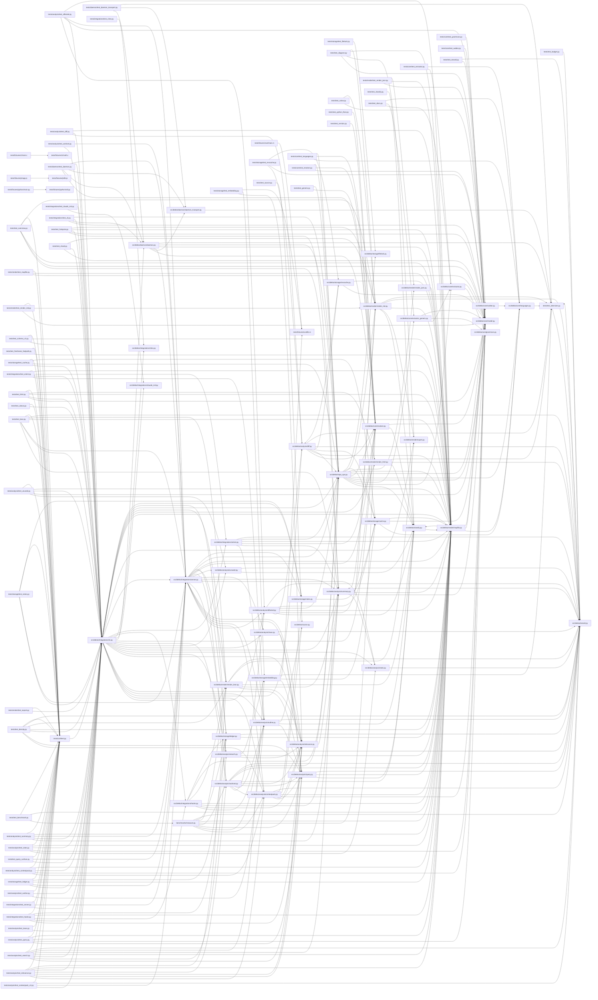

# Code Map — dekko

Generated by dekko on 2026-08-17 12:36 UTC. Do not edit by hand.

> **Agents:** prefer `dekko summary` for an overview and `dekko query | context | affected` (or the dekko MCP tools) for specifics — this file is the human-readable index and can be large.

**127** files (python 112, javascript 3, rust 3, c 2, typescript 2, bash 1, cpp 1, go 1, java 1, ruby 1) · **2013** functions/methods · **77** types · **4** variables · **4020** call edges (359 ambiguous, 3765 external — see map.json)

*Mapped 127 files in 560 ms (cache: 0 reused / 127 parsed).*

## Overview

| Directory | Files | Symbols | Internal | Cross-dir | Purpose |
|---|--:|--:|--:|--:|---|
| `tests/analysis/` | 13 | 350 | 153 | 598 | The affected subcommand: impacted test selection and exit c… |
| `tests/` | 23 | 244 | 205 | 606 | Shared pytest configuration. |
| `src/dekko/analysis/` | 13 | 230 | 318 | 403 | Read-side analysis commands: query, search, trace, and frie… |
| `tests/integrations/` | 6 | 206 | 101 | 234 | Tier 1: the idempotent dekko usage-policy block in CLAUDE.m… |
| `src/dekko/integrations/` | 7 | 136 | 207 | 521 | CLI, MCP server, and editor/tool integrations. |
| `src/dekko/core/` | 8 | 133 | 201 | 417 | Parsing primitives: models, grammars, extraction, resolutio… |
| `src/dekko/render/` | 7 | 128 | 162 | 348 | Map rendering: MAP.md, JSON, HTML, lean, and export formats. |
| `tests/core/` | 5 | 128 | 105 | 259 | Extraction tests for the Tier-1 Python and Rust queries. |
| `tests/daemon/` | 2 | 121 | 47 | 194 | The dekko daemon: accept loop, request routing, explicit li… |
| `tests/storage/` | 6 | 97 | 28 | 163 | The .dekko incremental cache: creation, reuse, and --full. |
| `src/dekko/storage/` | 7 | 77 | 73 | 165 | On-disk caches, locks, notes, and ledgers under .dekko/. |
| `src/dekko/daemon/` | 3 | 76 | 97 | 171 | Daemon process and its IPC transport. |

```mermaid
flowchart LR
  n0["benchmarks/measure.py"]
  n1["src/dekko/analysis/affected.py"]
  n2["src/dekko/analysis/contextpack.py"]
  n3["src/dekko/analysis/diff.py"]
  n4["src/dekko/analysis/outline.py"]
  n5["src/dekko/analysis/query.py"]
  n6["src/dekko/analysis/relevance.py"]
  n7["src/dekko/analysis/search.py"]
  n8["src/dekko/analysis/stats.py"]
  n9["src/dekko/analysis/summary.py"]
  n10["src/dekko/analysis/trace.py"]
  n11["src/dekko/analysis/unused.py"]
  n12["src/dekko/analysis/workset.py"]
  n13["src/dekko/classify.py"]
  n14["src/dekko/core/extractor.py"]
  n15["src/dekko/core/extractor_generic.py"]
  n16["src/dekko/core/grammars.py"]
  n17["src/dekko/core/languages.py"]
  n18["src/dekko/core/model.py"]
  n19["src/dekko/core/resolver.py"]
  n20["src/dekko/core/walker.py"]
  n21["src/dekko/daemon/daemon.py"]
  n22["src/dekko/daemon/daemon_transport.py"]
  n23["src/dekko/integrations/claude_md.py"]
  n24["src/dekko/integrations/cli.py"]
  n25["src/dekko/integrations/cline.py"]
  n26["src/dekko/integrations/hooks.py"]
  n27["src/dekko/integrations/orient.py"]
  n28["src/dekko/integrations/server.py"]
  n29["src/dekko/render/export.py"]
  n30["src/dekko/render/mapfile.py"]
  n31["src/dekko/render/render_html.py"]
  n32["src/dekko/render/render_json.py"]
  n33["src/dekko/render/render_lean.py"]
  n34["src/dekko/render/render_md.py"]
  n35["src/dekko/repo_ops.py"]
  n36["src/dekko/source.py"]
  n37["src/dekko/storage/cache.py"]
  n38["src/dekko/storage/embedding.py"]
  n39["src/dekko/storage/filelock.py"]
  n40["src/dekko/storage/ledger.py"]
  n41["src/dekko/storage/notes.py"]
  n42["src/dekko/storage/revcache.py"]
  n43["src/dekko/textutil.py"]
  n44["tests/analysis/test_affected.py"]
  n45["tests/analysis/test_contextpack.py"]
  n46["tests/analysis/test_contextpack_v2.py"]
  n47["tests/analysis/test_diff.py"]
  n48["tests/analysis/test_outline.py"]
  n49["tests/analysis/test_query.py"]
  n50["tests/analysis/test_relevance.py"]
  n51["tests/analysis/test_search.py"]
  n52["tests/analysis/test_stats.py"]
  n53["tests/analysis/test_summary.py"]
  n54["tests/analysis/test_trace.py"]
  n55["tests/analysis/test_unused.py"]
  n56["tests/analysis/test_workset.py"]
  n57["tests/conftest.py"]
  n58["tests/core/test_extractor.py"]
  n59["tests/core/test_grammars.py"]
  n60["tests/core/test_languages.py"]
  n61["tests/core/test_resolver.py"]
  n62["tests/core/test_walker.py"]
  n63["tests/daemon/test_daemon.py"]
  n64["tests/daemon/test_daemon_transport.py"]
  n65["tests/fixtures/c/main.c"]
  n66["tests/fixtures/c/math.c"]
  n67["tests/fixtures/js/app.js"]
  n68["tests/fixtures/js/lib.js"]
  n69["tests/fixtures/python/main.py"]
  n70["tests/fixtures/python/util.py"]
  n71["tests/fixtures/rust/lib.rs"]
  n72["tests/fixtures/rust/main.rs"]
  n73["tests/integrations/test_claude_md.py"]
  n74["tests/integrations/test_cli.py"]
  n75["tests/integrations/test_cline.py"]
  n76["tests/integrations/test_hooks.py"]
  n77["tests/integrations/test_orient.py"]
  n78["tests/integrations/test_server.py"]
  n79["tests/render/test_export.py"]
  n80["tests/render/test_mapfile.py"]
  n81["tests/render/test_render_json.py"]
  n82["tests/render/test_render_md.py"]
  n83["tests/storage/test_cache.py"]
  n84["tests/storage/test_embedding.py"]
  n85["tests/storage/test_filelock.py"]
  n86["tests/storage/test_ledger.py"]
  n87["tests/storage/test_notes.py"]
  n88["tests/storage/test_revcache.py"]
  n89["tests/test_benchmark.py"]
  n90["tests/test_budget.py"]
  n91["tests/test_classify.py"]
  n92["tests/test_density.py"]
  n93["tests/test_diagram.py"]
  n94["tests/test_docs.py"]
  n95["tests/test_freshness_fastpath.py"]
  n96["tests/test_generic.py"]
  n97["tests/test_hotspots.py"]
  n98["tests/test_html.py"]
  n99["tests/test_lean.py"]
  n100["tests/test_noise.py"]
  n101["tests/test_overview.py"]
  n102["tests/test_python_floor.py"]
  n103["tests/test_query_surface.py"]
  n104["tests/test_schema_v3.py"]
  n105["tests/test_shard.py"]
  n106["tests/test_source.py"]
  n107["tests/test_status.py"]
  n108["tests/test_textutil.py"]
  n109["tests/test_tokenizer.py"]
  n110["tests/test_version.py"]
  n0 --> n2
  n0 --> n4
  n0 --> n5
  n0 --> n12
  n0 --> n19
  n0 --> n30
  n0 --> n33
  n0 --> n40
  n0 --> n43
  n1 --> n3
  n1 --> n13
  n1 --> n19
  n1 --> n30
  n1 --> n35
  n1 --> n37
  n1 --> n43
  n2 --> n5
  n2 --> n6
  n2 --> n18
  n2 --> n30
  n2 --> n36
  n2 --> n41
  n2 --> n43
  n3 --> n19
  n3 --> n30
  n3 --> n35
  n3 --> n37
  n3 --> n42
  n3 --> n43
  n3 --> n109
  n4 --> n5
  n4 --> n13
  n4 --> n36
  n4 --> n43
  n5 --> n13
  n5 --> n30
  n5 --> n43
  n6 --> n9
  n7 --> n6
  n7 --> n30
  n7 --> n38
  n7 --> n43
  n8 --> n43
  n9 --> n8
  n9 --> n16
  n9 --> n30
  n9 --> n34
  n9 --> n43
  n10 --> n5
  n10 --> n43
  n11 --> n13
  n11 --> n43
  n12 --> n1
  n12 --> n2
  n12 --> n4
  n12 --> n5
  n12 --> n6
  n12 --> n13
  n12 --> n30
  n12 --> n35
  n12 --> n43
  n13 --> n30
  n14 --> n16
  n14 --> n18
  n15 --> n14
  n15 --> n16
  n15 --> n18
  n17 --> n109
  n19 --> n13
  n19 --> n18
  n20 --> n17
  n21 --> n19
  n21 --> n22
  n21 --> n28
  n21 --> n30
  n21 --> n35
  n21 --> n109
  n22 --> n109
  n24 --> n1
  n24 --> n2
  n24 --> n3
  n24 --> n4
  n24 --> n5
  n24 --> n6
  n24 --> n7
  n24 --> n8
  n24 --> n9
  n24 --> n10
  n24 --> n11
  n24 --> n12
  n24 --> n19
  n24 --> n21
  n24 --> n23
  n24 --> n25
  n24 --> n26
  n24 --> n27
  n24 --> n28
  n24 --> n29
  n24 --> n30
  n24 --> n31
  n24 --> n33
  n24 --> n35
  n24 --> n40
  n24 --> n41
  n26 --> n4
  n26 --> n6
  n26 --> n9
  n26 --> n30
  n26 --> n33
  n26 --> n35
  n26 --> n40
  n27 --> n4
  n27 --> n9
  n27 --> n19
  n27 --> n30
  n27 --> n35
  n27 --> n43
  n28 --> n1
  n28 --> n2
  n28 --> n4
  n28 --> n5
  n28 --> n6
  n28 --> n7
  n28 --> n8
  n28 --> n9
  n28 --> n10
  n28 --> n11
  n28 --> n12
  n28 --> n19
  n28 --> n30
  n28 --> n33
  n28 --> n35
  n28 --> n40
  n28 --> n41
  n30 --> n13
  n30 --> n17
  n30 --> n18
  n30 --> n20
  n31 --> n13
  n31 --> n43
  n31 --> n109
  n32 --> n30
  n33 --> n6
  n33 --> n9
  n33 --> n13
  n33 --> n29
  n33 --> n43
  n34 --> n9
  n34 --> n13
  n34 --> n29
  n34 --> n30
  n34 --> n43
  n34 --> n109
  n35 --> n13
  n35 --> n14
  n35 --> n15
  n35 --> n16
  n35 --> n17
  n35 --> n19
  n35 --> n20
  n35 --> n30
  n35 --> n32
  n35 --> n34
  n35 --> n37
  n35 --> n39
  n37 --> n17
  n37 --> n18
  n37 --> n30
  n38 --> n6
  n38 --> n37
  n38 --> n71
  n38 --> n109
  n40 --> n30
  n40 --> n43
  n41 --> n37
  n42 --> n3
  n42 --> n18
  n42 --> n30
  n43 --> n109
  n44 --> n1
  n44 --> n18
  n44 --> n24
  n44 --> n28
  n44 --> n30
  n45 --> n2
  n45 --> n18
  n45 --> n24
  n45 --> n30
  n45 --> n57
  n46 --> n24
  n46 --> n28
  n46 --> n43
  n46 --> n57
  n47 --> n3
  n47 --> n24
  n47 --> n30
  n48 --> n4
  n48 --> n24
  n48 --> n57
  n49 --> n5
  n49 --> n18
  n49 --> n24
  n49 --> n30
  n49 --> n57
  n50 --> n2
  n50 --> n5
  n50 --> n6
  n50 --> n12
  n50 --> n24
  n50 --> n30
  n50 --> n33
  n50 --> n57
  n51 --> n6
  n51 --> n7
  n51 --> n24
  n51 --> n30
  n51 --> n35
  n51 --> n38
  n51 --> n43
  n51 --> n57
  n52 --> n8
  n52 --> n18
  n52 --> n24
  n52 --> n30
  n52 --> n57
  n53 --> n9
  n53 --> n24
  n53 --> n28
  n53 --> n30
  n53 --> n57
  n54 --> n24
  n54 --> n57
  n55 --> n11
  n55 --> n18
  n55 --> n24
  n55 --> n30
  n55 --> n57
  n56 --> n24
  n56 --> n28
  n57 --> n24
  n58 --> n14
  n58 --> n17
  n59 --> n16
  n60 --> n17
  n60 --> n19
  n60 --> n35
  n61 --> n18
  n61 --> n19
  n61 --> n35
  n62 --> n20
  n63 --> n19
  n63 --> n21
  n63 --> n22
  n63 --> n24
  n63 --> n28
  n64 --> n21
  n64 --> n22
  n64 --> n109
  n65 --> n66
  n67 --> n68
  n69 --> n70
  n72 --> n71
  n73 --> n23
  n73 --> n24
  n74 --> n18
  n74 --> n21
  n74 --> n24
  n74 --> n35
  n75 --> n25
  n76 --> n6
  n76 --> n24
  n76 --> n26
  n76 --> n30
  n76 --> n40
  n76 --> n57
  n77 --> n4
  n77 --> n24
  n77 --> n27
  n77 --> n30
  n77 --> n57
  n78 --> n24
  n78 --> n28
  n78 --> n57
  n79 --> n24
  n79 --> n57
  n80 --> n18
  n80 --> n30
  n80 --> n57
  n81 --> n18
  n81 --> n30
  n81 --> n32
  n82 --> n18
  n82 --> n34
  n82 --> n57
  n83 --> n24
  n83 --> n35
  n83 --> n37
  n83 --> n57
  n84 --> n6
  n84 --> n38
  n84 --> n71
  n85 --> n39
  n86 --> n24
  n86 --> n28
  n86 --> n30
  n86 --> n40
  n86 --> n57
  n87 --> n24
  n87 --> n28
  n87 --> n41
  n87 --> n57
  n88 --> n3
  n88 --> n18
  n88 --> n42
  n89 --> n0
  n89 --> n30
  n89 --> n57
  n90 --> n43
  n91 --> n13
  n92 --> n2
  n92 --> n5
  n92 --> n24
  n92 --> n30
  n92 --> n33
  n92 --> n43
  n92 --> n57
  n93 --> n18
  n93 --> n29
  n93 --> n30
  n93 --> n34
  n94 --> n14
  n94 --> n15
  n94 --> n17
  n95 --> n30
  n95 --> n57
  n96 --> n19
  n96 --> n35
  n97 --> n9
  n97 --> n18
  n97 --> n24
  n97 --> n30
  n97 --> n34
  n98 --> n18
  n98 --> n24
  n98 --> n30
  n98 --> n31
  n98 --> n57
  n99 --> n9
  n99 --> n24
  n99 --> n28
  n99 --> n30
  n99 --> n33
  n99 --> n43
  n99 --> n57
  n100 --> n18
  n100 --> n34
  n101 --> n9
  n101 --> n18
  n101 --> n30
  n101 --> n34
  n101 --> n57
  n102 --> n19
  n103 --> n24
  n103 --> n28
  n103 --> n57
  n104 --> n24
  n104 --> n30
  n104 --> n57
  n105 --> n18
  n105 --> n24
  n105 --> n34
  n106 --> n36
  n107 --> n24
  n107 --> n57
  n108 --> n18
  n108 --> n43
  n109 --> n43
  n110 --> n19
```

**Load-bearing** (most called):

- [`make_mapped_repo(tmp_path: Path) -> RepoFactory`](map/tests.md#tests-conftest-py-make-mapped-repo) — 366
- [`main(argv: list[str] | None) -> int`](map/src-dekko-integrations.md#src-dekko-integrations-cli-py-main) — 264
- [`load_map(root: Path) -> MapIndex | None`](map/src-dekko-render.md#src-dekko-render-mapfile-py-load-map) — 92
- [`resolve(files: list[FileMap], workers: int) -> CallGraph`](map/src-dekko-core.md#src-dekko-core-resolver-py-resolve) — 85
- [`class FileMap`](map/src-dekko-core.md#src-dekko-core-model-py-filemap) — 78

**Orchestrators** (most calls out):

- [`_sharded(files: list[FileMap], graph: CallGraph, root_label: str, run_stats: RunStats | None, root: Path | None, order: str) -> list[tuple[str, str]]`](map/src-dekko-render.md#src-dekko-render-render-md-py-sharded) — 18
- [`run_map(args: argparse.Namespace, persist_excludes: bool) -> int`](map/src-dekko.md#src-dekko-repo-ops-py-run-map) — 18
- [`render_markdown(files: list[FileMap], graph: CallGraph, root_label: str, run_stats: RunStats | None, root: Path | None, order: str) -> str`](map/src-dekko-render.md#src-dekko-render-render-md-py-render-markdown) — 15
- [`_legacy_main(args_list: list[str]) -> int`](map/src-dekko-integrations.md#src-dekko-integrations-cli-py-legacy-main) — 12
- [`rank(index: MapIndex, query_text: str, kinds: frozenset[str] | None, scorer: relevance.Scorer | None) -> list[SearchHit]`](map/src-dekko-analysis.md#src-dekko-analysis-search-py-rank) — 10

**Largest files** (symbols):

- [`tests/daemon/test_daemon.py`](map/tests-daemon.md#tests-daemon-test-daemon-py) — 73
- [`tests/integrations/test_server.py`](map/tests-integrations.md#tests-integrations-test-server-py) — 63
- [`src/dekko/core/extractor.py`](map/src-dekko-core.md#src-dekko-core-extractor-py) — 61
- [`tests/core/test_resolver.py`](map/tests-core.md#tests-core-test-resolver-py) — 60
- [`tests/analysis/test_search.py`](map/tests-analysis.md#tests-analysis-test-search-py) — 58

**Hotspots** (recent churn x fan-in — change carefully):

| File | Commits | Fan-in | Risk |
|---|--:|--:|--:|
| [`tests/conftest.py`](map/tests.md#tests-conftest-py) | 6 | 366 | 6.0 |
| [`src/dekko/integrations/cli.py`](map/src-dekko-integrations.md#src-dekko-integrations-cli-py) | 3 | 332 | 2.7 |
| [`src/dekko/core/model.py`](map/src-dekko-core.md#src-dekko-core-model-py) | 3 | 258 | 2.1 |
| [`src/dekko/textutil.py`](map/src-dekko.md#src-dekko-textutil-py) | 6 | 127 | 2.1 |
| [`src/dekko/render/mapfile.py`](map/src-dekko-render.md#src-dekko-render-mapfile-py) | 3 | 236 | 1.9 |
| [`src/dekko/integrations/server.py`](map/src-dekko-integrations.md#src-dekko-integrations-server-py) | 4 | 150 | 1.6 |
| [`src/dekko/daemon/daemon.py`](map/src-dekko-daemon.md#src-dekko-daemon-daemon-py) | 3 | 116 | 1.0 |
| [`tests/test_lean.py`](map/tests.md#tests-test-lean-py) | 11 | 34 | 1.0 |
| [`src/dekko/daemon/daemon_transport.py`](map/src-dekko-daemon.md#src-dekko-daemon-daemon-transport-py) | 2 | 145 | 0.8 |
| [`src/dekko/core/extractor.py`](map/src-dekko-core.md#src-dekko-core-extractor-py) | 2 | 130 | 0.7 |

**Entry points:**

- [`Result.saved(self) -> int`](map/benchmarks.md#benchmarks-measure-py-result-saved)
- [`Result.reduction(self) -> float`](map/benchmarks.md#benchmarks-measure-py-result-reduction)
- [`main(argv: list[str] | None) -> int`](map/benchmarks.md#benchmarks-measure-py-main)
- [`TaskContext.is_empty(self) -> bool`](map/src-dekko-analysis.md#src-dekko-analysis-relevance-py-taskcontext-is-empty)
- [`DaemonTransport.preflight_check(self) -> None`](map/src-dekko-daemon.md#src-dekko-daemon-daemon-transport-py-daemontransport-preflight-check)
- [`main(argv: list[str] | None) -> int`](map/src-dekko-integrations.md#src-dekko-integrations-cli-py-main)
- [`LeanReport.per_signal(self) -> float | None`](map/src-dekko-render.md#src-dekko-render-render-lean-py-leanreport-per-signal)
- [`LeanReport.floored(self) -> bool`](map/src-dekko-render.md#src-dekko-render-render-lean-py-leanreport-floored)

## Contents

- **benchmarks/**
  - [`measure.py`](map/benchmarks.md#benchmarks-measure-py) (17 symbols) — Measurement harness for the Active Context Layer (design §7, step 3).
- **./**
  - [`install.sh`](map/root.md#install-sh)
- **src/dekko/**
  - [`__init__.py`](map/src-dekko.md#src-dekko-init-py) — dekko: static code map generator (MAP.md + map.json).
  - [`classify.py`](map/src-dekko.md#src-dekko-classify-py) (3 symbols) — Shared path classification: test code vs production code.
  - [`repo_ops.py`](map/src-dekko.md#src-dekko-repo-ops-py) (19 symbols) — Shared repo-mapping pipeline: discover, extract, resolve, render.
  - [`source.py`](map/src-dekko.md#src-dekko-source-py) (1 symbols) — Best-effort reads of repository source files.
  - [`textutil.py`](map/src-dekko.md#src-dekko-textutil-py) (18 symbols) — Small shared text helpers for the read-command renderers.
- **src/dekko/analysis/**
  - [`__init__.py`](map/src-dekko-analysis.md#src-dekko-analysis-init-py) — Read-side analysis commands: query, search, trace, and friends.
  - [`affected.py`](map/src-dekko-analysis.md#src-dekko-analysis-affected-py) (22 symbols) — Select the tests impacted by a change.
  - [`contextpack.py`](map/src-dekko-analysis.md#src-dekko-analysis-contextpack-py) (21 symbols) — Context packs: the minimal neighborhood needed to work on a target.
  - [`diff.py`](map/src-dekko-analysis.md#src-dekko-analysis-diff-py) (21 symbols) — Compare the working tree's symbols against an earlier git rev.
  - [`outline.py`](map/src-dekko-analysis.md#src-dekko-analysis-outline-py) (17 symbols) — Structural outline of a file or directory: signatures, no bodies.
  - [`query.py`](map/src-dekko-analysis.md#src-dekko-analysis-query-py) (29 symbols) — Query the loaded map index: callers, callees, symbols, files.
  - [`relevance.py`](map/src-dekko-analysis.md#src-dekko-analysis-relevance-py) (26 symbols) — Task-aware relevance scoring (Pillar B).
  - [`search.py`](map/src-dekko-analysis.md#src-dekko-analysis-search-py) (20 symbols) — Free-text relevance search over every symbol in the map.
  - [`stats.py`](map/src-dekko-analysis.md#src-dekko-analysis-stats-py) (7 symbols) — Aggregate metrics over the map: hotspots, sizes, language mix.
  - [`summary.py`](map/src-dekko-analysis.md#src-dekko-analysis-summary-py) (24 symbols) — A compact repo digest: the middle ground between MAP.md and a query.
  - [`trace.py`](map/src-dekko-analysis.md#src-dekko-analysis-trace-py) (10 symbols) — Trace shortest call path(s) between two symbols.
  - [`unused.py`](map/src-dekko-analysis.md#src-dekko-analysis-unused-py) (8 symbols) — Find symbols with no inbound calls that look like dead code.
  - [`workset.py`](map/src-dekko-analysis.md#src-dekko-analysis-workset-py) (25 symbols) — Task-scoped work-set bundles: one budgeted call for a whole change.
- **src/dekko/core/**
  - [`__init__.py`](map/src-dekko-core.md#src-dekko-core-init-py) — Parsing primitives: models, grammars, extraction, resolution.
  - [`extractor.py`](map/src-dekko-core.md#src-dekko-core-extractor-py) (61 symbols) — Tree-sitter extraction: source file → symbols, raw calls, imports.
  - [`extractor_generic.py`](map/src-dekko-core.md#src-dekko-core-extractor-generic-py) (9 symbols) — Tier-2 extraction: best-effort symbols for any grammar.
  - [`grammars.py`](map/src-dekko-core.md#src-dekko-core-grammars-py) (3 symbols) — Grammar resolution: a grammar name to a ``tree_sitter.Language``.
  - [`languages.py`](map/src-dekko-core.md#src-dekko-core-languages-py) (6 symbols) — Language registry: extensions, grammars, and tree-sitter queries.
  - [`model.py`](map/src-dekko-core.md#src-dekko-core-model-py) (9 symbols) — Shared data model for the code map: symbols, calls, edges.
  - [`resolver.py`](map/src-dekko-core.md#src-dekko-core-resolver-py) (32 symbols) — Best-effort static call resolution: raw calls → graph edges.
  - [`walker.py`](map/src-dekko-core.md#src-dekko-core-walker-py) (13 symbols) — File discovery: enumerate mappable source files in a repository.
- **src/dekko/daemon/**
  - [`__init__.py`](map/src-dekko-daemon.md#src-dekko-daemon-init-py) — Daemon process and its IPC transport.
  - [`daemon.py`](map/src-dekko-daemon.md#src-dekko-daemon-daemon-py) (27 symbols) — The dekko daemon: accept loop, request routing, explicit lifecycle.
  - [`daemon_transport.py`](map/src-dekko-daemon.md#src-dekko-daemon-daemon-transport-py) (49 symbols) — OS-independent transport abstraction for the dekko daemon.
- **src/dekko/integrations/**
  - [`__init__.py`](map/src-dekko-integrations.md#src-dekko-integrations-init-py) — CLI, MCP server, and editor/tool integrations.
  - [`claude_md.py`](map/src-dekko-integrations.md#src-dekko-integrations-claude-md-py) (5 symbols) — Idempotent dekko usage-policy block in a project's ``CLAUDE.md``.
  - [`cli.py`](map/src-dekko-integrations.md#src-dekko-integrations-cli-py) (48 symbols) — dekko: programmatically map a repository into MAP.md/map.json.
  - [`cline.py`](map/src-dekko-integrations.md#src-dekko-integrations-cline-py) (10 symbols) — Cline MCP registration: install/uninstall the ``dekko`` server.
  - [`hooks.py`](map/src-dekko-integrations.md#src-dekko-integrations-hooks-py) (25 symbols) — Claude Code hook entrypoints: the opt-in push layer (Pillar A).
  - [`orient.py`](map/src-dekko-integrations.md#src-dekko-integrations-orient-py) (6 symbols) — Proactive orientation: the opt-in push layer (F4).
  - [`server.py`](map/src-dekko-integrations.md#src-dekko-integrations-server-py) (42 symbols) — A hand-rolled MCP server exposing the map over stdio.
- **src/dekko/render/**
  - [`__init__.py`](map/src-dekko-render.md#src-dekko-render-init-py) — Map rendering: MAP.md, JSON, HTML, lean, and export formats.
  - [`export.py`](map/src-dekko-render.md#src-dekko-render-export-py) (11 symbols) — Render the call graph as Mermaid or Graphviz DOT.
  - [`mapfile.py`](map/src-dekko-render.md#src-dekko-render-mapfile-py) (32 symbols) — Read map.json back into a queryable index; provenance + freshness.
  - [`render_html.py`](map/src-dekko-render.md#src-dekko-render-render-html-py) (8 symbols) — Render the map as one self-contained interactive HTML file.
  - [`render_json.py`](map/src-dekko-render.md#src-dekko-render-render-json-py) (1 symbols) — Render the extracted symbol/call graph as map.json.
  - [`render_lean.py`](map/src-dekko-render.md#src-dekko-render-render-lean-py) (45 symbols) — The lean map: a budget-capped navigation map for agents.
  - [`render_md.py`](map/src-dekko-render.md#src-dekko-render-render-md-py) (31 symbols) — Render the extracted symbol/call graph as MAP.md.
- **src/dekko/storage/**
  - [`__init__.py`](map/src-dekko-storage.md#src-dekko-storage-init-py) — On-disk caches, locks, notes, and ledgers under .dekko/.
  - [`cache.py`](map/src-dekko-storage.md#src-dekko-storage-cache-py) (15 symbols) — Per-file extraction cache stored under ``.dekko/``.
  - [`embedding.py`](map/src-dekko-storage.md#src-dekko-storage-embedding-py) (17 symbols) — Optional embedding-based scorer for ``dekko search`` (Phase 2).
  - [`filelock.py`](map/src-dekko-storage.md#src-dekko-storage-filelock-py) (6 symbols) — Cross-platform advisory file lock for the ``.dekko/`` regen critical
  - [`ledger.py`](map/src-dekko-storage.md#src-dekko-storage-ledger-py) (23 symbols) — Session ledger: what is already in the agent's context (Pillar C).
  - [`notes.py`](map/src-dekko-storage.md#src-dekko-storage-notes-py) (7 symbols) — Symbol-anchored notes: durable, committable annotations on code.
  - [`revcache.py`](map/src-dekko-storage.md#src-dekko-storage-revcache-py) (9 symbols) — Disk-backed cache of mapped historical git revisions.

tests (75 files)

- **tests/analysis/**
  - [`test_affected.py`](map/tests-analysis.md#tests-analysis-test-affected-py) (36 symbols) — The affected subcommand: impacted test selection and exit codes.
  - [`test_contextpack.py`](map/tests-analysis.md#tests-analysis-test-contextpack-py) (16 symbols) — Context packs: neighborhood building, hops, budget trimming.
  - [`test_contextpack_v2.py`](map/tests-analysis.md#tests-analysis-test-contextpack-v2-py) (8 symbols) — Context pack v2: doc lines, --with-source, call-site excerpts.
  - [`test_diff.py`](map/tests-analysis.md#tests-analysis-test-diff-py) (28 symbols) — The diff subcommand: added/removed/changed symbols and exit codes.
  - [`test_outline.py`](map/tests-analysis.md#tests-analysis-test-outline-py) (17 symbols) — Outline subcommand: structure, nesting, size framing, budget.
  - [`test_query.py`](map/tests-analysis.md#tests-analysis-test-query-py) (56 symbols) — Query subcommand: actions, target syntax, exit codes.
  - [`test_relevance.py`](map/tests-analysis.md#tests-analysis-test-relevance-py) (50 symbols) — Pillar B: task-aware relevance scoring and the --task blend.
  - [`test_search.py`](map/tests-analysis.md#tests-analysis-test-search-py) (58 symbols) — The search subcommand: BM25 free-text relevance ranking and budget.
  - [`test_stats.py`](map/tests-analysis.md#tests-analysis-test-stats-py) (5 symbols) — The stats command: counts, hotspots, language mix.
  - [`test_summary.py`](map/tests-analysis.md#tests-analysis-test-summary-py) (23 symbols) — The summary digest and the MCP resource that serves it.
  - [`test_trace.py`](map/tests-analysis.md#tests-analysis-test-trace-py) (11 symbols) — Trace subcommand: shortest call paths, exit codes, JSON shape.
  - [`test_unused.py`](map/tests-analysis.md#tests-analysis-test-unused-py) (17 symbols) — The unused command: root rules, used-via-container, exit codes.
  - [`test_workset.py`](map/tests-analysis.md#tests-analysis-test-workset-py) (25 symbols) — The workset subcommand: seeds, tiered budget, and exit codes.
- **tests/**
  - [`conftest.py`](map/tests.md#tests-conftest-py) (2 symbols) — Shared pytest configuration.
  - [`test_benchmark.py`](map/tests.md#tests-test-benchmark-py) (8 symbols) — Regression guard for the context-layer benchmark (design §7, step 3).
  - [`test_budget.py`](map/tests.md#tests-test-budget-py) (10 symbols) — Unit tests for the shared budgeting seam (Meter + fit_to_budget).
  - [`test_classify.py`](map/tests.md#tests-test-classify-py) (9 symbols) — Shared path classification: test code vs production code.
  - [`test_density.py`](map/tests.md#tests-test-density-py) (9 symbols) — Pillar D: dense encoding and the FR-D3 density metric.
  - [`test_diagram.py`](map/tests.md#tests-test-diagram-py) (8 symbols) — MAP.md embedded mermaid diagram: scale-guard tiers and block syntax.
  - [`test_docs.py`](map/tests.md#tests-test-docs-py) (12 symbols) — Doc-line extraction: ``Symbol.doc`` and ``FileMap.doc``.
  - [`test_freshness_fastpath.py`](map/tests.md#tests-test-freshness-fastpath-py) (6 symbols) — The mtime/size fast path in check_freshness skips redundant hashing.
  - [`test_generic.py`](map/tests.md#tests-test-generic-py) (1 symbols) — Tier-2 generic fallback tests (Ruby fixture).
  - [`test_hotspots.py`](map/tests.md#tests-test-hotspots-py) (10 symbols) — B5: trust line, largest-files overview, and churn x fan-in hotspots.
  - [`test_html.py`](map/tests.md#tests-test-html-py) (11 symbols) — B7: interactive HTML export — document, escaping, size guard, CLI.
  - [`test_lean.py`](map/tests.md#tests-test-lean-py) (58 symbols) — FR1 file backbone: floor guarantee, dense encoding, determinism.
  - [`test_noise.py`](map/tests.md#tests-test-noise-py) (7 symbols) — B6: minor-file collapse, test grouping, and ``--order``.
  - [`test_overview.py`](map/tests.md#tests-test-overview-py) (5 symbols) — MAP.md Overview section: rollup table, hotspots, anchor links.
  - [`test_python_floor.py`](map/tests.md#tests-test-python-floor-py) (2 symbols) — Guard the package's declared requires-python floor.
  - [`test_query_surface.py`](map/tests.md#tests-test-query-surface-py) (16 symbols) — A2 query surface: --sites, uses, --no-tests, ranking, footers.
  - [`test_schema_v3.py`](map/tests.md#tests-test-schema-v3-py) (9 symbols) — map.json doc version 3: edge lines, externals, test flags, compat.
  - [`test_shard.py`](map/tests.md#tests-test-shard-py) (13 symbols) — Sharded MAP.md: mode matrix, auto threshold, orphans, link resolution.
  - [`test_source.py`](map/tests.md#tests-test-source-py) (2 symbols) — Direct unit tests for ``source.read_lines``.
  - [`test_status.py`](map/tests.md#tests-test-status-py) (8 symbols) — Status subcommand exit codes and the auto-regen/no-regen paths.
  - [`test_textutil.py`](map/tests.md#tests-test-textutil-py) (21 symbols) — Direct unit tests for ``textutil.signature``/``oneline``/``dir_of``.
  - [`test_tokenizer.py`](map/tests.md#tests-test-tokenizer-py) (13 symbols) — Q2 token-counting seam: fallback, backend selection, determinism.
  - [`test_version.py`](map/tests.md#tests-test-version-py) (4 symbols) — Guard: the version is declared in four places and must agree.
- **tests/core/**
  - [`test_extractor.py`](map/tests-core.md#tests-core-test-extractor-py) (25 symbols) — Extraction tests for the Tier-1 Python and Rust queries.
  - [`test_grammars.py`](map/tests-core.md#tests-core-test-grammars-py) (9 symbols) — Grammar registry: Tier-1 offline resolution and Tier-2 fallback.
  - [`test_languages.py`](map/tests-core.md#tests-core-test-languages-py) (13 symbols) — Per-language extraction and resolution tests for Tier-1 specs.
  - [`test_resolver.py`](map/tests-core.md#tests-core-test-resolver-py) (60 symbols) — End-to-end resolution tests over the language fixtures.
  - [`test_walker.py`](map/tests-core.md#tests-core-test-walker-py) (21 symbols) — File discovery tests.
- **tests/daemon/**
  - [`test_daemon.py`](map/tests-daemon.md#tests-daemon-test-daemon-py) (73 symbols) — The dekko daemon: accept loop, request routing, explicit lifecycle.
  - [`test_daemon_transport.py`](map/tests-daemon.md#tests-daemon-test-daemon-transport-py) (48 symbols) — Tests for the OS-independent daemon transport abstraction.
- **tests/fixtures/c/**
  - [`main.c`](map/tests-fixtures-c.md#tests-fixtures-c-main-c) (1 symbols)
  - [`math.c`](map/tests-fixtures-c.md#tests-fixtures-c-math-c) (2 symbols)
- **tests/fixtures/cpp/**
  - [`shapes.cpp`](map/tests-fixtures-cpp.md#tests-fixtures-cpp-shapes-cpp) (4 symbols)
- **tests/fixtures/go/**
  - [`srv.go`](map/tests-fixtures-go.md#tests-fixtures-go-srv-go) (5 symbols)
- **tests/fixtures/java/**
  - [`App.java`](map/tests-fixtures-java.md#tests-fixtures-java-app-java) (7 symbols)
- **tests/fixtures/js/**
  - [`app.js`](map/tests-fixtures-js.md#tests-fixtures-js-app-js) (1 symbols)
  - [`exports.js`](map/tests-fixtures-js.md#tests-fixtures-js-exports-js) (3 symbols)
  - [`lib.js`](map/tests-fixtures-js.md#tests-fixtures-js-lib-js) (4 symbols)
- **tests/fixtures/python/**
  - [`main.py`](map/tests-fixtures-python.md#tests-fixtures-python-main-py) (1 symbols)
  - [`util.py`](map/tests-fixtures-python.md#tests-fixtures-python-util-py) (4 symbols)
- **tests/fixtures/ruby/**
  - [`store.rb`](map/tests-fixtures-ruby.md#tests-fixtures-ruby-store-rb)
- **tests/fixtures/rust/**
  - [`kinds.rs`](map/tests-fixtures-rust.md#tests-fixtures-rust-kinds-rs) (3 symbols) — Kind-mapping coverage: enum and trait definitions (Package F1).
  - [`lib.rs`](map/tests-fixtures-rust.md#tests-fixtures-rust-lib-rs) (4 symbols)
  - [`main.rs`](map/tests-fixtures-rust.md#tests-fixtures-rust-main-rs) (1 symbols)
- **tests/fixtures/ts/**
  - [`exports.ts`](map/tests-fixtures-ts.md#tests-fixtures-ts-exports-ts) (3 symbols)
  - [`svc.ts`](map/tests-fixtures-ts.md#tests-fixtures-ts-svc-ts) (8 symbols)
- **tests/integrations/**
  - [`test_claude_md.py`](map/tests-integrations.md#tests-integrations-test-claude-md-py) (10 symbols) — Tier 1: the idempotent dekko usage-policy block in CLAUDE.md.
  - [`test_cli.py`](map/tests-integrations.md#tests-integrations-test-cli-py) (57 symbols) — CLI surface tests: flags, output resolution, plugin install.
  - [`test_cline.py`](map/tests-integrations.md#tests-integrations-test-cline-py) (19 symbols) — Cline MCP config install/uninstall: idempotent JSON merge/removal.
  - [`test_hooks.py`](map/tests-integrations.md#tests-integrations-test-hooks-py) (42 symbols) — Pillar A: the opt-in Claude Code push hooks.
  - [`test_orient.py`](map/tests-integrations.md#tests-integrations-test-orient-py) (15 symbols) — Proactive orientation (F4): session digest + pre-read advisory.
  - [`test_server.py`](map/tests-integrations.md#tests-integrations-test-server-py) (63 symbols) — The hand-rolled MCP server: protocol handling and tool dispatch.
- **tests/render/**
  - [`test_export.py`](map/tests-render.md#tests-render-test-export-py) (6 symbols) — The export command: mermaid/dot rendering, scope, size guard.
  - [`test_mapfile.py`](map/tests-render.md#tests-render-test-mapfile-py) (39 symbols) — map.json round-trip, provenance, and freshness checks.
  - [`test_render_json.py`](map/tests-render.md#tests-render-test-render-json-py) (6 symbols) — render_json.py: id-interning, compact output, backward-read compat
  - [`test_render_md.py`](map/tests-render.md#tests-render-test-render-md-py) (8 symbols) — MAP.md rendering: the agent-steering header and purpose lines.
- **tests/storage/**
  - [`test_cache.py`](map/tests-storage.md#tests-storage-test-cache-py) (26 symbols) — The .dekko incremental cache: creation, reuse, and --full.
  - [`test_embedding.py`](map/tests-storage.md#tests-storage-test-embedding-py) (24 symbols) — Phase 2: the optional hashing-trick embedding scorer (dekko[search]).
  - [`test_filelock.py`](map/tests-storage.md#tests-storage-test-filelock-py) (9 symbols) — Cross-platform advisory regen lock (round-12 §4.1b).
  - [`test_ledger.py`](map/tests-storage.md#tests-storage-test-ledger-py) (18 symbols) — Pillar C read side: the transcript-projected session ledger.
  - [`test_notes.py`](map/tests-storage.md#tests-storage-test-notes-py) (12 symbols) — Symbol-anchored notes: CRUD, rendering, orphans, MCP, committability.
  - [`test_revcache.py`](map/tests-storage.md#tests-storage-test-revcache-py) (8 symbols) — The disk-backed rev-cache: round-trip, eviction, isolation.

