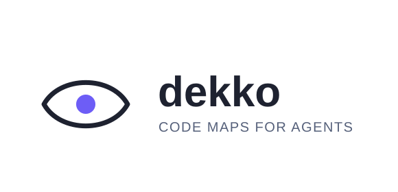

<p align="center">
  <picture>
    <source media="(prefers-color-scheme: dark)" srcset="assets/logo-full-dark.svg">
    <source media="(prefers-color-scheme: light)" srcset="assets/logo-full-light.svg">
    
  </picture>
</p>

<p align="center">
  <a href="https://github.com/aahlijia/dekko/actions/workflows/ci.yml"></a>
  <a href="https://pypi.org/project/dekko/"></a>
  <a href="https://pepy.tech/project/dekko"></a>
  <a href="https://pypi.org/project/dekko/"></a>
  <a href="https://opensource.org/licenses/MIT"></a>
  <a href="https://github.com/astral-sh/ruff"></a>
</p>

<!-- mcp-name: io.github.aahlijia/dekko -->

**dekko** is a fast, offline, dependency-free **static code map
generator** and **codebase indexer for LLM coding agents**. It scans a
repository with [tree-sitter](https://tree-sitter.github.io/) (no model
tokens spent parsing) and writes:

- **`MAP.md`** — a human-readable map: a per-directory overview, an
  embedded architecture diagram, load-bearing/orchestrator rankings,
  then every file's functions/methods with signatures, doc lines, and
  who calls and is called by whom.
- **`map.json`** — the same graph in machine-readable form.

On top of the map, dekko gives an agent a token-cheap way to answer
questions like "what does this file contain," "who calls this function,"
and "what do I need to safely change this" — without reading whole files.
It ships as a **CLI**, a **Claude Code `/map` plugin + MCP server**
([Model Context Protocol](https://modelcontextprotocol.io/)), and
works with **Cline** too.

## Why dekko?

Most agent workflows gather context by reading whole files or grepping
across a repo — expensive, and it throws away structure (who calls
what, what a function's fan-in/fan-out looks like). dekko instead
parses the repo once into a call graph and answers targeted questions
against it. Measured across 7 real, unmodified open-source repos
(Go, TypeScript, Java, Rust, Python/C++ — up to 14k files), dekko's
structured queries used **3x–200x fewer tokens** than the equivalent
`Read`/`Grep` workflow for the same task (repo orientation, outlining a
large file, tracing a symbol's callers/callees).

| Task | Example repo (scale) | dekko | Read/Grep | Savings |
|---|---|---:|---:|---:|
| Repo orientation (`summary`) | awesome-go (10 files) | 308 tok | ~15,271 tok | ~50x |
| Repo orientation (`summary`) | cline (2,730 files) | 1,202 tok | ~4,020 tok | ~3.3x |
| Outline a large file | claude-code `main.tsx` (4,683 lines) | 1,017 tok | 200,981 tok | ~197x |
| Outline a large file | zed `editor.rs` (12,554 lines) | 1,996 tok | 115,109 tok | ~58x |
| Symbol lookup (`query_symbol` + callers/callees) | tensorflow `Graph` class | ~811 tok | 61,656 tok | ~76x |
| Symbol lookup (`query_symbol` + callers/callees) | spring-boot `prepareContext` | 759 tok | ~18,460 tok | ~24x |
| Bundled context (`workset`) | zed | 2,984 tok | ~5,903+ tok (targeted) / ~164,571 tok (whole file) | ~2x / ~55x |
| Bundled context (`workset`) | awesome-go | 617 tok | ~6,136 tok | ~10x |

dekko's cost stays roughly flat per query while `Read`/`Grep` scales
with file/repo size, so the ratio grows with scale. The win isn't
universal — small,
self-contained files and already-grep-friendly local symbols see
little to no benefit, and a few cases in the raw data are void because
the cheap answer was also an incomplete one. See
[`benchmarks/real-world-repos/`](benchmarks/real-world-repos/README.md)
for the full per-task breakdown, methodology, and correctness caveats.

Compared to tag-index tools like `ctags`/`gtags`, dekko resolves actual
call edges (not just definitions), ranks files by load-bearing-ness,
and speaks directly to agents over MCP or the CLI — no editor plugin
required.

## Install

```sh
uv tool install dekko      # or: pip install dekko / pipx install dekko
dekko --claude-install     # add the /map command + MCP server to Claude Code, then restart
```

Extras (`dekko[all]` for ~55 more languages, `dekko[search]` for
embedding search), installing from a local clone, and uninstalling are
in [docs/install.md](docs/install.md).

## Quick start

```sh
cd my-project
dekko map                  # writes .dekko/MAP.md + .dekko/map.json
dekko summary               # ~40-line digest: dirs, hotspots, entry points
```

`.dekko/` is git-ignored by default; the map regenerates on demand, so
you rarely need to run `dekko map` again by hand.

## Documentation

- [docs/install.md](docs/install.md) — installation, extras, local
  clone, uninstall
- [docs/cli.md](docs/cli.md) — every CLI command, symbol targets,
  excluding files, notes, daemon mode, language support
- [docs/claude-code.md](docs/claude-code.md) — the `/map` plugin, push
  hooks, Claude Code skills, the MCP server, and Cline

## Learn more

- [CHANGELOG.md](CHANGELOG.md) — per-version history
- [CONTRIBUTING.md](CONTRIBUTING.md) — dev setup, testing, releasing
- [benchmarks/](benchmarks/) — token-efficiency measurements, including
  a 7-repo real-world comparison against a plain Read/Grep workflow
